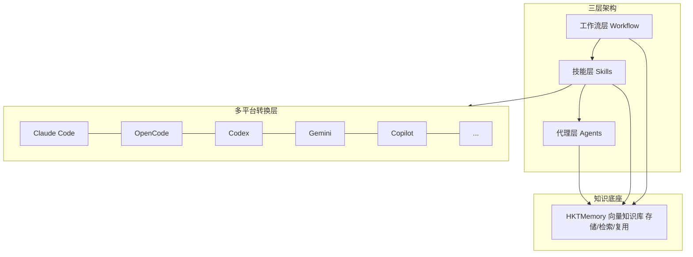
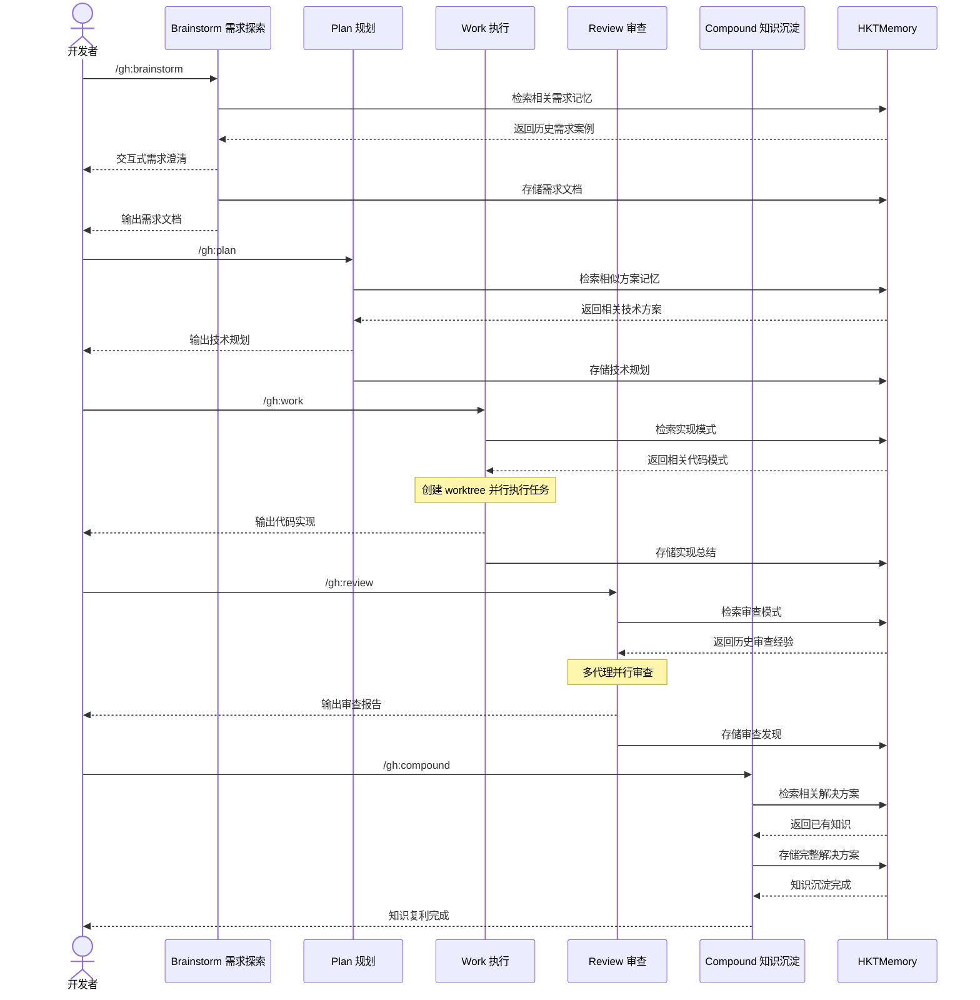
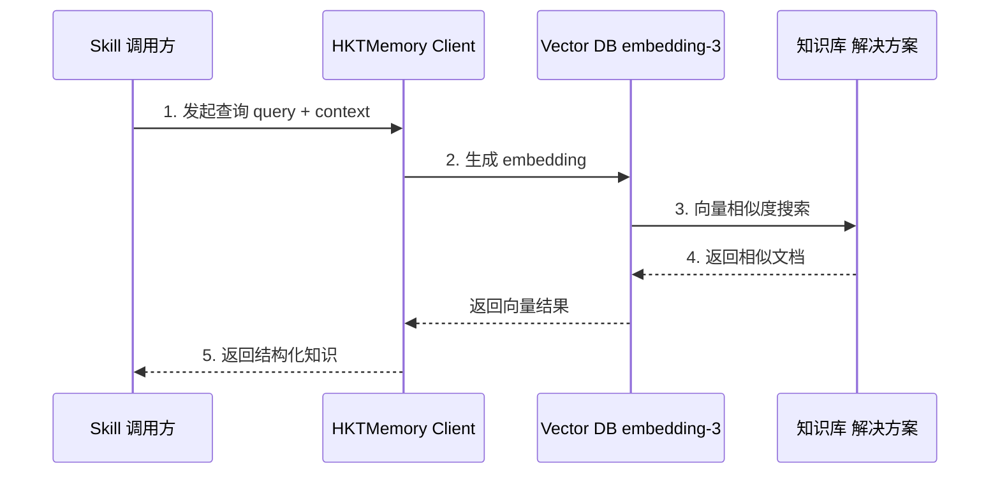
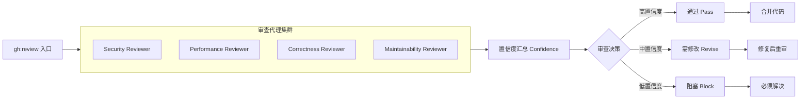

# GaleHarnessCLI

巨风科技研发团队提效工具 —— 基于 Compound Engineering 工作流与 HKTMemory 向量知识库的 AI 驱动开发套件。

## 核心理念

**每一次工程实践都应该让后续工作变得更简单，而不是更复杂。**

传统开发累积技术债务，每个功能增加复杂度。HarnessCLI 反转这一模式：
- 80% 精力投入规划与审查
- 20% 精力投入执行
- 通过知识沉淀实现复利效应

---

## 工程师实战指南

本章节以研发导师的视角，指导工程师在不同开发场景下如何高效使用 GaleHarnessCLI。

### 场景一：新需求开发

当你接到一个新需求时，遵循「先规划、后执行」的原则：

```
需求理解 -> 技术规划 -> 编码实现 -> 代码审查 -> 知识沉淀
```

**步骤一：需求探索**

```bash
/gh:brainstorm "实现用户登录功能"
```

这会：
- 自动检索 HKTMemory 中相关的历史需求案例
- 通过交互式问答帮你细化需求
- 输出一份结构化的需求文档到 `docs/brainstorms/`
- 自动将需求存储到 HKTMemory

**步骤二：技术规划**

```bash
/gh:plan docs/brainstorms/user-login-requirements.md
```

这会：
- 检索相似的技术方案
- 生成详细的实施计划，包含任务分解和置信度评估
- 输出到 `docs/plans/`

**步骤三：编码实现**

```bash
/gh:work docs/plans/user-login-plan.md
```

这会：
- 创建 git worktree 隔离开发环境
- 系统化执行任务清单
- 检索相关的实现模式参考
- 存储实现总结

**步骤四：代码审查**

```bash
/gh:review
```

这会启动多代理并行审查，从安全、性能、正确性、可维护性等维度检查代码。

**步骤五：知识沉淀**

```bash
/gh:compound "用户登录功能的实现经验"
```

记录解决方案，供未来类似需求参考。

---

### 场景二：Bug 修复

当你遇到 Bug 时，有两种选择：

**选项 A：使用 GaleHarnessCLI 工作流（推荐）**

```bash
/gh:debug
```

这会：
- 自动检索 HKTMemory 中类似的历史问题
- 系统性定位根本原因
- 修复后自动存储调试经验
- 知识自动沉淀到向量库

**调试输入方式**：

```
/gh:debug "用户登录时偶尔出现 500 错误"

# 或直接粘贴错误信息
/gh:debug
> Error: Connection timeout at UserService.authenticate()
> Stack trace: ...

# 或引用 GitHub Issue
/gh:debug https://github.com/org/repo/issues/123
```

---

### 场景三：需求讨论与评审

当需要评审需求文档或技术方案时：

**需求文档评审**

```bash
/document-review docs/brainstorms/new-feature.md
```

这会启动多个角色代理并行评审：
- **产品视角**：挑战前提假设，评估战略影响
- **安全视角**：识别数据暴露风险、认证漏洞
- **可行性视角**：评估技术可行性、架构冲突
- **范围视角**：识别不必要的复杂度、过度设计

**技术方案评审**

```bash
/document-review docs/plans/implementation-plan.md
```

产出一份包含各角色视角的评审报告。

---

### 场景四：知识归档与复用

**归档已解决的问题**

当你完成一个有价值的解决方案后：

```bash
/gh:compound "解决大文件上传超时问题"
```

这会：
- 检索是否已有相关记录，避免重复
- 引导你描述问题背景、方案选择、最终实现
- 存储到 HKTMemory 向量库
- 以后遇到类似问题自动检索参考

**查询历史经验**

当你遇到问题时，可以先查询是否有相关经验：

```bash
# 在工作流中自动触发
/gh:brainstorm "..."
/gh:plan "..."
/gh:debug "..."
# 以上命令都会自动检索 HKTMemory

# 或显式查询
Task 工具调用 galeharness-cli:research:learnings-researcher
```

---

### 场景五：代码优化

当你需要优化性能、重构代码或提升质量时：

```bash
/gh:optimize "优化首页加载速度"
```

这会：
- 定义可测量的目标指标
- 构建测量脚手架
- 并行运行多个实验方案
- 用 LLM 作为评分器评估效果
- 自动保留改进方案，回退失败的尝试

---

### 场景六：研究现有代码

当你需要理解项目背景或查找历史决策时：

**查询历史会话**

```bash
/gh:sessions "上次我们是怎么处理认证问题的？"
```

这会搜索你过去的 Claude Code、Codex、Cursor 会话记录。

**搜索 Slack 讨论**

```bash
/gh:slack-research "团队对微服务拆分的讨论"
```

这会搜索 Slack 获取组织上下文，产出研究摘要。

**分析 Issue 趋势**

```bash
# 需要通过 Task 工具调用
Task 工具调用 issue-intelligence-analyst
```

分析 GitHub Issues 发现重复主题和痛点模式。

---

### 场景七：探索改进机会

当你想主动发现项目改进点时：

```bash
/gh:ideate
```

这会：
- 扫描代码库发现潜在改进点
- 通过发散思维生成改进建议
- 使用对抗性过滤筛选高价值项目
- 引导你选择优先处理的方向

---

### 快速决策表

| 我想要... | 使用命令 | 记忆交互 |
|-----------|----------|----------|
| 细化新需求 | `/gh:brainstorm` | 读取历史需求，存储新需求 |
| 制定实施计划 | `/gh:plan` | 读取相似方案，存储技术规划 |
| 执行开发任务 | `/gh:work` | 读取实现模式，存储实现总结 |
| 修复 Bug | `/gh:debug` | 读取类似问题，存储调试经验 |
| 审查代码 | `/gh:review` | 读取审查模式，存储审查发现 |
| 沉淀知识 | `/gh:compound` | 检索重复，存储完整方案 |
| 优化性能 | `/gh:optimize` | 读取策略，存储优化结果 |
| 评审文档 | `/document-review` | 无 |
| 查历史会话 | `/gh:sessions` | 无 |
| 查 Slack 讨论 | `/gh:slack-research` | 无 |
| 发现改进点 | `/gh:ideate` | 读取历史建议，存储新发现 |

---

### 新手上路建议

**第一周：熟悉工作流**

1. 用 `/gh:brainstorm` 练习一个小需求
2. 用 `/gh:plan` 生成技术规划
3. 用 `/gh:work` 执行实现
4. 用 `/gh:review` 审查自己的代码
5. 用 `/gh:compound` 记录学到的经验

**第二周：积累知识库**

1. 遇到问题先用 `/gh:debug` 让系统检索历史方案
2. 解决后用 `/gh:compound` 归档
3. 开始体会到「知识复利」的效果

**第三周及以后：形成习惯**

1. 所有需求走完整工作流
2. 所有 Bug 先查后改再归档
3. 定期用 `/gh:ideate` 发现改进机会

---

## 工作流

```
Brainstorm -> Plan -> Work -> Review -> Compound -> Repeat
    ^
  Ideate (可选 -- 用于发现改进点)
```

**每个阶段都与 HKTMemory 向量知识库双向交互**：阶段开始前检索相关记忆，阶段完成后存储新产生的知识。

| 命令 | 用途 | HKTMemory 交互 |
|------|------|----------------|
| `/gh:ideate` | 通过发散思维和对抗性过滤发现高影响力项目改进点 | 检索历史改进建议，存储新发现 |
| `/gh:brainstorm` | 在规划前探索需求和方案，通过交互式问答细化想法 | 检索相关需求，存储需求文档 |
| `/gh:plan` | 将功能想法转化为详细实施计划，带自动置信度检查 | 检索相似方案，存储技术规划 |
| `/gh:work` | 系统化执行工作项，使用 worktree 和任务追踪 | 检索实现模式，存储实现总结 |
| `/gh:review` | 多代理代码审查，分层角色和置信度门控 | 检索审查模式，存储审查发现 |
| `/gh:compound` | 记录已解决问题，沉淀团队知识 | 检索相关解决方案，存储完整知识 |
| `/gh:debug` | 系统性查找根本原因并修复缺陷 | 检索类似问题，存储调试经验 |
| `/gh:optimize` | 迭代优化循环，并行实验和 LLM 评分 | 检索优化策略，存储优化结果 |

`/gh:brainstorm` 是主要入口 —— 它通过交互式问答将想法细化为需求文档，并在不需要时自动跳过。`/gh:plan` 接收 brainstorming 输出的需求文档或详细想法，转化为技术实施方案。

`/gh:ideate` 使用较少但效果显著 —— 它基于代码库主动发现改进建议，支持你的方向引导。

**记忆驱动的复利效应**：每个阶段自动读取历史记忆辅助决策，执行完毕后自动写入新产生的知识。Brainstorms 优化 Plans，Plans 参考历史实现，Reviews 捕获模式，所有经验沉淀到 HKTMemory 供未来循环复用。

---

## 系统架构



---

## 核心工作流时序图

### 1. 完整开发周期（记忆驱动）



### 2. HKTMemory 知识检索流程



### 3. 代码审查流水线



---

## 核心功能

### 工作流命令 (Workflow Commands)

每个命令在执行前后都与 HKTMemory 交互，实现记忆驱动的开发：

| 命令 | 功能描述 | 记忆读取 | 记忆写入 |
|------|----------|----------|----------|
| `/gh:ideate` | 通过发散思维和对抗性过滤发现高影响力项目改进点 | 历史改进建议 | 新发现的机会 |
| `/gh:brainstorm` | 在规划前探索需求和方案 | 相关需求案例 | 需求文档 |
| `/gh:plan` | 将功能想法转化为详细实施计划，带自动置信度检查 | 相似技术方案 | 技术规划 |
| `/gh:work` | 系统化执行工作项 | 实现模式与代码示例 | 实现总结 |
| `/gh:review` | 多代理代码审查，分层角色和置信度门控 | 审查模式与常见问题 | 审查发现与模式 |
| `/gh:compound` | 记录已解决问题，沉淀团队知识 | 相关解决方案 | 完整知识条目 |
| `/gh:debug` | 系统性查找根本原因并修复缺陷 | 类似问题与修复方案 | 调试经验 |
| `/gh:optimize` | 迭代优化循环，并行实验和 LLM 评分 | 优化策略与实验结果 | 优化结果 |

### 研究代理 (Research Agents)

| 代理 | 功能描述 |
|------|----------|
| `learnings-researcher` | 搜索机构知识库寻找相关过往解决方案 |
| `session-historian` | 搜索 Claude Code、Codex、Cursor 历史会话 |
| `slack-researcher` | 搜索 Slack 获取组织上下文 |
| `issue-intelligence-analyst` | 分析 GitHub Issues 发现重复主题和痛点 |

### 审查代理 (Review Agents)

| 代理 | 功能描述 |
|------|----------|
| `security-reviewer` | 安全漏洞检测，带置信度校准 |
| `performance-reviewer` | 运行时性能分析 |
| `correctness-reviewer` | 逻辑错误、边界情况、状态缺陷 |
| `maintainability-reviewer` | 耦合度、复杂度、命名、死代码 |
| `testing-reviewer` | 测试覆盖缺口、弱断言 |

---

## 安装方式

### 前置要求

| 工具 | 版本 | 用途 | 必需 |
|------|------|------|------|
| [Git](https://git-scm.com/) | 任意 | 代码管理 | 是 |
| [Bun](https://bun.sh/) | >= 1.0.0 | 运行时与包管理 | 是 |
| [Node.js](https://nodejs.org/) | >= 18 | 部分工具依赖 | 否 |
| [Python](https://www.python.org/) | >= 3.9 | HKTMemory 知识库 | 是 |
| [uv](https://docs.astral.sh/uv/) | 任意 | Python 依赖管理（推荐） | 否 |
| [gh](https://cli.github.com/) | 任意 | GitHub CLI | 否 |
| [jq](https://jqlang.github.io/jq/) | 任意 | JSON 处理 | 否 |

---

### 环境准备（按平台）

#### macOS

```bash
# 1. 安装 Homebrew（如未安装）
/bin/bash -c "$(curl -fsSL https://raw.githubusercontent.com/Homebrew/install/HEAD/install.sh)"

# 2. 安装 Bun
curl -fsSL https://bun.sh/install | bash
# 安装完成后，按提示将 bun 加入 PATH，或重启终端

# 3. 安装 Git、Python、uv（如未安装）
brew install git python jq gh
# uv 推荐通过官方脚本安装：
curl -LsSf https://astral.sh/uv/install.sh | sh

# 4. 验证
bun --version    # >= 1.0.0
python3 --version # >= 3.9
git --version
```

#### Windows

Windows 用户建议使用 **PowerShell 7+** 或 Windows Terminal。部分 bash 脚本在 Windows 上不可用，但 `gh:setup` 已内置 PowerShell 替代路径。

```powershell
# 1. 安装 Git（如未安装）
winget install Git.Git

# 2. 安装 Bun（PowerShell）
powershell -c "irm bun.sh/install.ps1|iex"
# 安装完成后，将以下路径加入用户 PATH：
#   C:\Users\<你的用户名>\.bun\bin
# 或在 PowerShell profile 中添加：
#   $env:PATH = "$env:USERPROFILE\.bun\bin;$env:PATH"

# 3. 安装 Python（推荐通过 Microsoft Store 或 python.org 安装）
winget install Python.Python.3.12

# 4. 安装 uv（PowerShell）
irm https://astral.sh/uv/install.ps1 | iex
# 安装后，将以下路径加入用户 PATH（如未自动添加）：
#   $env:USERPROFILE\.local\bin

# 5. 安装其他推荐工具
winget install GitHub.cli      # gh
winget install jqlang.jq       # jq
winget install Gyan.FFmpeg     # ffmpeg（可选）

# 6. 验证（重新打开 PowerShell 后）
bun --version
python --version  # 或 py --version
git --version
uv --version
```

> **注意：** Windows 默认 PowerShell 执行策略可能阻止脚本运行。如遇到权限错误，以管理员身份运行：
> ```powershell
> Set-ExecutionPolicy -ExecutionPolicy RemoteSigned -Scope CurrentUser
> ```

---

### 方式一：克隆源码（所有安装方式的前提）

```bash
# 克隆仓库
git clone https://github.com/wangrenzhu-ola/GaleHarnessCLI.git
cd GaleHarnessCLI

# 安装依赖
bun install
```

#### 安装 HKTMemory（必需）

**macOS / Linux：**

```bash
bash vendor/hkt-memory/install.sh
```

**Windows：**

`install.sh` 依赖 bash，在 Windows 上不可用。请手动执行以下等价步骤：

```powershell
# 1. 验证 Python 版本（>= 3.9）
python --version

# 2. 安装 Python 依赖（二选一）
# 方式 A：使用 uv（推荐）
uv pip install openai requests tqdm
# 方式 B：使用 pip
pip install openai requests tqdm

# 3. 创建目录结构（PowerShell）
New-Item -ItemType Directory -Force -Path memory/L0-Abstract/topics
New-Item -ItemType Directory -Force -Path memory/L1-Overview/topics
New-Item -ItemType Directory -Force -Path memory/L2-Full/daily
New-Item -ItemType Directory -Force -Path memory/L2-Full/evergreen
New-Item -ItemType Directory -Force -Path memory/L2-Full/episodes
New-Item -ItemType File -Force -Path memory/L0-Abstract/index.md
New-Item -ItemType File -Force -Path memory/L1-Overview/index.md
New-Item -ItemType File -Force -Path memory/L2-Full/evergreen/MEMORY.md

# 4. 验证
uv run vendor/hkt-memory/scripts/hkt_memory_v5.py stats
```

#### 配置 HKTMemory 环境变量

**macOS / Linux（~/.zshrc 或 ~/.bashrc）：**

```bash
export HKT_MEMORY_API_KEY=<your_key>
export HKT_MEMORY_BASE_URL=https://open.bigmodel.cn/api/paas/v4/
export HKT_MEMORY_MODEL=embedding-3

# 或使用文件模式（无需 API）
export HKT_MEMORY_FILE_MODE=true
```

**Windows（系统环境变量）：**

在「系统属性 → 环境变量」中，添加以下**用户变量**（或 PowerShell 临时设置）：

```powershell
$env:HKT_MEMORY_API_KEY = "<your_key>"
$env:HKT_MEMORY_BASE_URL = "https://open.bigmodel.cn/api/paas/v4/"
$env:HKT_MEMORY_MODEL = "embedding-3"

# 或使用文件模式（无需 API）
$env:HKT_MEMORY_FILE_MODE = "true"
```

> 如需永久生效，使用「系统属性 → 环境变量」设置，或添加到 PowerShell profile：
> ```powershell
> notepad $PROFILE
> # 将上述 $env:... 行加入文件并保存
> ```

#### 验证安装

```bash
bun test
```

> 本项目不发布到 npm。所有安装方式均基于源码克隆。

### 方式二：全局安装（推荐，随处可用）

克隆后通过 `bun link` 将 CLI 链接到全局，无需每次指定路径：

```bash
# 在仓库根目录执行
bun link
```

**确保 bun 全局 bin 目录在 PATH 中：**

- **macOS / Linux：** 添加到 `~/.zshrc` 或 `~/.bashrc`
  ```bash
  export PATH="$HOME/.bun/bin:$PATH"
  ```

- **Windows（PowerShell）：** 添加到 PowerShell profile
  ```powershell
  $env:PATH = "$env:USERPROFILE\.bun\bin;$env:PATH"
  # 或永久写入 profile：
  Add-Content -Path $PROFILE -Value '$env:PATH = "$env:USERPROFILE\.bun\bin;$env:PATH"'
  ```

**验证全局安装：**

```bash
gale-harness install ./plugins/galeharness-cli --to qoder
```

**支持的平台 (15个)：**

| 平台 | 说明 |
|------|------|
| `claude` | Claude Code |
| `opencode` | OpenCode |
| `codex` | OpenAI Codex |
| `droid` | Droid |
| `pi` | PI |
| `copilot` | GitHub Copilot |
| `gemini` | Gemini CLI |
| `kiro` | Kiro |
| `windsurf` | Windsurf |
| `openclaw` | OpenClaw |
| `qwen` | Qwen |
| `qoder` | Qoder |
| `trae` | Trae (字节跳动) |
| `cursor` | Cursor |
| `kimi` | Kimi Code CLI |

**一键安装到所有平台：**

```bash
# 安装到所有检测到的平台
gale-harness install ./plugins/galeharness-cli --to all
```

**Claude Code** —— 本地插件模式：

```bash
# 添加到 ~/.zshrc 或 ~/.bashrc
alias ghc='claude --plugin-dir /path/to/GaleHarnessCLI/plugins/galeharness-cli'
```

运行 `ghc` 而不是 `claude` 来加载本地插件。

### 方式三：安装到目标平台

#### Claude Code

```bash
# 加载本地插件（在 ~/.zshrc 或 ~/.bashrc 中设置 alias 后随处使用）
alias ghc='claude --plugin-dir /path/to/GaleHarnessCLI/plugins/galeharness-cli'

# 或用 CLI 安装（一次性写入配置）
bun run src/index.ts install ./plugins/galeharness-cli --to claude
```

#### OpenCode / Codex / Gemini / Qoder / 其他平台

```bash
# 在仓库根目录执行

# OpenCode
bun run src/index.ts install ./plugins/galeharness-cli --to opencode

# Codex
bun run src/index.ts install ./plugins/galeharness-cli --to codex

# Gemini CLI
bun run src/index.ts install ./plugins/galeharness-cli --to gemini

# GitHub Copilot
bun run src/index.ts install ./plugins/galeharness-cli --to copilot

# Qoder
bun run src/index.ts install ./plugins/galeharness-cli --to qoder

# 支持的平台: claude, opencode, codex, droid, pi, gemini, copilot, kiro, windsurf, openclaw, qwen, qoder, trae, cursor, kimi
bun run src/index.ts install ./plugins/galeharness-cli --to <platform>

# 安装到所有检测到的平台
bun run src/index.ts install ./plugins/galeharness-cli --to all
```

<details>
<summary>各平台输出详情</summary>

| 平台 | 输出路径 | 说明 |
|------|----------|------|
| `claude` | `~/.claude/` | 原生格式：skills、agents、commands 直接写入 |
| `opencode` | `~/.config/opencode/` | 命令作为 `.md` 文件；`opencode.json` MCP 配置深度合并；覆盖前备份 |
| `codex` | `~/.codex/prompts` + `~/.codex/skills` | 命令成为 prompt + skill 对 |
| `droid` | `~/.factory/` | 工具名称映射 (`Bash`->`Execute`, `Write`->`Create`) |
| `pi` | `~/.pi/agent/` | Prompts, skills, extensions 和 `mcporter.json` |
| `gemini` | `.gemini/` | Skills 来自 agents；命令作为 `.toml` |
| `copilot` | `.github/` | Agents 作为 `.agent.md` 带 Copilot frontmatter |
| `kiro` | `.kiro/` | Agents 作为 JSON configs + prompt `.md` 文件 |
| `openclaw` | `~/.openclaw/extensions/<plugin>/` | 入口 TypeScript skill 文件 |
| `windsurf` | `~/.codeium/windsurf/` (global) 或 `.windsurf/` (workspace) | Agents 成为 skills；命令成为 flat workflows |
| `qwen` | `~/.qwen/extensions/<plugin>/` | Agents 作为 `.yaml` |
| `qoder` | `~/.qoder/` | Skills, agents, commands 作为 `.md` 文件 |
| `trae` | `~/.trae/` | Skills, agents, commands 作为 `.md` 文件 (Agent Skills 标准) |
| `cursor` | `~/.cursor/rules/` | Skills 作为 `.mdc` 规则文件 |
| `kimi` | `~/.kimi/` | Skills、agents、commands 统一作为 `~/.kimi/skills/<name>/SKILL.md` |

所有平台都是实验性的，可能随格式演进变化。

</details>

### 项目初始化

安装完成后，在项目目录运行：

```bash
/gh:setup
```

这将：
- 诊断环境配置（自动检测 Windows / macOS / Linux）
- **强制安装 HKTMemory 向量知识库**
- 交互式配置 HKTMemory API 凭证（支持文件模式回退）
- 安装缺失工具 (agent-browser, gh, jq, vhs, silicon, ffmpeg)
- 引导项目配置
- 验证 HKTMemory 连接状态

> **Windows 用户：** `gh:setup` 会自动使用 PowerShell 路径进行工具检测和安装，无需手动运行 `install.sh`。

---

## 同步个人配置

将个人 Claude Code 配置 (`~/.claude/`) 同步到其他 AI 编码工具。省略 `--target` 自动同步到所有检测到的支持工具：

```bash
# 在仓库根目录执行

# 同步到所有检测到的工具 (默认)
bun run src/index.ts sync

# 同步到特定平台
bun run src/index.ts sync --target opencode
bun run src/index.ts sync --target codex
bun run src/index.ts sync --target gemini
bun run src/index.ts sync --target copilot
bun run src/index.ts sync --target windsurf
bun run src/index.ts sync --target kiro
bun run src/index.ts sync --target qwen
bun run src/index.ts sync --target qoder
bun run src/index.ts sync --target trae
bun run src/index.ts sync --target cursor

# 同步到所有检测到的平台
bun run src/index.ts sync --target all
```

这将同步：
- 个人 skills 从 `~/.claude/skills/` (作为符号链接)
- 个人斜杠命令从 `~/.claude/commands/`
- MCP servers 从 `~/.claude/settings.json`

---

## 快速开始

### 典型工作流示例（记忆驱动）

```bash
# 1. 探索需求（自动读取历史需求，存储新需求文档）
/gh:brainstorm "我们需要一个用户认证系统"

# 2. 生成技术规划（自动检索相似方案，存储技术规划）
/gh:plan docs/brainstorms/auth-system-requirements.md

# 3. 执行开发（自动检索实现模式，存储实现总结）
/gh:work docs/plans/auth-system-plan.md

# 4. 代码审查（自动检索审查模式，存储审查发现）
/gh:review

# 5. 沉淀知识（自动检索相关方案，存储完整知识）
/gh:compound "用户认证系统的最佳实践"

# 所有阶段自动与 HKTMemory 交互，无需手动操作
# 跨环境使用时，memory/ 目录已提交到 git，可同步记忆数据
```

---

## 目录结构

```
GaleHarnessCLI/
├── src/                      # CLI 入口、解析器、转换器
│   ├── index.ts             # 主入口
│   ├── converters/          # 平台转换逻辑
│   └── targets/             # 目标平台写入器
├── plugins/
│   ├── galeharness-cli/     # 核心工作流插件 (gh: prefix)
│   └── coding-tutor/        # 编程导师插件
├── vendor/
│   └── hkt-memory/          # HKTMemory v5.0 向量知识库
├── scripts/                 # 发布工具
├── tests/                   # 转换器、写入器和 CLI 测试
├── docs/                    # 需求、规划、解决方案、规范
│   ├── brainstorms/         # 需求探索
│   ├── plans/               # 实施规划
│   ├── solutions/           # 已记录解决方案
│   └── specs/               # 目标平台规范
└── .claude-plugin/          # Claude 市场目录元数据
```

---

## 开发指南

### Shell 别名

添加到 `~/.zshrc` 或 `~/.bashrc`：

```bash
GHC_REPO=~/code/GaleHarnessCLI

ghc-cli() { bun run "$GHC_REPO/src/index.ts" "$@"; }

# --- 本地副本 (活跃开发) ---
alias ghc='claude --plugin-dir $GHC_REPO/plugins/galeharness-cli'

ghc-codex() {
  ghc-cli install "$GHC_REPO/plugins/galeharness-cli" --to codex "$@"
}

# --- 推送分支 (测试 PRs, worktree workflows) ---
ghcb() {
  claude --plugin-dir "$(ghc-cli plugin-path galeharness-cli --branch "$1")" "${@:2}"
}

ghc-codexb() {
  ghc-cli install galeharness-cli --to codex --branch "$1" "${@:2}"
}
```

使用方式：

```bash
ghc                              # 本地副本 + Claude Code
ghc-codex                        # 安装本地副本到 Codex
ghcb feat/new-agents             # 测试推送分支 + Claude Code
ghcb feat/new-agents --verbose   # 额外标志转发到 claude
ghc-codexb feat/new-agents       # 安装推送分支到 Codex
```

### 常用命令

```bash
# 列出所有可用插件
bun run src/index.ts list

# 转换插件到指定格式
bun run src/index.ts convert ./plugins/galeharness-cli --to opencode

# 同步个人配置到其他工具
bun run src/index.ts sync --target all
```

---

## 环境变量

| 变量 | 说明 | 必需 |
|------|------|------|
| `HKT_MEMORY_API_KEY` | HKTMemory API 密钥 | 否（可用文件模式） |
| `HKT_MEMORY_BASE_URL` | HKTMemory 服务端点 | 否（可用文件模式） |
| `HKT_MEMORY_MODEL` | Embedding 模型 | 否（可用文件模式） |
| `HKT_MEMORY_FILE_MODE` | 启用纯文件模式（无需 API） | 否 |

**文件模式**：设置 `HKT_MEMORY_FILE_MODE=true` 可在无 API 密钥的情况下使用 HKTMemory，仅使用本地文件存储（L0/L1/L2 层 + 本地索引）。

**配置方式：**

- **macOS / Linux：** 在 `~/.zshrc` 或 `~/.bashrc` 中添加 `export VAR=value`，然后 `source ~/.zshrc`
- **Windows：**
  - 临时（当前 PowerShell 会话）：`$env:VAR = "value"`
  - 永久：系统属性 → 环境变量 → 新建用户变量
  - 或添加到 PowerShell profile：`notepad $PROFILE`

---

## 贡献指南

1. **测试**: 任何影响解析、转换或输出的更改后运行 `bun test`
2. **验证**: 运行 `bun run release:validate` 验证插件一致性
3. **提交**: 使用 conventional commits (`feat:`, `fix:`, `docs:` 等)

---

## 许可证

MIT License - 巨风科技研发团队
