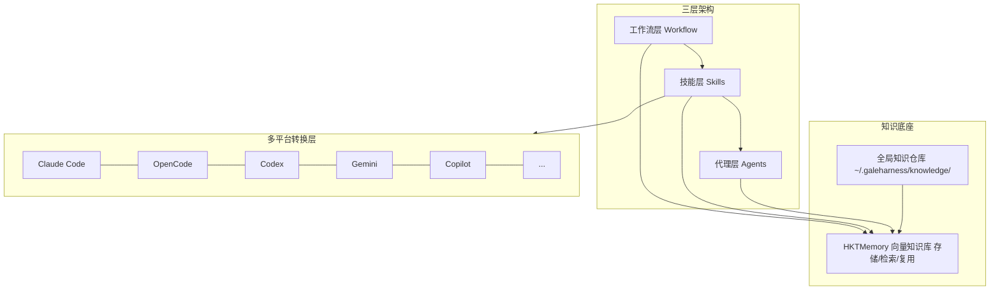
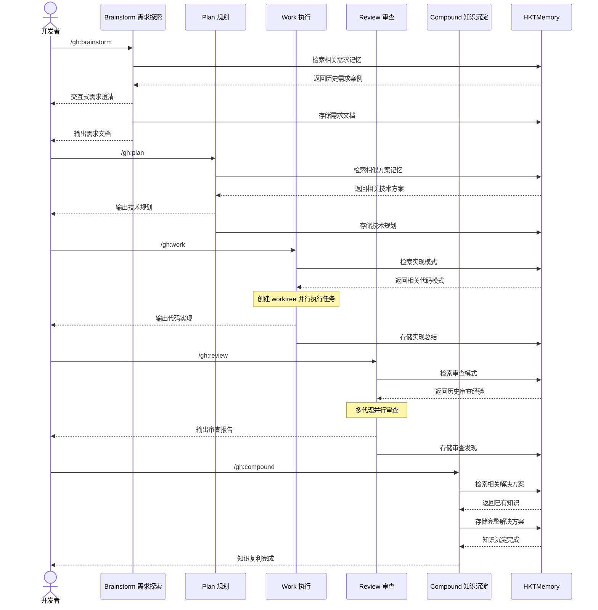
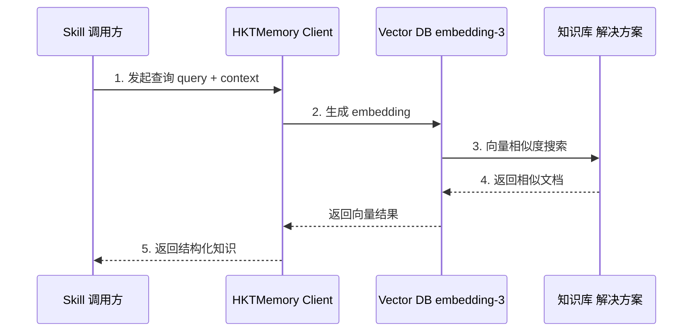
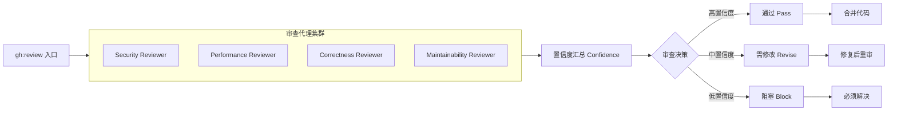

# GaleHarnessCLI

巨风科技研发团队提效工具 —— 基于 Compound Engineering 工作流与 HKTMemory 向量知识库的 AI 驱动开发套件。

## 目录

- [核心理念](#核心理念)
- [工作流](#工作流)
- [工程师实战指南](#工程师实战指南)
  - [场景一：新需求开发](#场景一新需求开发)
  - [场景二：Bug 修复](#场景二bug-修复)
  - [场景三：需求讨论与评审](#场景三需求讨论与评审)
  - [场景四：知识归档与复用](#场景四知识归档与复用)
  - [场景五：代码优化](#场景五代码优化)
  - [场景六：研究现有代码](#场景六研究现有代码)
  - [场景七：并行开发（Worktree 隔离）](#场景七并行开发worktree-隔离)
  - [场景八：探索改进机会](#场景八探索改进机会)
- [系统架构](#系统架构)
- [核心工作流时序图](#核心工作流时序图)
- [核心功能](#核心功能)
- [全局知识仓库](#全局知识仓库)
- [安装方式](#安装方式)
- [AI工具安装](#ai工具安装)
- [同步个人配置](#同步个人配置)
- [目录结构](#目录结构)
- [环境变量](#环境变量)
- [贡献指南](#贡献指南)
- [许可证](#许可证)

---

## 核心理念

**每一次工程实践都应该让后续工作变得更简单，而不是更复杂。**

传统开发累积技术债务，每个功能增加复杂度。HarnessCLI 反转这一模式：
- 80% 精力投入规划与审查
- 20% 精力投入执行
- 通过知识沉淀实现复利效应

---

## 工作流

```
Brainstorm -> Plan -> Work -> Review -> Compound -> Repeat
    ^
  Ideate (可选 -- 用于发现改进点)
```

**每个阶段都与 HKTMemory 向量知识库双向交互**：阶段开始前检索相关记忆，阶段完成后存储新产生的知识。

### 命令一览表

| 命令 | 用途 | HKTMemory 交互 |
|------|------|----------------|
| `/gh:ideate` | 通过发散思维和对抗性过滤发现高影响力改进点 | 检索历史建议，存储新发现 |
| `/gh:brainstorm` | 在规划前探索需求和方案，通过交互式问答细化想法 | 检索相关需求，存储需求文档 |
| `/gh:plan` | 将功能想法转化为详细实施计划，带自动置信度检查 | 检索相似方案，存储技术规划 |
| `/gh:work` | 系统化执行工作项，使用 worktree 和任务追踪 | 检索实现模式，存储实现总结 |
| `/gh:review` | 多代理代码审查，分层角色和置信度门控 | 检索审查模式，存储审查发现 |
| `/gh:compound` | 记录已解决问题，沉淀团队知识 | 检索相关解决方案，存储完整知识 |
| `/gh:debug` | 系统性查找根本原因并修复缺陷 | 检索类似问题，存储调试经验 |
| `/gh:optimize` | 迭代优化循环，并行实验和 LLM 评分 | 检索优化策略，存储优化结果 |
| `/document-review` | 多角色并行评审需求/方案文档 | 无 |
| `/gh:sessions` | 搜索历史 Claude Code/Codex/Cursor 会话 | 无 |
| `/gh:slack-research` | 搜索 Slack 获取组织上下文 | 无 |

> **入口说明**：`/gh:brainstorm` 是主要入口 —— 它通过交互式问答将想法细化为需求文档，在不需要时自动跳过。`/gh:ideate` 效果显著但使用较少 —— 基于代码库主动发现改进建议。

---

## 工程师实战指南

以研发导师的视角，指导工程师在不同开发场景下如何高效使用。

### 场景一：新需求开发

```
需求理解 -> 技术规划 -> 编码实现 -> 代码审查 -> 知识沉淀
```

| 步骤 | 命令 | 产出 |
|------|------|------|
| 需求探索 | `/gh:brainstorm "实现用户登录功能"` | 检索历史案例，输出结构化需求文档到 `docs/brainstorms/` |
| 技术规划 | `/gh:plan docs/brainstorms/user-login-requirements.md` | 检索相似方案，输出任务分解和置信度评估到 `docs/plans/` |
| 编码实现 | `/gh:work docs/plans/user-login-plan.md` | 创建 git worktree，检索实现模式，存储实现总结 |
| 代码审查 | `/gh:review` | 多代理并行审查（安全/性能/正确性/可维护性） |
| 知识沉淀 | `/gh:compound "用户登录功能的实现经验"` | 记录解决方案供未来参考 |

### 场景二：Bug 修复

```bash
# 推荐：使用完整工作流
/gh:debug

# 支持多种输入方式
/gh:debug "用户登录时偶尔出现 500 错误"
/gh:debug
> Error: Connection timeout at UserService.authenticate()
> Stack trace: ...
/gh:debug https://github.com/org/repo/issues/123
```

`/gh:debug` 会自动检索 HKTMemory 中类似历史问题，系统性定位根因，修复后自动存储调试经验。

### 场景三：需求讨论与评审

```bash
# 需求文档评审
/document-review docs/brainstorms/new-feature.md

# 技术方案评审
/document-review docs/plans/implementation-plan.md
```

多角色代理并行评审：**产品视角**（挑战假设/战略影响）、**安全视角**（数据暴露/认证漏洞）、**可行性视角**（技术可行性/架构冲突）、**范围视角**（复杂度/过度设计）。

### 场景四：知识归档与复用

```bash
# 归档已解决的问题
/gh:compound "解决大文件上传超时问题"

# 以上命令都会自动检索 HKTMemory
/gh:brainstorm "..."
/gh:plan "..."
/gh:debug "..."
```

### 场景五：代码优化

```bash
/gh:optimize "优化首页加载速度"
```

定义可测量目标，构建测量脚手架，并行运行多个实验方案，用 LLM 评分评估效果，自动保留改进方案。

### 场景六：研究现有代码

```bash
# 查询历史会话
/gh:sessions "上次我们是怎么处理认证问题的？"

/# 搜索 Slack 讨论
/gh:slack-research "团队对微服务拆分的讨论"
```

### 场景七：并行开发（Worktree 隔离）

多个需求可以同时推进，互不影响。每个 worktree 拥有独立的文件目录和分支，共享 Git 对象，创建速度快、占用空间小。

```bash
# 开需求1
/gh:brainstorm "实现用户登录"
# → 选择 Option 2: Use a worktree → 自动创建 brainstorm/user-login 分支和 worktree

# 开需求2（同时进行，互不干扰）
/gh:brainstorm "接入支付系统"
# → 选择 Option 2: Use a worktree → 自动创建 brainstorm/payment 分支和 worktree

# 查看所有进行中的工作
# git worktree list 或使用 git-worktree skill
```

**跨阶段复用**：从 `gh:brainstorm` 进入 `gh:work` 时，系统检测到已在 feature 分支，直接沿用，不会重复创建 worktree 或分支。如需调整分支名风格（如 `brainstorm/xxx` → `feat/xxx`），会提示 rename。

```bash
# brainstorm 阶段已创建 worktree + brainstorm/feature-a 分支
/gh:work docs/plans/feature-a-plan.md
# → 检测到已在 feature 分支 → 沿用，不重复创建
```

| 操作 | 命令 |
|------|------|
| 创建 worktree | `/gh:brainstorm` 或 `/gh:work` 中选择 worktree 选项 |
| 查看所有 worktree | `git worktree list` 或 `/git-worktree` skill |
| 切换 worktree | `/git-worktree` skill |
| 清理完成的 worktree | `/git-worktree` skill |

### 场景八：探索改进机会

```bash
/gh:ideate
```

扫描代码库发现潜在改进点，通过发散思维生成建议，使用对抗性过滤筛选高价值项目，引导选择优先方向。

---

## 系统架构



---

## 核心工作流时序图

### 1. 完整开发周期（记忆驱动）



### 2. HKTMemory 知识检索流程



### 3. 代码审查流水线



---

## 核心功能

### 工作流命令

每个命令在执行前后都与 HKTMemory 交互，实现记忆驱动的开发。

### 研究代理

| 代理 | 功能 |
|------|------|
| `learnings-researcher` | 搜索机构知识库寻找相关过往解决方案 |
| `session-historian` | 搜索 Claude Code、Codex、Cursor 历史会话 |
| `slack-researcher` | 搜索 Slack 获取组织上下文 |
| `issue-intelligence-analyst` | 分析 GitHub Issues 发现重复主题和痛点 |

### 审查代理

| 代理 | 功能 |
|------|------|
| `security-reviewer` | 安全漏洞检测，带置信度校准 |
| `performance-reviewer` | 运行时性能分析 |
| `correctness-reviewer` | 逻辑错误、边界情况、状态缺陷 |
| `maintainability-reviewer` | 耦合度、复杂度、命名、死代码 |
| `testing-reviewer` | 测试覆盖缺口、弱断言 |

---

## 全局知识仓库

所有 `gh:` 工作流技能产生的知识文档统一存储到 `~/.galeharness/knowledge/<project>/<type>/`。

**路径解析优先级**：
1. 环境变量 `GALE_KNOWLEDGE_HOME`（最高）
2. 配置文件 `~/.galeharness/config.json` 或 `config.yaml` 中的 `knowledge_home`
3. 默认 `~/.galeharness/knowledge/`

项目仓库保持整洁，知识积累在 Git 管理的专属存储中。写入失败时自动回退到项目本地 `docs/` 目录。

### CLI 管理命令

| 命令 | 功能 |
|------|------|
| `gale-knowledge init` | 初始化全局知识仓库（含 Git） |
| `gale-knowledge resolve-home` | 输出知识仓库根目录路径 |
| `gale-knowledge resolve-path --type <type>` | 输出指定类型的文档目录路径 |
| `gale-knowledge extract-project` | 输出当前项目名（从 Git remote 提取） |
| `gale-knowledge commit` | 批量提交知识文档 |
| `gale-knowledge rebuild-index` | 重建 HKTMemory 向量索引（支持增量/全量） |

### 示例

```bash
gale-knowledge init
gale-knowledge resolve-home
gale-knowledge resolve-path --type brainstorms
gale-knowledge rebuild-index      # 增量模式
gale-knowledge rebuild-index --full  # 全量
```

---

## 安装方式

### 前置要求

- macOS 11+ 或 Windows 10/11
- 能联网的终端（macOS: Terminal / iTerm2，Windows: PowerShell）

> 不需要预先安装任何工具。一键脚本会自动检测并安装缺失的依赖。

### 一键安装

#### macOS

```bash
git clone https://github.com/wangrenzhu-ola/GaleHarnessCodingCLI.git
cd GaleHarnessCodingCLI
bash scripts/setup.sh
```

#### Windows

**已有 Git：**

```powershell
git config --global credential.helper ""
$latestTag = (git ls-remote --tags --sort="-v:refname" https://github.com/wangrenzhu-ola/GaleHarnessCodingCLI.git | Select-Object -First 1).Split("`t")[1].Replace("refs/tags/", "")
git clone --branch $latestTag --depth 1 --single-branch https://github.com/wangrenzhu-ola/GaleHarnessCodingCLI.git
cd GaleHarnessCodingCLI
.\scripts\setup.ps1
```

**全新 Windows（未安装 Git）：**

```powershell
# 首选：jsDelivr CDN（国内快）
irm https://cdn.jsdelivr.net/gh/wangrenzhu-ola/GaleHarnessCodingCLI@main/scripts/bootstrap.ps1 | iex

# 备选：GitHub 官方源
irm https://raw.githubusercontent.com/wangrenzhu-ola/GaleHarnessCodingCLI/main/scripts/bootstrap.ps1 | iex
```

> **PowerShell 执行策略：** 如果脚本无法运行，先执行：`Set-ExecutionPolicy -ExecutionPolicy RemoteSigned -Scope CurrentUser`

### 安装后自检

重新打开终端后依次运行：

```bash
bun --version                    # 期望: 1.x.x
python3 --version                # 期望: Python 3.9+
uv --version                     # 期望: uv x.x.x
gale-harness --help              # 期望: 显示 CLI 帮助
gale-knowledge init              # 初始化知识仓库
gale-knowledge resolve-home      # 期望: ~/.galeharness/knowledge/
uv run vendor/hkt-memory/scripts/hkt_memory_v5.py stats  # 期望: 统计信息
bun test                         # 期望: 测试通过
```

---

## AI工具安装

在 repo 根目录执行：

```bash
# 安装到所有检测到的平台
gale-harness install ./plugins/galeharness-cli --to all

# 指定平台
gale-harness install ./plugins/galeharness-cli --to claude
gale-harness install ./plugins/galeharness-cli --to cursor
gale-harness install ./plugins/galeharness-cli --to kimi
```

**支持的平台 (15个)：** `claude`, `opencode`, `codex`, `droid`, `pi`, `gemini`, `copilot`, `kiro`, `windsurf`, `openclaw`, `qwen`, `qoder`, `trae`, `cursor`, `kimi`

**Claude Code 本地插件模式：**

```bash
alias ghc='claude --plugin-dir /path/to/GaleHarnessCodingCLI/plugins/galeharness-cli'
```

### 项目初始化

```bash
/gh:setup
```

这将诊断环境配置、安装缺失推荐工具、引导项目配置、验证 HKTMemory 连接状态。

---

## 同步个人配置

将个人 Claude Code 配置同步到其他 AI 编码工具：

```bash
# 在仓库根目录执行，同步到所有检测到的工具
bun run src/index.ts sync

# 同步到特定平台
bun run src/index.ts sync --target opencode
bun run src/index.ts sync --target codex
```

同步内容：个人 skills（符号链接）、斜杠命令、MCP servers。

---

## 目录结构

```
GaleHarnessCodingCLI/
├── cmd/gale-knowledge/          # 全局知识仓库 CLI
├── src/                         # 主入口、转换器、目标写入器
├── plugins/
│   ├── galeharness-cli/         # 核心工作流插件 (gh: prefix)
│   └── coding-tutor/            # 编程导师插件
├── vendor/hkt-memory/           # HKTMemory v5.0 向量知识库
├── scripts/                     # 发布工具
├── tests/                       # 测试
├── docs/                        # 需求、规划、解决方案、规范
└── .claude-plugin/              # Claude 市场目录元数据
```

---

## 环境变量

安装脚本自动配置，通常无需手动操作。

| 变量 | 说明 | 必需 |
|------|------|------|
| `HKT_MEMORY_API_KEY` | HKTMemory API 密钥 | 否（可用文件模式） |
| `HKT_MEMORY_BASE_URL` | HKTMemory 服务端点 | 否（可用文件模式） |
| `HKT_MEMORY_MODEL` | Embedding 模型 | 否（可用文件模式） |
| `HKT_MEMORY_FILE_MODE` | 启用纯文件模式（无需 API） | 否 |
| `GALE_KNOWLEDGE_HOME` | 全局知识仓库路径 | 否 |

**文件模式**：`HKT_MEMORY_FILE_MODE=true` 可在无 API 密钥情况下使用 HKTMemory。

**手动修改位置**：
- macOS：`~/.zshrc` 或 `~/.bashrc`
- Windows：`notepad $PROFILE` 或系统环境变量

---

## 贡献指南

1. **测试**：更改后运行 `bun test`
2. **验证**：运行 `bun run release:validate` 验证插件一致性
3. **提交**：使用 conventional commits（`feat:`、`fix:`、`docs:` 等）

---

## 许可证

MIT License - 巨风科技研发团队
