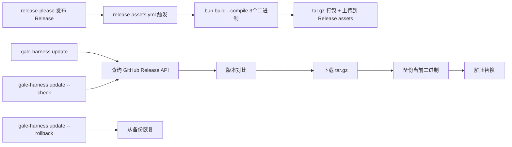

# feat: CLI 自更新能力实施计划

## Problem Frame

GaleHarnessCLI 不具备自更新能力。用户获取新版本只能手动 `git pull` 或重跑 `setup.sh`。需求文档 `docs/brainstorms/2026-04-23-cli-self-update-requirements.md` 定义了 11 项需求（R1-R11）、6 项成功标准（SC1-SC6）。

本计划将需求转化为 7 个实施单元，按依赖顺序执行。

## High-Level Technical Design



**核心决策**：

1. **CI 产物构建采用独立 workflow**：新增 `release-assets.yml`，触发条件为 `release: published`（release-please 发布 Release 后自动触发），而非在 `release-pr.yml` 中添加步骤。原因：release-please 创建 Release 是异步的，当前 workflow 无法等待其完成。

2. **二进制定位策略**：使用 `Bun.execPath` 获取当前运行二进制的绝对路径，`path.dirname` 得到安装目录。对于 `bun link` 安装（开发模式），提示用户改用编译版本。备份目录固定为 `~/.galeharness/backup/{version}/`。

3. **GitHub API 访问**：直接使用 `fetch` 调用 GitHub REST API（`/repos/{owner}/{repo}/releases/latest`），无需依赖 `gh` CLI。支持 `COMPOUND_PLUGIN_GITHUB_SOURCE` 环境变量覆盖仓库地址（与 install 命令一致）。

4. **回滚机制**：更新前将三个二进制复制到 `~/.galeharness/backup/{current-version}/`，只保留一个备份版本。更新失败时自动回滚。`--rollback` 可手动回滚到上一版本。

## Implementation Units

- [ ] U1. **Release 编译脚本**
- [ ] U2. **CI Release 产物上传 workflow**
- [ ] U3. **update 子命令核心逻辑**
- [ ] U4. **注册 update 子命令到 CLI 入口**
- [ ] U5. **update 命令测试**
- [ ] U6. **修复 gh:update skill**
- [ ] U7. **package.json 构建脚本**

---

### U1. Release 编译脚本

**Goal**: 创建可复用的编译脚本，将三个二进制入口编译为独立可执行文件并打包为 tar.gz

**Requirements**: R1, R2, R3, R4

**Dependencies**: 无

**Files**:
- `scripts/release/build.ts` — 新增

**Approach**:
- 编译三个入口：`src/index.ts` → `gale-harness`，`src/index.ts` → `compound-plugin`（同入口不同名称），`cmd/gale-knowledge/index.ts` → `gale-knowledge`
- 使用 `bun build --compile --target bun`，与现有 `build:gale-task` 脚本模式一致
- 生成 `VERSION` 文本文件（内容为 `package.json` 中的 version）
- 打包为 `galeharness-cli-{version}-darwin-arm64.tar.gz`
- 脚本接受 `--version` 参数（CI 传入 release tag 中的版本号）和 `--platform` 参数（默认 `darwin-arm64`）
- 脚本输出 tar.gz 文件路径到 stdout，便于 CI 后续步骤使用

**Patterns to follow**: `package.json` 中 `build:gale-task` 的 `bun build --compile` 用法

**Technical design** (directional):

```
# 编译流程
1. mkdir -p /tmp/galeharness-build
2. bun build --compile src/index.ts --outfile /tmp/galeharness-build/gale-harness --target bun
3. cp /tmp/galeharness-build/gale-harness /tmp/galeharness-build/compound-plugin
4. bun build --compile cmd/gale-knowledge/index.ts --outfile /tmp/galeharness-build/gale-knowledge --target bun
5. echo "{version}" > /tmp/galeharness-build/VERSION
6. tar -czf galeharness-cli-{version}-darwin-arm64.tar.gz -C /tmp/galeharness-build gale-harness compound-plugin gale-knowledge VERSION
7. 输出 tar.gz 文件路径
```

---

### U2. CI Release 产物上传 workflow

**Goal**: 在 release-please 发布 Release 后自动编译并上传 tar.gz 产物

**Requirements**: R1, R2, R3, R4, SC6

**Dependencies**: U1

**Files**:
- `.github/workflows/release-assets.yml` — 新增

**Approach**:
- 新增独立 workflow，触发条件 `on: release: types: [published]`
- 仅在 tag 匹配 `galeharness-cli-v*` 时执行（使用 `if: startsWith(github.event.release.tag_name, 'galeharness-cli-v')`）
- 步骤：checkout → setup bun → install deps → run build script → upload asset to release
- 使用 `softprops/action-gh-release` 或 `gh release upload` 上传产物
- 当前仅 macOS arm64（`runs-on: macos-latest`，Apple Silicon runner）
- 架构预留：workflow 中 `platform` 矩阵可后续扩展

**Patterns to follow**: 现有 `.github/workflows/release-pr.yml` 的 Bun setup 步骤

**Technical design** (directional):

```yaml
name: Release Assets
on:
  release:
    types: [published]

jobs:
  build-and-upload:
    if: startsWith(github.event.release.tag_name, 'galeharness-cli-v')
    runs-on: macos-latest
    steps:
      - uses: actions/checkout@v6
      - uses: oven-sh/setup-bun@v2
      - run: bun install --frozen-lockfile
      - run: bun run scripts/release/build.ts --version ${{ github.event.release.tag_name }}
      - uses: softprops/action-gh-release@v2
        with:
          files: galeharness-cli-*.tar.gz
```

**Test scenarios**:
- 手动触发 workflow_dispatch 测试编译和上传
- 验证 Release assets 中包含 tar.gz 文件
- 验证 tar.gz 内包含三个二进制 + VERSION 文件

---

### U3. update 子命令核心逻辑

**Goal**: 实现 `gale-harness update` 子命令，支持版本检查、自动更新和回滚

**Requirements**: R5, R6, R7, R8, R9, SC1, SC2, SC3, SC4

**Dependencies**: U1（需要 Release 中有产物才能端到端测试，但代码可独立编写）

**Files**:
- `src/commands/update.ts` — 新增
- `src/utils/update.ts` — 新增（更新逻辑核心，与命令定义解耦）

**Approach**:

**命令定义** (`src/commands/update.ts`):
- 使用 `citty` 的 `defineCommand`，与 sync/install 命令模式一致
- args: `--check`（boolean，仅检查）、`--rollback`（boolean，回滚）
- 将核心逻辑放在 `src/utils/update.ts`，命令文件只做参数解析和调用

**核心逻辑** (`src/utils/update.ts`):
- `resolveGitHubSource()`: 复用 install.ts 的模式，读取 `COMPOUND_PLUGIN_GITHUB_SOURCE` 环境变量，默认 `wangrenzhu-ola/GaleHarnessCLI`
- `getCurrentVersion()`: 从 `package.json` 的 `version` 字段读取（编译时嵌入）
- `getLatestVersion(repo)`: 调用 `https://api.github.com/repos/{owner}/{repo}/releases/latest`，过滤 tag 前缀 `galeharness-cli-v`，提取版本号
- `downloadAsset(url, destDir)`: 下载 tar.gz 到临时目录，校验文件大小 > 0
- `backupBinaries(binDir, version)`: 复制三个二进制到 `~/.galeharness/backup/{version}/`
- `replaceBinaries(binDir, extractDir)`: 解压 tar.gz，替换 binDir 下的三个二进制 + 更新 VERSION
- `rollback(version)`: 从 `~/.galeharness/backup/{version}/` 恢复二进制

**二进制定位**:
- 使用 `Bun.execPath` 获取当前运行二进制路径
- 如果是编译二进制，`Bun.execPath` 返回二进制本身路径，`path.dirname` 得到安装目录
- 如果是 `bun run`（开发模式），检测到 Bun runtime 路径后提示用户需要使用编译版本
- 三个二进制在同一目录下（`gale-harness`、`compound-plugin`、`gale-knowledge`）

**错误处理**:
- 下载失败：清理临时文件，报错
- 解压失败：自动回滚到备份版本，报错
- 替换失败：自动回滚到备份版本，报错
- 备份不存在时 `--rollback`：报错 "No backup available"

**Patterns to follow**: `src/commands/install.ts` 的 `resolveGitHubSource()` 模式、`src/commands/sync.ts` 的命令定义模式

**Technical design** (directional):

```
update --check 流程:
  1. current = getCurrentVersion()
  2. latest, assetUrl = getLatestVersion(repo)
  3. if current === latest → "Already up to date (v{current})"
  4. else → "Update available: v{current} → v{latest}"

update 流程:
  1. current = getCurrentVersion()
  2. latest, assetUrl = getLatestVersion(repo)
  3. if current === latest → "Already up to date"
  4. binDir = detectBinDir() // from Bun.execPath
  5. tempDir = mkdtemp()
  6. downloadAsset(assetUrl, tempDir)
  7. backupBinaries(binDir, current)
  8. try { replaceBinaries(binDir, tempDir) }
     catch { rollback(current); throw }
  9. "Updated: v{current} → v{latest}"

update --rollback 流程:
  1. backupDir = ~/.galeharness/backup/
  2. 找到最新的备份版本目录
  3. rollback(backupVersion)
  4. "Rolled back to v{backupVersion}"
```

---

### U4. 注册 update 子命令到 CLI 入口

**Goal**: 将 update 子命令注册到 CLI 主入口

**Requirements**: R5

**Dependencies**: U3

**Files**:
- `src/index.ts` — 修改（添加 import 和 subCommands 注册）

**Approach**:
- 在 `src/index.ts` 中 `import update from "./commands/update"`
- 在 `subCommands` 对象中添加 `update: () => update`

**Patterns to follow**: 现有 6 个子命令的注册方式（第 4-9 行的 import + 第 17-24 行的 subCommands）

---

### U5. update 命令测试

**Goal**: 为 update 子命令编写全面的测试

**Requirements**: SC1, SC2, SC3, SC4

**Dependencies**: U3, U4

**Files**:
- `tests/update-command.test.ts` — 新增

**Approach**:
- 参考 `tests/cli.test.ts` 的测试模式：spawn `bun run src/index.ts update` 子进程，检查 exit code 和 stdout
- 使用 mock HTTP server 或 mock GitHub API 响应来测试版本检查和更新逻辑
- 测试场景：

| 场景 | 描述 | 验证 |
|------|------|------|
| check-uptodate | 当前已是最新版本 | stdout 包含 "Already up to date" |
| check-update-available | 有新版本可用 | stdout 包含 "Update available" |
| update-success | 正常更新流程 | 二进制被替换，stdout 包含版本变更信息 |
| update-rollback-on-failure | 更新失败自动回滚 | 回滚到备份版本 |
| rollback-manual | 手动回滚 | 恢复到上一版本 |
| rollback-no-backup | 无备份时回滚 | 报错 "No backup available" |
| dev-mode-detection | 在 bun run 模式下运行 update | 提示需要编译版本 |
| env-override | COMPOUND_PLUGIN_GITHUB_SOURCE 覆盖 | 使用覆盖后的仓库地址 |

**关键测试策略**:
- 核心逻辑测试（`src/utils/update.ts`）可直接 import 函数，mock fetch 和 fs 操作
- CLI 集成测试 spawn 子进程，使用临时目录和 mock 环境变量
- 下载测试使用本地 HTTP server 提供预构建的 tar.gz

---

### U6. 修复 gh:update skill

**Goal**: 修正 gh:update skill 的仓库指向、tag 格式和缓存路径，增加 CLI 更新提示

**Requirements**: R10, R11, SC5

**Dependencies**: 无（可独立先行）

**Files**:
- `plugins/galeharness-cli/skills/gh-update/SKILL.md` — 修改

**Approach**:
具体修改点：
1. 第 31 行：`--repo EveryInc/compound-engineering-plugin` → `--repo wangrenzhu-ola/GaleHarnessCLI`
2. 第 31 行：`startswith("compound-engineering-v")` → `startswith("galeharness-cli-v")`
3. 第 31 行：`sub("compound-engineering-v";"")` → `sub("galeharness-cli-v";"")`
4. 第 34 行：缓存路径 `compound-engineering-plugin/compound-engineering/` → `gale-harness-cli/galeharness-cli/`（基于 marketplace.json 中的 name 和 plugin name）
5. 第 64 行：删除路径 `compound-engineering-plugin/compound-engineering` → `gale-harness-cli/galeharness-cli`
6. 第 56、68 行：将 "compound-engineering" 替换为 "GaleHarnessCLI"
7. 新增提示：告知用户可通过 `gale-harness update` 更新 CLI 本身

**验证**: 修改后的 skill 内容语义正确，仓库地址、tag 前缀、缓存路径均指向正确的值

---

### U7. package.json 构建脚本

**Goal**: 在 package.json 中添加 release 构建脚本

**Requirements**: R1, R2

**Dependencies**: U1

**Files**:
- `package.json` — 修改（添加 scripts）

**Approach**:
- 添加 `"build:release": "bun run scripts/release/build.ts"` 脚本
- 添加 `"build:cli": "bun build --compile src/index.ts --outfile gale-harness --target bun"` 脚本（本地开发用）
- 保留现有的 `build:gale-task` 和 `install-gale-task` 脚本

**Patterns to follow**: 现有 `build:gale-task` 和 `install-gale-task` 脚本格式

---

## System-Wide Impact

| 影响面 | 说明 |
|--------|------|
| CI/CD | 新增 `release-assets.yml` workflow，macOS runner 产生费用 |
| CLI 接口 | 新增 `update` 子命令，变更 CLI 公共 API surface |
| 环境变量 | 复用现有 `COMPOUND_PLUGIN_GITHUB_SOURCE`，不新增 |
| 用户工作流 | `gale-harness update` 替代手动 `git pull` |

## Risks

| 风险 | 缓解 |
|------|------|
| 编译产物体积较大（Bun 单二进制约 80-120MB） | tar.gz 压缩后约 30-50MB，可接受 |
| `Bun.execPath` 在不同安装模式下行为不同 | 添加开发模式检测和友好提示 |
| macOS runner 的 CI 费用 | macOS runner 分钟数是 Linux 的 10 倍，但仅在 release 时触发，频率低 |
| 回滚只保留一个备份版本 | 符合当前需求，复杂场景可后续扩展 |
| release-please 与 release-assets.yml 的时序 | 使用 `release: published` 事件确保 release 已创建 |

## Execution Sequence

```
U6 (gh:update skill 修复，独立先行)
  ↓
U1 (编译脚本) → U7 (package.json 脚本)
  ↓
U2 (CI workflow)
  ↓
U3 (update 核心逻辑) → U4 (注册子命令)
  ↓
U5 (测试)
```

U6 和 U1-U7 可以并行开发，但 U2 依赖 U1，U4 依赖 U3，U5 依赖 U3+U4。
