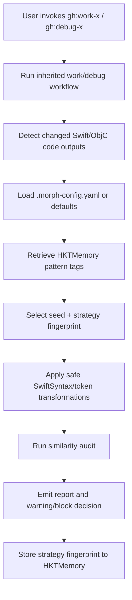
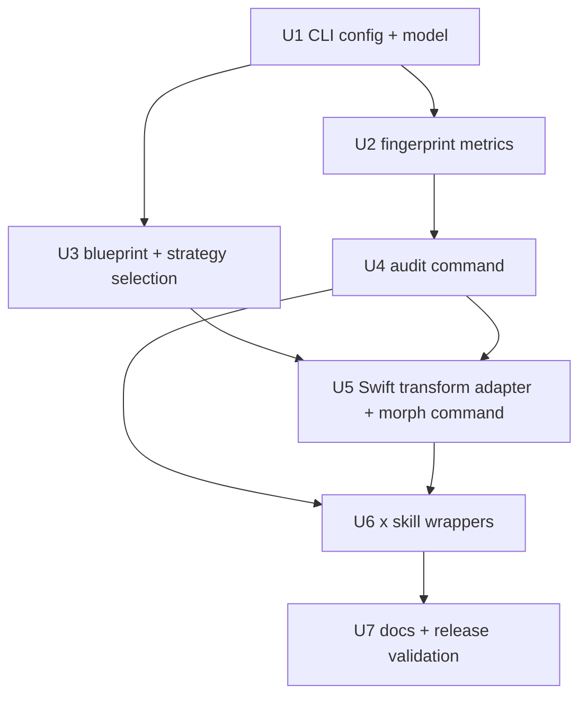

# feat: iOS Morph-X 防重复代码生成 Skills

## Overview

本计划为 GaleHarnessCLI 增加面向 iOS Swift/ObjC 代码产出的 `-x` 系列工作流：`gh:work-x` 与 `gh:debug-x`。它们继承原有 `gh:work` / `gh:debug` 的执行与调试能力，但把差异化前移到代码生成决策阶段：先用项目种子和历史模式标签选择不同的实现蓝图，再在最终代码产出后执行 AST 安全整理、自检和记忆回写，降低不同 iOS 项目之间因模板化代码生成造成的重复风险。

重要边界：本功能只能帮助团队识别并减少代码结构层面的重复与模板化输出，不能保证 App Review 通过，也不能替代真实的产品、UI、内容和功能差异。Apple App Review Guideline 4.3 当前明确关注重复 Bundle ID、相似/重打包应用和饱和品类，代码相似度只是风险信号之一，不应把本功能设计成规避审核的欺骗工具。

---

## Problem Frame

现有 `gh:work` 与 `gh:debug` 会通过 HKTMemory 复用历史实现经验。复用本身是 GaleHarnessCLI 的核心价值，但在 A/B 包、白标包或连续 iOS 项目交付中，反复复用相同 Swift/ObjC 结构、命名、文件布局和控制流，会把“高效复用”推向“高度同构输出”。用户需求要求保留记忆复用，同时让代码产出在架构蓝图、文件边界、AST、token 和控制流层面具备可验证的结构差异。

更稳的技术判断是：不要把主方案押在“同一份实现的后置 AST 变形”上。后置变形能降低局部相似度，但很难改变模块分工、状态流、协议边界和错误传播路径；这些更容易成为跨项目同构信号。因此 `-x` 应采用三层管线：生成前选择原创实现蓝图，生成中约束 agent 不复刻历史代码形状，生成后做 AST 安全变换与相似度审计。

计划选择新增独立 `-x` skills，而不是改动原版 skills。这样默认工作流保持稳定，只有明确选择 iOS 降重场景时才启用 Morph-X 管线。

---

## Requirements Trace

- R1. 生成前原创实现蓝图：在 agent 写代码前选择项目级 implementation blueprint，覆盖状态管理、模块边界、文件拆分、协议抽取、错误处理和数据流组织。
- R2. AST 安全差异化引擎：Swift/ObjC 代码产出后进行不改变语义的结构变换，覆盖命名、控制流、结构布局和文件内排序等维度。
- R3. `-x` 系列技能封装：新增 `gh:work-x`、`gh:debug-x`，继承原版流程能力，原版 `gh:work` / `gh:debug` 不修改。
- R4. 记忆感知差异化：读取历史模式标签，优先选择与已用策略距离更远的蓝图和变体，并将本次种子、蓝图指纹与策略指纹写回 HKTMemory。
- R5. 相似度自检门禁：自动和手动计算 AST 结构指纹、token n-gram、控制流近似指标，支持可配置告警/阻塞。
- R6. 项目级差异化配置：支持 `.morph-config.yaml`，包含项目种子、阈值、历史变体、基准库与黑名单模式。
- SC1. `-x` 版本能力等价：原版流程能力不减少，测试通过率不回退。
- SC2. 相似度降低：同需求不同种子输出的语句级 Jaccard 相似度目标低于 10%，原版与 `-x` 输出低于 15%。
- SC3. 编译零回归：变换后的 Swift/ObjC 代码需要保持可编译。
- SC4. 性能可控：Morph-X 管线目标不超过整体生成时间 30% 的额外开销。

---

## Scope Boundaries

- 不修改原版 `plugins/galeharness-cli/skills/gh-work/SKILL.md` 与 `plugins/galeharness-cli/skills/gh-debug/SKILL.md` 的现有行为。
- 不承诺或宣称“绕过 Apple 审核”；计划只提供重复风险降低与自检证据。
- 不做 UI、素材、元数据、业务概念或 App Store Listing 差异化。
- 不做运行时代码混淆、Xcode build phase 注入或二进制层混淆。
- 不做跨语言通用降重；一期只覆盖 Swift，ObjC 先以检测与有限重排支持为主。
- 不把外部 Swift 工具链设为普通 GaleHarnessCLI 用户的必需依赖；缺少 SwiftSyntax 环境时，CLI 需要降级到 token/文本结构审计并给出清晰原因。

### Deferred to Follow-Up Work

- ObjC 完整 AST 变换：一期先建立接口和检测路径，完整语义安全变换留到后续。
- 自动跨项目基准库同步服务：一期只支持本地目录/配置指定的基准库。
- Swift 编译验证深度集成：一期提供钩子与建议，实际 Xcode build/test 由实现阶段根据目标项目环境接入。

---

## Context & Research

### Relevant Code and Patterns

- `plugins/galeharness-cli/skills/gh-work/SKILL.md`：现有执行工作流，包含 HKTMemory retrieve、session-search、执行循环、质量检查和最终 store。
- `plugins/galeharness-cli/skills/gh-debug/SKILL.md`：现有调试工作流，包含系统化根因分析、修复阶段、HKTMemory retrieve/session-search/store。
- `tests/hkt-memory-compounding.test.ts`：核心 workflow skills 的 HKT-PATCH 契约测试，新增 `gh-work-x` / `gh-debug-x` 后需要决定是否纳入 compounding loop。
- `src/index.ts` 与 `src/commands/*`：CLI 子命令注册模式；`gale-harness audit --similarity` 需要通过这里暴露。
- `src/parsers/claude.ts`、`src/converters/claude-to-*`、`src/targets/*`：skills 以目录为单位复制，`SKILL.md` frontmatter 决定名称和描述；新增 skill 目录会自动进入转换输出。
- `tests/*writer.test.ts` 与 `tests/*converter.test.ts`：多平台转换对 skill 目录复制和 Task 引用变换有覆盖；新增 skill 主要需要增量契约测试，而不是逐个平台手写枚举。
- `plugins/galeharness-cli/README.md`：用户可见 skill inventory，新增 `-x` 入口需要更新。

### Institutional Learnings

- `docs/solutions/skill-design/research-agent-pipeline-separation-2026-04-05.md` 强调 `gh:plan` 与 `gh:work` 职责分离；本计划保持 `-x` 为执行期能力，不把实际变换塞入 planning。
- `docs/solutions/integration-issues/hktmemory-pr2-vendor-sync-session-search-integration-2026-04-22.md` 与 `docs/plans/2026-04-22-001-feat-hktmemory-pr2-upgrade-plan.md` 显示 HKTMemory 集成应使用显式 HKT-PATCH 段落，并保持失败不阻塞主流程。
- `tests/hkt-memory-compounding.test.ts` 已把 retrieve-before-store、非阻塞失败和 patch 命名约定固化为测试。`-x` skills 应沿用这些约定，而不是引入隐式框架魔法。

### External References

- Apple App Review Guidelines, Guideline 4.3 Spam：官方页面当前说明不要创建同一 app 的多个 Bundle ID，也会拒绝饱和品类中缺乏独特高质量体验的应用。来源：[Apple App Review Guidelines](https://developer.apple.com/appstore/resources/approval/guidelines.html)
- Apple Developer Forums 中 App Review 团队对 4.3 的公开答复指出相似 binary、metadata 和 overall concept 都可能构成风险，并建议通过 App Review Appointment 沟通。来源：[Apple Developer Forums 4.3B Spam Error](https://developer.apple.com/forums/thread/789153)
- SwiftSyntax 是 Swift 官方生态中用于解析、检查、生成和转换 Swift source 的库，适合作为 Swift AST 安全变换的基础。来源：[swiftlang/swift-syntax](https://github.com/swiftlang/swift-syntax)
- Swift Package Manager 官方文档可用于规划 SwiftSyntax sidecar 工具的依赖和构建方式。来源：[Swift Package Manager](https://docs.swift.org/package-manager/)

---

## Key Technical Decisions

- 新增 `gh:work-x` / `gh:debug-x`，不改原版 skills：降低回归风险，并让用户显式选择 iOS 降重模式。
- 主方案采用“生成前蓝图分叉 + 生成后 AST 安全变换”，而不是纯后置变形：蓝图层负责制造真实的实现结构差异，AST 层负责在不改变语义的前提下进一步降低局部同构。
- HKTMemory 只提供可迁移的经验、约束和反例标签，不允许 `-x` skills 直接要求 agent 复刻历史代码结构：记忆检索结果需要先转成 blueprint constraints，再由项目 seed 选择差异化实现路径。
- 将 Morph-X 能力落在 CLI shared engine，而不是复制大段脚本到每个 skill：`SKILL.md` 只能引用自身目录内文件，但 CLI 是插件安装后的共享执行入口，适合承载跨 skill 的 parser、config、audit、transform 和 fingerprint 逻辑。
- Swift 一期使用 SwiftSyntax adapter，TypeScript/Bun 负责编排、配置、报告与测试夹具：SwiftSyntax 更适合 AST 安全性，Bun 保持与现有 CLI 架构一致。
- ObjC 一期只提供 token/结构检测和保守布局变换接口：完整 ObjC AST 安全变换需要额外 parser 选型，不能在一期假装可安全完成。
- 相似度门禁默认告警、不默认阻塞：用户需求允许可配置阻塞；默认阻塞会让缺少基准库或 Swift 工具链的项目不可用。
- `.morph-config.yaml` 读取目标项目根目录，而不是 GaleHarnessCLI 仓库根目录：`-x` skills 运行在用户项目中，配置必须跟随被生成的 iOS 项目。
- 策略指纹只存摘要和标签到 HKTMemory，不存完整源码：HKTMemory 负责发现和调度记忆，不应成为源码全文或敏感业务逻辑仓库。
- CLI surface 采用 `gale-harness audit --similarity` 作为稳定手动扫描入口；另提供受控的 `gale-harness morph --apply` 执行入口供 `-x` skills 调用。`morph` 命令先按 experimental/internal 文案处理，避免过早承诺长期公共 API。

---

## Open Questions

### Resolved During Planning

- 是否改动原版 `gh:work` / `gh:debug`：不改，新增 `-x` 变体。
- 一期是否覆盖所有 skills：不覆盖，只覆盖直接产出或修改代码的 `gh:work` 与 `gh:debug`。
- 是否需要外部研究：需要。Apple 4.3 是当前平台规则，SwiftSyntax 是关键工具选型，均需要官方来源约束。
- 计划深度：Deep。该变更跨 plugin skill、CLI、HKTMemory、测试、README 和外部 Swift 工具链。

### Deferred to Implementation

- SwiftSyntax sidecar 的具体 package 版本：实现时根据当前本机 Swift toolchain 和 SwiftSyntax release 选择，测试中锁定可复现版本。
- ObjC parser 的最终方案：一期只建立接口和保守检测，完整变换另开后续。
- 精确阈值默认值：先按需求目标设计配置字段和报告结构，具体默认阈值需要用真实项目基准样本校准。
- 编译验证命令：不同 iOS 项目使用 Xcode project、workspace 或 Swift Package，执行期读取目标项目后再决定。

---

## Output Structure

```text
plugins/galeharness-cli/skills/
  gh-work-x/
    SKILL.md
  gh-debug-x/
    SKILL.md

src/
  commands/
    audit.ts
    morph.ts
  morph/
    blueprints.ts
    config.ts
    fingerprints.ts
    metrics.ts
    report.ts
    strategies.ts
    swift-adapter.ts
    types.ts

tests/
  morph-config.test.ts
  morph-fingerprints.test.ts
  morph-metrics.test.ts
  morph-strategies.test.ts
  audit-command.test.ts
  x-skill-contract.test.ts
```

这个结构说明预期输出形态，实施时可根据现有模块边界微调；每个单元的 `Files` 列表仍是更具体的执行范围。

---

## High-Level Technical Design

> *This illustrates the intended approach and is directional guidance for review, not implementation specification. The implementing agent should treat it as context, not code to reproduce.*



依赖关系：



---

## Implementation Units

- [ ] U1. **Morph-X 配置与数据模型**

**Goal:** 建立 `.morph-config.yaml`、项目种子、阈值、基准库、策略指纹和报告结构的共享 TypeScript 类型与加载逻辑。

**Requirements:** R1, R4, R5, R6, SC4

**Dependencies:** None

**Files:**
- Create: `src/morph/types.ts`
- Create: `src/morph/config.ts`
- Test: `tests/morph-config.test.ts`

**Approach:**
- 从目标项目根目录读取 `.morph-config.yaml`，缺失时生成内存默认值，不自动写文件。
- 支持显式 seed、随机 seed fallback、similarity thresholds、baseline paths、blacklisted pattern tags、used strategy fingerprints。
- 配置解析沿用 repo 已有 `js-yaml` 依赖，避免引入新的 YAML parser。
- 默认值要偏保守：缺少基准库时仍可输出本次 fingerprint，但相似度报告标记为 `baseline_missing`。

**Patterns to follow:**
- `src/utils/frontmatter.ts` 的轻量解析/错误边界风格。
- `src/utils/files.ts` 的文件存在性和读写辅助模式。
- `tests/knowledge-path.test.ts`、`tests/resolve-output.test.ts` 的临时目录测试方式。

**Test scenarios:**
- Happy path: 给定完整 `.morph-config.yaml`，加载后 seed、阈值、baseline paths、黑名单和历史 fingerprints 与配置一致。
- Happy path: 无配置文件时，返回默认阈值、随机或派生 seed，并标记配置来源为 default。
- Edge case: 配置文件为空或只有部分字段时，缺失字段使用默认值，不丢弃已配置字段。
- Error path: YAML 语法错误时返回可读错误，CLI 上层能把错误关联到 `.morph-config.yaml`。
- Error path: 阈值为负数或超过 1 时拒绝配置，并说明字段名。

**Verification:**
- 配置加载可以在任意目标项目目录运行，不依赖 GaleHarnessCLI 当前 cwd。
- 类型和默认值足以支撑后续 audit、strategy selection 和 skill 报告。

---

- [ ] U2. **相似度指纹与度量核心**

**Goal:** 实现可测试的 fingerprint 与 similarity metrics：语句级 Jaccard、token n-gram、AST-like structural hash 和控制流近似摘要。

**Requirements:** R2, R5, SC2, SC4

**Dependencies:** U1

**Files:**
- Create: `src/morph/fingerprints.ts`
- Create: `src/morph/metrics.ts`
- Create: `src/morph/report.ts`
- Test: `tests/morph-fingerprints.test.ts`
- Test: `tests/morph-metrics.test.ts`

**Approach:**
- 将核心度量设计成纯函数，输入为文件路径、源码文本和可选 AST adapter 输出，便于无 Swift 工具链环境下测试。
- 语句级 Jaccard 先基于规范化 statement slices；token n-gram 用可配置 n 值；AST-like hash 接受 SwiftSyntax adapter 结果，也能从轻量 token structure fallback 生成。
- 控制流图一期做近似摘要：提取条件、循环、早退、switch/case 等结构序列，不声称是完整编译器 CFG。
- 报告需要输出 per-file、per-module 和 overall 分数，并列出高风险片段位置范围或文件级风险原因。

**Patterns to follow:**
- `tests/windows-compat-scan.test.ts` 的轻量静态扫描思路。
- `src/utils/secrets.ts` 的结构化报告和敏感内容规避原则。

**Test scenarios:**
- Happy path: 两段相同 Swift 代码的 Jaccard 和 token n-gram similarity 为 1 或接近 1。
- Happy path: 控制流重排但语义类似的代码，token similarity 下降，control-flow summary 仍能提示结构相近。
- Edge case: 空文件、只有注释的文件、只有 import 的文件不导致除零或 NaN。
- Edge case: 大小写、空白、注释变化不会显著影响 statement normalization。
- Error path: 无法解析 AST adapter 输出时，报告降级到 fallback metric，并保留 warning。
- Integration: 多文件输入中只有一个文件超阈值时，overall 报告和 per-file 报告都能定位该文件。

**Verification:**
- 度量核心不调用外部命令，Bun 单元测试可稳定运行。
- 报告结构可以直接被 `gale-harness audit --similarity` 和 `-x` skills 复用。

---

- [ ] U3. **原创实现蓝图、差异化策略与记忆感知选择**

**Goal:** 建立确定性的 blueprint registry 与 strategy registry，根据项目 seed、历史 fingerprints、黑名单和文件语言选择生成前实现蓝图与生成后 AST 变体组合。

**Requirements:** R1, R2, R4, R6, SC2, SC4

**Dependencies:** U1, U2

**Files:**
- Create: `src/morph/blueprints.ts`
- Create: `src/morph/strategies.ts`
- Test: `tests/morph-strategies.test.ts`

**Approach:**
- 每个生成前蓝图维度至少定义 3 个可组合标签：状态模型、模块边界、文件拆分、协议/泛型抽取、依赖注入形态、错误传播形态、异步组织方式。
- 每个生成后 AST 维度至少定义 3 个策略标签：命名、控制流、结构布局、import/order、extension/protocol split。
- 蓝图选择结果以 agent-facing constraints 输出，例如“本项目使用 coordinator-first navigation + view-model-local state + service protocol boundary”，让 agent 在写代码前改变实现形状。
- 一期先把策略定义为 declarative plan 和 adapter hooks，避免在 TypeScript 层手写 Swift AST 变换。
- 选择器必须 deterministic：相同 seed、相同输入和相同历史标签输出同一 strategy fingerprint。
- HKTMemory 返回的历史记录只作为 bias：找不到历史或检索失败时仍可根据 seed 选择；检索到历史实现时优先规避已用蓝图，而不是复用同一代码骨架。
- 黑名单标签优先级高于 distance 最大化，确保项目可以禁用风险策略。

**Patterns to follow:**
- `plugins/galeharness-cli/skills/compound-sync/SKILL.md` 中 HKT-PATCH 增量模式的显式策略说明。
- `src/release/components.ts` 中明确映射优于隐式魔法的风格。

**Test scenarios:**
- Happy path: 同一 seed 连续运行两次，blueprint fingerprint 与 strategy fingerprint 完全一致。
- Happy path: 不同 seed 对同一输入选择不同蓝图和 AST 组合，且覆盖多个维度。
- Happy path: 历史记录显示某项目已使用 MVVM service-layer blueprint 时，新选择优先避开相同模块边界和状态组织标签。
- Edge case: 黑名单禁用某策略时，选择器不会返回该策略。
- Edge case: 历史 fingerprints 覆盖大部分策略时，选择器仍能返回可用组合并标注低差异空间 warning。
- Error path: 没有任何可用蓝图或策略时，返回明确错误而不是空 fingerprint。

**Verification:**
- 选择逻辑与实际 AST adapter 解耦，可在实现 Swift transform 前独立验证。
- 每个蓝图标签和策略标签都能进入报告和 HKTMemory summary。

---

- [ ] U4. **`gale-harness audit --similarity` 手动扫描命令**

**Goal:** 新增 CLI audit 入口，支持对目标项目或指定文件集执行相似度扫描，并输出人类可读和机器可读结果。

**Requirements:** R5, R6, SC2

**Dependencies:** U1, U2

**Files:**
- Create: `src/commands/audit.ts`
- Modify: `src/index.ts`
- Test: `tests/audit-command.test.ts`
- Test: `tests/cli.test.ts`

**Approach:**
- 在现有 `citty` 子命令结构下新增 `audit`，支持 `--similarity` 开关、目标路径、baseline path、threshold、json output 和 fail-on-threshold。
- 默认读取目标项目 `.morph-config.yaml`；命令行参数覆盖配置。
- 命令输出需要明确区分：通过、告警、阻塞、缺少基准库、缺少 SwiftSyntax adapter、解析降级。
- `--json` 输出供 `-x` skills 后续解析，文本输出供人工使用。

**Patterns to follow:**
- `src/commands/list.ts`、`src/commands/plugin-path.ts` 的小型命令结构。
- `tests/cli.test.ts` 中通过 `Bun.spawn` 验证 CLI 行为的方式。

**Test scenarios:**
- Happy path: 对包含两份高相似 Swift fixture 的目录运行 `audit --similarity`，文本输出显示超阈值文件。
- Happy path: `--json` 输出可解析，包含 overall、files、warnings、threshold 和 exit decision。
- Edge case: 没有 baseline 时命令退出成功但输出 `baseline_missing` warning，除非用户显式要求 fail。
- Error path: 指定不存在路径时退出非零并显示路径错误。
- Error path: 阈值非法时退出非零并显示参数名。
- Integration: `src/index.ts` 注册后，`bun run src/index.ts audit --similarity <path>` 可调用到命令实现。

**Verification:**
- CLI surface 满足用户要求的手动扫描入口。
- 默认行为不会因为缺少外部 Swift 工具链而让整个 CLI 不可用。

---

- [ ] U5. **SwiftSyntax Adapter 与 Morph Apply 管线**

**Goal:** 接入 SwiftSyntax sidecar 或 adapter，并提供 `gale-harness morph --apply` 入口执行 Swift AST 安全变换；同时接收 U3 生成的蓝图 fingerprint 作为报告上下文，缺少工具链时降级为检测-only 或明确失败。

**Requirements:** R2, R3, R5, SC2, SC3, SC5

**Dependencies:** U1, U2, U3, U4

**Files:**
- Create: `src/morph/swift-adapter.ts`
- Create: `src/morph/adapters/README.md`
- Create: `src/commands/morph.ts`
- Modify: `src/index.ts`
- Test: `tests/morph-swift-adapter.test.ts`
- Test: `tests/morph-command.test.ts`

**Approach:**
- TypeScript adapter 负责发现 Swift toolchain、调用 SwiftSyntax sidecar、解析 structured output 和处理失败。
- `morph --apply` 作为 skill 可调用的执行入口，读取 U1 config、U3 blueprint/strategy fingerprint，并把 transform report 写到 stdout/json 或指定报告文件。
- SwiftSyntax sidecar 的具体实现文件由实施阶段确定；计划层只要求它提供稳定输入/输出协议，并且不把 Swift dependency 强加给普通 converter 测试。
- 安全变换必须采用 allowlist：先支持 import/order、declaration ordering、extension grouping、guard/if 等可验证策略；命名变换只对局部、private/internal 且引用关系可解析的标识符开放，不改 public/open API、IBOutlet/IBAction、SwiftUI property wrapper 语义或 Objective-C 暴露符号。
- 每次变换后重新生成 fingerprint，并把变换前后 diff 摘要纳入报告。
- 变换失败时不能写坏源码：保留原文件，报告 failure reason，让 skill 提示人工处理。

**Patterns to follow:**
- `plugins/galeharness-cli/skills/test-xcode/SKILL.md` 的 iOS 工具链可用性判断思路。
- `src/utils/detect-tools.ts` 的工具探测风格。

**Test scenarios:**
- Happy path: adapter 在 mock SwiftSyntax executable 返回成功时，写出 transformed content 和 strategy fingerprint。
- Happy path: `gale-harness morph --apply <path> --json` 调用 mock adapter 后输出可解析 report，包含 files changed、strategy fingerprint 和 warnings。
- Happy path: 支持 detection-only 模式，跳过变换但仍生成 similarity report。
- Edge case: Swift toolchain 不存在时，返回 `adapter_unavailable` warning，不抛出未处理异常。
- Error path: sidecar 返回非零时，保留原始源码，报告具体文件和 stderr 摘要。
- Error path: sidecar 输出非法 JSON 时，adapter 返回 parse failure，调用方可降级。
- Error path: `morph --apply` 遇到 dirty write conflict 或不可写文件时退出非零，且不产生部分写坏状态。
- Integration: fixture Swift 文件经过 mock transform 后，后续 U2 metrics 能计算变换前后分数。

**Verification:**
- Swift adapter 的失败边界清楚，不能破坏用户项目代码。
- 实施阶段可在有 Swift 工具链的机器上补充可选集成测试，但普通 `bun test` 不应依赖 Xcode。

---

- [ ] U6. **`gh:work-x` 与 `gh:debug-x` Skill 封装**

**Goal:** 新增两个 `-x` skills，继承原版能力，在代码生成前注入 Morph-X blueprint constraints，并在最终代码产出阶段注入 transform、audit 和 HKTMemory blueprint/strategy store。

**Requirements:** R1, R2, R3, R4, R5, R6, SC1, SC2, SC3, SC5

**Dependencies:** U1, U2, U3, U4, U5

**Files:**
- Create: `plugins/galeharness-cli/skills/gh-work-x/SKILL.md`
- Create: `plugins/galeharness-cli/skills/gh-debug-x/SKILL.md`
- Modify: `tests/hkt-memory-compounding.test.ts`
- Create: `tests/x-skill-contract.test.ts`

**Approach:**
- `gh:work-x` 从 `gh:work` 流程复制必要内容并明确新增 Morph-X phases；避免在 `SKILL.md` 中引用 sibling skill 文件。执行时先选择 blueprint constraints，再进入常规实现循环。
- `gh:debug-x` 从 `gh:debug` 流程复制必要内容，保持“先调查根因再修复”的调试原则；修复实现前选择 blueprint constraints，Phase 3 修复产出后进入 Morph-X transform/audit。
- 为复制式继承增加 contract test：检查关键原版流程锚点仍存在于 `-x` 版本，避免后续原版 skill 演进时 `-x` 静默漂移。
- 新 skills 必须带自己的 HKT-PATCH retrieve/store 段落，且 HKTMemory 失败不阻塞主流程。
- Morph-X 阶段先生成 blueprint prompt block，约束 agent 不复刻历史骨架；最终调用 `gale-harness audit --similarity` 和内部/显式 transform command；缺少 CLI 时给出降级说明。
- Morph-X 阶段先调用 `gale-harness morph --apply` 生成变换报告，再调用 `gale-harness audit --similarity` 做门禁；两者的 JSON report 都需要写入最终总结。
- 在 skill 文案中明确合规边界：减少模板化代码重复风险，不承诺通过 Apple 审核，不替代真实产品差异。

**Patterns to follow:**
- `plugins/galeharness-cli/skills/gh-work/SKILL.md` 的执行循环和 HKTMemory session-search。
- `plugins/galeharness-cli/skills/gh-debug/SKILL.md` 的 causal chain gate。
- AGENTS.md 的 skill self-contained 文件引用规则。

**Test scenarios:**
- Happy path: `gh-work-x/SKILL.md` 和 `gh-debug-x/SKILL.md` frontmatter 名称、描述、argument-hint 可被 parser 读取。
- Happy path: `gh-work-x` 保留 `gh-work` 的输入 triage、setup、task list、quality check 和 HKTMemory session-search 锚点；`gh-debug-x` 保留 `gh-debug` 的 triage、investigation、causal chain gate、test-first fix 和 close summary 锚点。
- Happy path: 两个 `-x` skills 都包含 HKTMemory retrieve、session-search（适用时）、blueprint/strategy fingerprint store 和非阻塞 fallback 文案。
- Happy path: skill 文案包含 Morph-X blueprint constraints、transform、audit、threshold handling 和 `.morph-config.yaml` 配置说明。
- Edge case: `SKILL.md` 不引用 `../gh-work`、`../gh-debug` 或绝对路径，满足 self-contained 规则。
- Integration: `tests/hkt-memory-compounding.test.ts` 纳入或单独覆盖 `-x` skills 的 retrieve-before-store 顺序。

**Verification:**
- 新 skills 在 converter 中作为普通 skill directory 被复制到各目标平台。
- 原版 `gh-work` / `gh-debug` 文件未被修改。

---

- [ ] U7. **文档、release 校验与用户可发现性**

**Goal:** 更新 README、release validation 相关说明和必要测试，确保 `-x` skills 与 audit command 对用户可见且不会破坏插件发布流程。

**Requirements:** R3, R5, R6, SC1

**Dependencies:** U4, U6

**Files:**
- Modify: `plugins/galeharness-cli/README.md`
- Modify: `README.md`
- Modify: `tests/release-metadata.test.ts`
- Modify: `tests/release-components.test.ts`
- Test: `tests/converter.test.ts`
- Test: `tests/codex-converter.test.ts`

**Approach:**
- 在 plugin README 的 Core Workflow 或 Beta/Experimental 区域增加 `/gh:work-x`、`/gh:debug-x`，并简述适用场景。
- 在 CLI 文档中增加 `gale-harness audit --similarity` 的存在和用途，但避免写成 Apple 审核保证。
- release-owned version 不手动 bump；如 counts 或 metadata 由 release tooling 生成，实施阶段运行 `bun run release:validate` 判断是否需要同步。
- 增加一条 converter/parser 级测试，验证新增 `gh:* -x` skill 被加载、名称保留、目标平台路径 sanitizer 结果正确。

**Patterns to follow:**
- `plugins/galeharness-cli/README.md` 的 skill inventory 表格。
- AGENTS.md 的 release versioning 和 plugin maintenance 规则。

**Test scenarios:**
- Happy path: parser 加载 `plugins/galeharness-cli` 时能发现 `gh:work-x` 与 `gh:debug-x`。
- Happy path: Codex/OpenCode 转换输出中包含对应 skill 目录。
- Edge case: release metadata stable description 不因新增 skill 手动改动版本。
- Integration: `bun run release:validate` 对新增 skill inventory 不报 drift，或明确输出需由 release metadata sync 处理。

**Verification:**
- 用户能通过 README 和安装后的 skill 列表发现 `-x` 入口。
- 发布校验对新增 skill 有覆盖。

---

## System-Wide Impact

- **Interaction graph:** 新增入口从 skills 进入 CLI blueprint/audit/morph engine，再进入 HKTMemory retrieve/store；转换器会自动复制新增 skill 目录到 Codex、OpenCode、Gemini、Kiro 等目标。
- **Error propagation:** SwiftSyntax adapter、HKTMemory、baseline lookup 和 audit threshold 都必须返回结构化 warning/error；默认告警不阻塞，只有配置 `fail-on-threshold` 或 skill 明确选择阻塞时才中止。
- **State lifecycle risks:** `.morph-config.yaml` 默认只读；blueprint/strategy fingerprint 写入 HKTMemory 和报告，不应悄悄修改用户配置。若后续要自动追加 used variants，必须单独确认或由明确命令执行。
- **API surface parity:** CLI 新增 `audit --similarity` 后需要 help output、tests 和 docs 一致；`-x` skills 需要在所有转换目标中可用。
- **Integration coverage:** 单元测试覆盖 config、metrics、strategy；CLI 测试覆盖命令注册和输出；skill contract 测试覆盖 HKT-PATCH、自包含引用和 converter discoverability。
- **Unchanged invariants:** 原版 `gh:work` / `gh:debug` 行为、HKTMemory 失败不阻塞原则、release-owned version 不手动 bump、skill 目录自包含规则都保持不变。

---

## Alternative Approaches Considered

- 修改原版 `gh:work` / `gh:debug`：拒绝。会把高风险 iOS 特定逻辑带入默认工作流，也违背用户要求的原版不动。
- 只做后置 AST 变形：拒绝作为主方案。它对 import、局部控制流和声明顺序有效，但难以改变模块分工、状态模型、协议边界和数据流组织，容易留下跨项目同构骨架。
- 纯 prompt 约束，不做 CLI/AST 工具：拒绝。无法满足可验证相似度门禁，也不能可靠实现 seed-driven deterministic variants。
- 只做文本替换/命名扰动：拒绝。容易破坏语义，且不能覆盖 AST/control-flow 层面的同构风险。
- 直接引入运行时代码混淆：拒绝。属于构建产物/二进制层问题，不符合本需求的 skill 产出阶段范围。

---

## Success Metrics

- `gh:work-x` 与 `gh:debug-x` 被 parser、converter 和 README 全部识别。
- 同一需求使用不同 seed 时，生成前 blueprint fingerprint 不同，最终代码在模块边界、文件拆分或状态组织上至少出现一种结构级差异。
- 相同 Swift fixture 使用不同 seed 时，metrics 测试能观察到 token/statement similarity 下降，并生成不同 strategy fingerprint。
- `gale-harness audit --similarity` 可对本地 fixture 输出 per-file 风险报告。
- 缺少 SwiftSyntax/Xcode 时，`bun test` 仍通过，audit 命令以 warning 降级。
- `bun test` 与 `bun run release:validate` 在实施完成后通过或给出明确、可解释的非代码环境阻塞。

---

## Dependencies / Prerequisites

- Bun/TypeScript 仍是主 CLI 运行时。
- SwiftSyntax adapter 的完整 AST 变换需要本机 Swift toolchain；测试必须允许无 Swift 环境降级。
- HKTMemory 环境变量可用时启用历史 pattern bias；不可用时按现有约定非阻塞跳过。
- 真实阈值校准需要用户提供或团队积累 iOS 项目基准库；计划不能凭空证明 App Review 通过率。

---

## Risks & Dependencies

| Risk | Mitigation |
|------|------------|
| 把功能误用为“绕过审核”工具 | 文案、报告和 README 明确合规边界：只降低代码重复风险，不保证审核，不替代真实产品差异 |
| 蓝图分叉导致实现复杂度膨胀 | 蓝图 registry 只允许成熟 iOS 架构变体，禁止为了差异而引入反模式；报告记录选择理由和历史规避原因 |
| AST 变换引入 Swift 编译错误 | 使用 SwiftSyntax allowlist、失败不写坏源码、建议实施阶段加入目标项目编译验证 |
| 相似度目标“趋近 0”不现实 | 计划中将目标作为检测指标，不承诺所有等价代码都能低于阈值；高风险时报告具体模块 |
| Swift 工具链依赖破坏普通 CLI 用户 | adapter 可选，缺少时降级检测；普通 Bun 测试不依赖 Xcode |
| HKTMemory 写入泄露业务源码 | 只写 strategy fingerprint、标签、摘要和 repo-relative/path-like 信息，不写完整源码 |
| 新增 skills 破坏转换器输出 | 依赖现有 skill directory copy 机制，并补 parser/converter contract 测试 |
| `-x` skills 复制原版流程后随时间漂移 | 增加 contract test 锚定原版关键阶段；原版变更时要求同步评估 `-x` |
| 命名变换破坏 Swift/ObjC 对外契约 | 命名策略只允许局部、private/internal 且引用可解析符号；禁止 public/open、IBOutlet/IBAction、SwiftUI property wrapper 和 Objective-C 暴露符号 |
| `.morph-config.yaml` 自动修改造成团队配置漂移 | 一期默认只读配置，不自动追加；如需写回，另行设计显式命令 |

---

## Documentation / Operational Notes

- README 需要把 `-x` 定义为 iOS 代码重复风险降低模式，而不是 Apple 4.3 保证模式。
- skill 文案应提示用户：如遭遇 4.3，仍应检查 app concept、metadata、UI、内容、功能差异，并通过 Apple 官方 App Review 沟通渠道处理。
- 实施完成后建议用至少两组真实或匿名 Swift 项目样本校准阈值，再把默认 threshold 从保守值调整到更实用的范围。
- 如果后续要让 `.morph-config.yaml` 纳入用户项目版本控制，可增加 `gale-harness audit --init-morph-config`，但不放入一期。

---

## Sources & References

- Origin input: 用户提供的 DEM-010《iOS 防重复代码生成 Skill（-x 系列）— 需求文档》
- Related code: `plugins/galeharness-cli/skills/gh-work/SKILL.md`
- Related code: `plugins/galeharness-cli/skills/gh-debug/SKILL.md`
- Related code: `tests/hkt-memory-compounding.test.ts`
- Related code: `src/index.ts`
- Related code: `src/parsers/claude.ts`
- Related docs: `plugins/galeharness-cli/README.md`
- Institutional learning: `docs/solutions/skill-design/research-agent-pipeline-separation-2026-04-05.md`
- External docs: [Apple App Review Guidelines](https://developer.apple.com/appstore/resources/approval/guidelines.html)
- External docs: [Apple Developer Forums 4.3B Spam Error](https://developer.apple.com/forums/thread/789153)
- External docs: [SwiftSyntax](https://github.com/swiftlang/swift-syntax)
- External docs: [Swift Package Manager](https://docs.swift.org/package-manager/)
