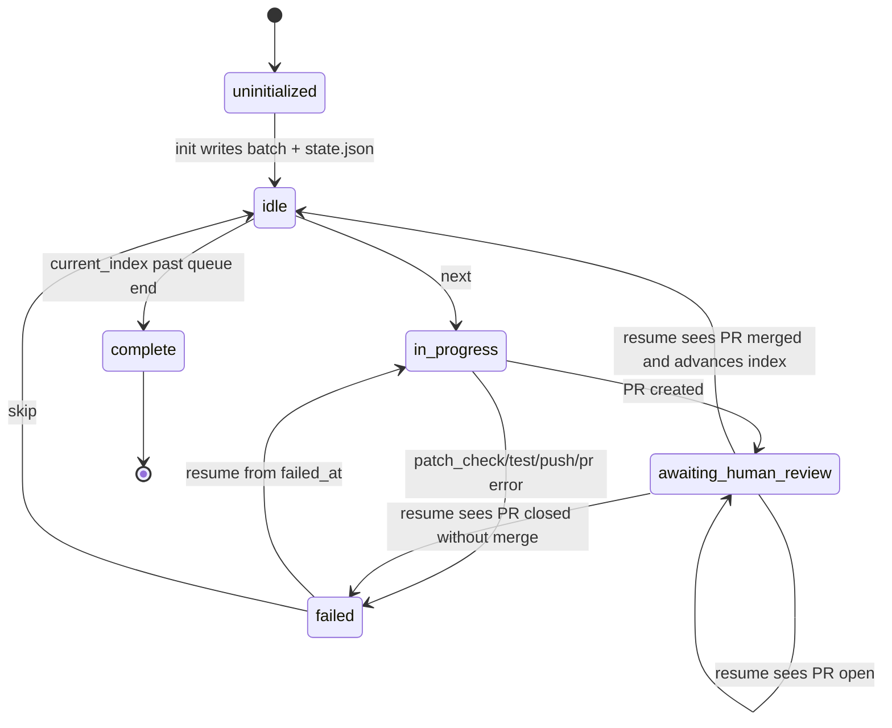
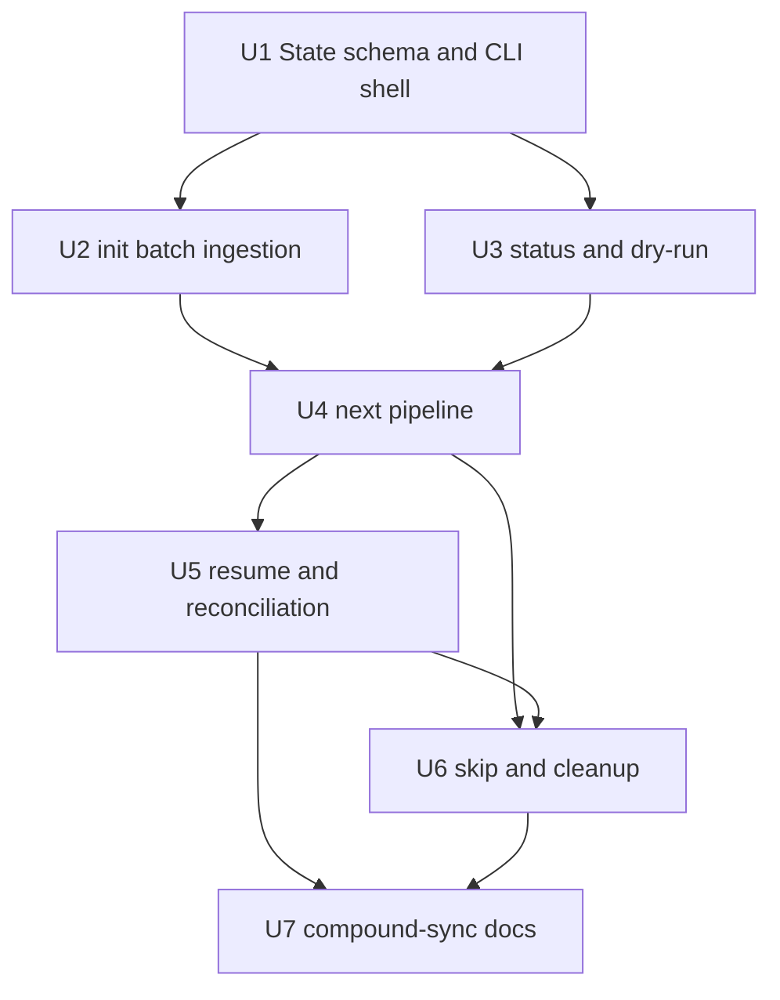

# feat: Upstream Sync CLI 自动化工作流

## Overview

本计划把现有 `scripts/upstream-sync/` 的逐 commit patch 批次能力升级为半自动化 CLI：`init` 一次性生成 raw/adapted patch batch 并初始化 `state.json`，`next` 消费已生成的 adapted patch 并完成 worktree、patch 预检、测试、commit、push、PR 创建，`resume` 处理 PR merged/open/closed 与 failed 恢复，`skip` 只推进指针并可在 `--force-cleanup` 下清理失败/关闭 PR 的残留资源。

核心边界是“自动化机械步骤，保留人类验收暂停点”。状态文件是主要事实来源，`.upstream-ref` 只在 merge 对账成功后作为派生 baseline 写入，避免旧流程里靠手工记忆推进同步进度的问题。

| 命令 | 主要输入状态 | 副作用边界 | 终态 |
|---|---|---|---|
| `init` | 无状态或新批次 | 生成 patch batch，写入 `state.json` | `idle` / `pending` 队列就绪 |
| `status` | 任意状态 | 无副作用 | 输出当前状态与最近操作 |
| `next` | `idle` 且当前 commit 为 `pending` | 创建 worktree、应用 patch、测试、提交、push、创建 PR | `awaiting_human_review` 或 `failed` |
| `resume` | `awaiting_human_review` 或 `failed` | merged 时只推进 baseline/index 并清理；failed 时从失败步骤重试 | `idle` / `complete`、继续等待或 `failed` |
| `skip` | `pending` / `failed` / closed PR 场景 | 推进 `current_index`；可选清理 worktree/远程分支 | `idle` / `complete`，不自动 `next` |

---

## Problem Frame

当前 upstream 同步已有 per-commit patch 批次基础，但仍需要研发手动创建 worktree、应用 patch、运行测试、创建 PR、等待 review、更新 `.upstream-ref` 并重复处理下一个 commit。需求文档以 14 个待同步 commit 为触发场景，要求 CLI 承担可机械化的步骤，同时在 PR 创建后明确暂停并交给人类验收（see origin: `brainstorms/2026-04-23-upstream-sync-cli-automation-requirements.md`）。

这不是只为一次 14-commit 批处理写临时脚本：GaleHarnessCLI 会持续 vendored upstream HKTMemory，并且每次 upstream 拉取都要重复同一组 worktree、patch、测试、PR、baseline 对账动作。v1 仍放在 `scripts/upstream-sync/` 内，避免过早产品化到顶层 CLI；但用显式状态机和可恢复命令，是为了降低后续每次同步的认知负担和重复出错率。

更新后的需求进一步明确了几个规划约束：

- **F1 逐 Commit 同步主流程**：触发命令为 `sync-cli.py next`；CLI 读取状态文件的 `current_index`，从 `init` 阶段已生成的 `adapted/` 目录消费 patch（不再现场生成）；新增 `git apply --check` 预检步骤（步骤4），通过后才应用 patch。Covered by: R1, R2, R4, R5, R7, R9, R10, R13。
- **F2 人类验收后继续**：触发命令为 `sync-cli.py resume`；`resume` 处理三种 PR 状态——已 merge（执行推进流程）、未 merge/open（输出状态，保持等待）、已关闭/拒绝（警告，提示 `skip --force-cleanup`）；新增 CLI 对账 `state.json` 与 `.upstream-ref` 的步骤；merged 后将 commit 状态更新为 `merged`，`current_index += 1`。需求 F2 步骤6 指定 resume 在 merged 后自动进入下一个 commit 的 F1 流程，但本计划选择不自动调用 `next`（见 Scope Boundaries 说明）。Covered by: R11, R13, R14。
- **F3 失败处理与人工接管**：失败时记录 `failed_at` 字段和失败阶段；`resume` 从失败步骤开始重试（不重跑整个流程），例如 `failed_at: "test"` 时重跑 `bun test`，`failed_at: "patch_check"` 时重跑 `git apply --check`；`skip` 将状态变为 `skipped`。Covered by: R6, R8, R15, R16。
- **其他约束**：`skip` 只推进指针，不自动 `next`；`--dry-run` 是单步预览；`state.json` 是主要事实来源，`.upstream-ref` 是派生状态。

---

## Requirements Trace

### 状态与输出

- R1. 启动时读取 `.upstream-ref` baseline，并结合 `.upstream-repo` 发现待同步 commits
- R2. 维护 `.context/galeharness-cli/upstream-sync/state.json`，记录批次、队列、PR、失败和操作日志
- R3/R12. `status` 统一输出同步概览、commit 队列、当前状态、下一个 commit 和最近 3 条操作日志
- R19. 每个失败步骤都写入状态并给出可操作下一步提示
- R20. CLI 输出使用中文，路径、命令和 JSON 字段保留英文

### `init`

- R13. `init` 调用现有 `generate-batch.py` 生成全量 raw/adapted patch batch，并初始化状态

### `next`

- R4. `next` 基于当前 commit 准备独立 worktree 并消费 `init` 生成的 adapted patch
- R5. worktree 名称包含 commit 序号和主题摘要
- R6. patch 应用前执行 `git apply --check`，冲突时记录 `failed_at: "patch_check"` 并输出 raw/adapted patch 路径
- R7. patch 应用成功后运行 `bun test`
- R8. 测试失败时阻止 PR 创建，记录失败摘要和日志路径
- R9. 测试通过后自动 commit、push，并调用 `gh pr create`
- R9b. PR 分支名冲突时自动生成后缀或给出明确错误
- R10. PR 创建后进入 `awaiting_human_review` 并暂停，等待显式 `resume`
- R14. `next` 只处理当前 commit 的应用、测试、PR、暂停，不再生成 patch

### `resume`

- R11. `resume` 根据 PR merged/open/closed 状态分别推进、继续等待或提示 `skip --force-cleanup`
- R15. `resume` 在人类 merge PR 后继续同步流程；从 `failed` 状态恢复时从失败步骤开始重试（而非重跑完整流程），并继续后续步骤；若 PR 未 merge，输出当前状态并保持等待

### `dry-run` 与 `skip`

- R16. 全局 `--dry-run` 只预览单步操作，不执行副作用；全批次预览不进入 v1
- R17. `skip` 标记当前 commit 为 skipped，只推进 `current_index` 并返回控制权，不自动 `next`
- R18. `skip --force-cleanup` 清理已推送远程分支和 worktree，然后标记 skipped

**Origin actors:** A1 研发人员（同步执行者），A2 自动化同步 CLI，A3 代码审查者
**Origin flows:**
  F1 逐 Commit 同步主流程 — Trigger: `sync-cli.py next`；含 `git apply --check` 预检；从 `init` 已生成的 `adapted/` 消费 patch；Covered by: R1, R2, R4, R5, R7, R9, R10, R13
  F2 人类验收后继续 — Trigger: `sync-cli.py resume`；覆盖 merged/open/closed 三种 PR 状态；含 state.json 与 .upstream-ref 对账；merged 后 current_index += 1；Covered by: R11, R13, R14
  F3 失败处理与人工接管 — 记录 `failed_at`；`resume` 从失败步骤重试；`skip` 变为 skipped；Covered by: R6, R8, R15, R16
**Origin acceptance examples:**
  AE1 Covers R1, R3/R12 — status 队列检测
  AE2 Covers R4, R7, R9, R10 — next 创建 PR 并暂停
  AE3 Covers R6, R17 — patch 冲突失败（含 `failed_at: "patch_check"` 描述）
  AE4 Covers R11, R14 — resume after merge
  AE5 Covers R16 — dry-run 单步预览（只预览 current_index 指向的 commit）

---

## Scope Boundaries

- 不自动处理 adapted patch 应用后的业务逻辑人工适配；CLI 只创建环境、执行机械门禁并在测试通过后发 PR。
- 不做无人值守定时同步或 CI 自动同步；本计划只覆盖人工发起的人机协作 CLI。
- 不处理 upstream force-push 导致的历史 SHA 失效；仍假设 upstream 历史线性可追踪。
- 不支持多个 upstream commit 合并为一个 PR；保持 1:1 commit-to-PR 映射。
- 不自动 merge PR，也不绕过 review。
- 不在 `resume` merged 后自动启动下一轮 `next`；用户每次进入新的 commit 副作用流程都必须显式执行 `next`。**与需求文档 F2 的差异**：需求 F2 步骤6 指定"CLI 自动进入下一个 commit 的 F1 流程（除非已到达队列末尾）"，但本计划选择不自动调用 `next`，理由：(1) 每次 `next` 产生 worktree、push、PR 等不可逆副作用，自动链式执行会剥夺用户在 commit 间检查和干预的机会；(2) 保持 `skip`/`next`/`resume` 的正交语义——`resume` 只负责验收推进和 failed 恢复，`next` 只负责启动新的副作用流程；(3) 减少状态机复杂度，避免 `resume` 内部隐式调用 `next` 时嵌套失败导致的恢复路径歧义。
- 不在 v1 支持全量 14-commit dry-run 计划输出；`--dry-run` 只预览当前命令的单步副作用。

### Deferred to Follow-Up Work

- 将 `sync-cli.py` 集成到正式 `gale-harness` 顶层 TypeScript CLI：本次先在 `scripts/upstream-sync/` 内交付低风险工作流 CLI。
- 让状态写入 task board 或 HKTMemory：当前状态以本地 `state.json` 为准，知识发现另行规划。
- 更复杂的 PR review 批处理或批量 merge 辅助：不进入本次半自动同步核心闭环。

---

## Context & Research

### Relevant Code and Patterns

- `scripts/upstream-sync/generate-batch.py` 已经能基于 `.upstream-ref` 和 `.upstream-repo` 生成 `.context/galeharness-cli/upstream-sync/<date>/{raw,adapted}`、`commit-range.txt` 和 README。
- `scripts/upstream-sync/apply-patch-to-worktree.sh` 已包含 main worktree 风险检查、干净工作区检查、patch 路径解析、`git apply --check` 和 `--3way` 可选路径；CLI 可以复用其语义，也可以在 Python 内实现等价步骤以便记录状态。
- `tests/upstream-sync-generate-batch.test.ts`、`tests/upstream-sync-adapt-patch.test.ts`、`tests/upstream-sync-apply-patch.test.ts` 使用 Bun 测试临时 git 仓库与 fixture；新增 CLI 测试应沿用这种端到端小仓库模式。
- `plugins/galeharness-cli/skills/compound-sync/SKILL.md` 当前仍描述手动逐 patch 流程；CLI 完成后需要更新为 `init/status/next/resume/skip` 使用说明。
- `src/index.ts` 的主 CLI 是 Bun/citty 插件转换工具；本功能是本地 upstream sync 运维脚本，放在 `scripts/upstream-sync/` 更符合现有边界，避免把内部半自动同步流程暴露成通用产品 CLI。

### Institutional Learnings

- `docs/solutions/best-practices/prefer-python-over-bash-for-pipeline-scripts-2026-04-09.md`：多步骤编排、重试、超时和受控失败路径应优先用 Python，而不是 Bash。
- `docs/solutions/skill-design/git-workflow-skills-need-explicit-state-machines-2026-03-27.md`：Git/PR 工作流必须建模为显式状态机，每个转移点重新读取真实状态，避免 stale branch、PR lookup 和 clean-tree shortcut 类 bug。
- `docs/solutions/agent-friendly-cli-principles.md`：面向 agent 的 CLI 应非交互、输出可解析、错误可操作、变更边界明确，并为数据型命令提供结构化输出路径。
- `docs/solutions/workflow-issues/upstream-sync-per-commit-configuration.md`：`.upstream-repo` 必须是本地 git checkout 路径，`.upstream-ref` 必须是 upstream 历史中的真实 commit；现有批次目录结构已经稳定。

### External References

- 本计划不需要外部调研。设计主要受本仓库现有脚本、Bun 测试模式、GitHub CLI 行为和本地知识库中的 CLI/Git 工作流经验约束。

---

## Key Technical Decisions

- **实现语言选 Python，入口为 `scripts/upstream-sync/sync-cli.py`**：该 CLI 要编排 `git`、`gh`、`bun test`、文件状态、失败恢复和 retry，符合“多步骤 pipeline 用 Python”的本地经验。TypeScript 主 CLI 保持插件转换产品面，不承担内部 upstream sync 自动化。
- **`init` 是唯一初始 patch batch 生成入口**：`init` 调用或复用 `generate-batch.py` 输出 batch，并从 `commit-range.txt` 和 patch 目录初始化 `state.json`。`next` 不调用 `generate-batch.py`，只消费状态里记录的 adapted patch。该设计依赖一个明确不变量：batch 中的 adapted patch 必须能按 upstream commit 顺序应用到逐步合入后的 target base；实现必须用连续 commit 修改同一区域的 fixture 验证该不变量。若测试证明预生成 patch 在累计 base 上不可靠，v1 应降级为在每次 `resume` merged 后重新生成/重新适配下一条 commit 的 patch，并把新 patch 路径写回 state。
- **`state.json` 是主要事实来源，但不是破坏性操作的唯一信任来源**：状态文件记录 baseline、target、batch_dir、current_index、每个 commit 的状态、patch 路径、worktree、branch、PR、失败阶段、操作日志、`main_worktree_root`、`target_repo_root`、`base_branch`、`remote_name` 和 `github_repo`。`.upstream-ref` 只在 PR merged 后由 `resume` 写入，且写入前先和 state 与 upstream ancestry 对账。cleanup、push、PR 查询和远程分支删除必须重新向 git/GitHub 验证 state 中记录的目标。
- **所有本地 workflow 文件都相对 main worktree root 解析**：CLI 启动时先解析当前 git repository 的 main worktree root，而不是信任当前 shell cwd。`.context/galeharness-cli/upstream-sync/state.json`、batch patch、`.upstream-ref` 都相对 main worktree root 读写；这样用户在同步 worktree 内运行 `status/resume/skip` 时不会误读或新建第二份状态。
- **base branch 是显式状态字段**：`init` 解析 remote default branch 作为默认 `base_branch`，允许 `--base <branch>` 覆盖，并写入 state。`next` 创建 worktree、`gh pr create` 的 base、`resume` 对账和 cleanup 都只使用 state 中的 `base_branch`；执行前 fetch 目标 remote/base，避免从当前 shell 分支或 stale local branch 推断同步基准。
- **状态转移用显式阶段枚举**：`next` 和 failed `resume` 共享同一阶段 pipeline：`worktree_create -> patch_check -> patch_apply -> test -> commit -> push -> pr_create -> await_review`。失败时记录 `failed_at`，恢复时从该阶段重试并继续后续阶段。
- **外部命令封装必须可测试且安全**：`git`、`gh`、`bun`、`generate-batch.py` 都通过 command runner abstraction 调用。生产路径使用 argv 数组执行真实命令（Python 中等价于 `subprocess.run([...], shell=False)`），禁止 shell 字符串拼接；每个命令必须显式设置已验证的 cwd。测试路径注入 fake runner，避免靠 shell monkeypatch 才能覆盖 PR merged/open/closed、push failure、branch conflict 等状态。
- **GitHub 目标必须显式验真**：`init` 或首次 `next` 记录 expected `github_repo`、`remote_name`、origin URL、base branch 和 `gh auth status` 主体；`gh pr create/view` 必须显式传 `--repo owner/repo`，push 必须使用已验证 remote。`resume` 和 cleanup 前重新校验 PR repo、headRefName、baseRefName 与 state 一致。
- **PR 状态三分处理**：`resume` 对 `merged` 执行 baseline 推进、清理并回到 `idle` 或 `complete`；对 `open` 只提示继续等待并保持状态；对 `closed without merge` 不隐式跳过，要求用户执行 `skip --force-cleanup` 或手动修复。
- **`complete` 是唯一批次完成终态**：当 `current_index` 越过队列末尾时，workflow_state 必须为 `complete`。`idle` 只表示还有 pending commit 且当前没有活跃副作用流程。
- **`skip` 不触发下一步工作**：`skip` 只标记当前 commit skipped、推进指针并退出，让用户显式执行 `next`，避免跳过后立即进入新的副作用流程。
- **`--dry-run` 是单步副作用预览**：dry-run 应输出当前命令会读取/写入哪些路径、将创建哪个 worktree/branch、将运行哪些外部命令、将创建什么 PR 标题，但不执行文件写入、worktree 创建、push 或 PR 创建。
- **CLI 输出中文，人机与 agent 双可读**：默认中文摘要和下一步提示；`status --json` 或全局 `--json` 可作为结构化输出增量，至少在 `status` 和 dry-run 上应提供稳定字段以方便 agent 解析。
- **"无状态方案"被拒绝**：曾有建议用单次执行命令处理下一个 commit、通过 `.upstream-ref` 隐式追踪进度。此方案被拒绝，因为用户明确要求"每执行完毕后交给人类验收"，无状态方案无法在中断后恢复上下文（如机器重启、会话切换后无法知道当前处理到哪个 commit、PR 链接是什么、worktree 在哪里）。显式状态机是必要的。
- **1:1 commit-to-PR 映射是不可协商约束**：用户明确要求"独立的一个 commit 一个 commit 的适配然后发到 PR 里"。虽然这带来更多 PR review 周期，但对于机械变更 review 成本极低，对于业务逻辑变更则必须独立 review。该约束作为不可协商的 scope boundary 保留。
- **`compound-sync` SKILL 将在 CLI 建成后更新**：`plugins/galeharness-cli/skills/compound-sync/SKILL.md` 当前描述手动版工作流，新 CLI 自动化其中的机械步骤。CLI 建设完成后，`compound-sync` SKILL 将更新为引用 `sync-cli.py` 命令而非手动步骤描述。

---

## Open Questions

### Resolved During Planning

- CLI 实现语言选择：使用 Python，与现有 `scripts/upstream-sync/` 脚本和多步骤编排经验一致；不进入 TypeScript 主 CLI。（对应需求文档 Deferred to Planning: CLI 实现语言选择）
- PR 分支命名策略：使用 `upstream-sync-<date>-<NNNN>-<slug>`，若远程已存在同名分支，尝试 `-2`、`-3` 后缀并记录最终 branch 到 state。此策略已在 R9b 中覆盖。（对应需求文档 Deferred to Planning: PR 分支命名策略）
- `bun test` 执行路径：在新 worktree 根目录运行；默认不在 CLI 内执行 `bun install`，依赖仓库已有 Bun 安装和 lockfile。若缺依赖，按 test 失败记录并提示用户修复。（对应需求文档 Deferred to Planning: bun test 执行路径）
- 并发批次：v1 假设一次只有一个同步流程，固定状态文件为 `.context/galeharness-cli/upstream-sync/state.json`。多批次并发后续另行规划。（对应需求文档 Deferred to Planning: 状态文件 schema 与多批次并发）
- failed 恢复粒度：从 `failed_at` 阶段重新执行，并继续所有后续阶段；不会从 F1 顶部重跑已成功阶段，除非状态缺失导致无法安全恢复。具体示例：`failed_at: "test"` 时重跑 `bun test`，`failed_at: "patch_check"` 时重跑 `git apply --check`。（对应需求文档 Deferred to Planning: resume 从 failed 恢复时的重试粒度）
- 需求文档中 Success Criteria 的"完整预览整个 14-commit 流程"与 R16 更新冲突：本计划以更新后的 R16 为准，v1 只做单步 dry-run。
- `resume` merged 后的默认行为：只推进 `.upstream-ref`、清理资源、标记当前 commit merged、推进 `current_index`，然后回到 `idle` 或 `complete`；不自动调用下一轮 `next`。**与需求文档 F2 的差异**：需求 F2 步骤6 指定"CLI 自动进入下一个 commit 的 F1 流程"，但本计划选择不自动调用 `next`，理由见 Scope Boundaries。
- worktree 基准分支选择：`base_branch` 是 state 字段，默认来自已验证 remote 的 default branch，也可用 `--base` 显式指定；不得隐式依赖当前 shell 所在分支。

### Deferred to Implementation

- `generate-batch.py` 是否需要输出机器可读 manifest：计划可以先解析 `commit-range.txt` 和目录结构；若实现中解析脆弱，再小幅扩展生成脚本输出 `manifest.json`。
- PR 创建失败后的 retry 细节：实现时按 `failed_at: "pr_create"` 重试，并确保不会重复 push 同一分支或重复创建 PR。
- `state.json` 写入 helper 名称：计划要求临时文件 + rename 原子写入；具体 helper 名称由实现阶段决定。

---

## High-Level Technical Design

> *This illustrates the intended approach and is directional guidance for review, not implementation specification. The implementing agent should treat it as context, not code to reproduce.*



```text
init
  -> run/consume generate-batch.py
  -> build queue from commit-range + raw/adapted patches
  -> write state.json (primary source of truth)

next
  -> load current pending commit from state.json
  -> create worktree + branch
  -> git apply --check adapted patch
  -> git apply adapted patch
  -> bun test
  -> git commit + push
  -> gh pr create
  -> state = awaiting_human_review

resume
  -> if state = failed: retry from failed_at
  -> if state = awaiting_human_review:
       gh pr view
       merged -> reconcile .upstream-ref + cleanup + current_index += 1 + idle/complete
       open   -> report and keep waiting
       closed -> report and require skip --force-cleanup or manual intervention

skip
  -> optionally cleanup worktree + remote branch
  -> mark current commit skipped + current_index += 1
  -> exit without starting next
```

---

## Implementation Units



- [ ] U1. **状态模型与 CLI 基础骨架**

**Goal:** 建立 `sync-cli.py` 的子命令结构、状态 schema、原子读写、操作日志和通用外部命令执行封装。

**Requirements:** R2, R3/R12, R16, R19, R20

**Dependencies:** None

**Files:**
- Create: `scripts/upstream-sync/sync-cli.py`
- Create: `tests/upstream-sync-cli-state.test.ts`
- Modify: `scripts/upstream-sync/generate-batch.py`（仅当状态初始化需要更稳定的机器可读 batch metadata）

**Approach:**
- 使用 Python `argparse` 实现 `init/status/next/resume/skip` 子命令和全局 `--dry-run`。
- CLI 启动时解析 main worktree root：优先通过 `git worktree list --porcelain` 或 `git rev-parse --git-common-dir` 找到当前 repository 的 common git dir 和主 worktree。所有 workflow 文件路径都相对 main worktree root，不相对当前 shell cwd。
- 定义 `state.json` 顶层字段：`schema_version`、`main_worktree_root`、`target_repo_root`、`batch_dir`、`baseline_sha`、`target_sha`、`base_branch`、`remote_name`、`github_repo`、`current_index`、`workflow_state`、`commits[]`、`operations[]`。
- commit 条目至少记录：`sequence`、`sha`、`subject`、`raw_patch`、`adapted_patch`、`status`、`worktree_path`、`branch`、`base_branch`、`pr_url`、`pr_number`、`pr_head_ref`、`pr_base_ref`、`failed_at`、`failure_summary`。
- 明确枚举合法状态：workflow_state 使用 `uninitialized | idle | in_progress | awaiting_human_review | failed | complete`；commit status 使用 `pending | in_progress | awaiting_human_review | merged | failed | skipped`。
- `complete` 是唯一批次完成状态；`current_index >= commits.length` 时必须写 `workflow_state: "complete"`，仍有 pending commit 时才允许 `idle`。
- 在 state 中记录每个阶段的完成标记或最近成功阶段，让 failed `resume` 可以判断哪些副作用已经发生，尤其是 `commit`、`push`、`pr_create` 这类不可盲目重复的阶段。
- 写状态时使用临时文件 + rename，读状态时做 schema/version/path 存在性校验。
- 所有外部命令通过统一 wrapper 捕获 exit code、stdout、stderr 和阶段名，失败时转换为状态更新与中文提示。wrapper 必须使用 argv 数组、`shell=False`、显式 cwd；路径参数 resolve 后必须位于允许根目录内。
- 输出和日志写入前执行安全处理：stdout/stderr 进入 state 前截断并 redaction token、Authorization、`GH_TOKEN`、`GITHUB_TOKEN`、basic-auth URL 和 home 绝对路径；完整日志文件权限使用 `0600`。
- command runner 要支持测试注入 fake outputs；测试不应依赖真实 GitHub 远程或真实 `gh` 认证。

**Patterns to follow:**
- `scripts/upstream-sync/generate-batch.py` 的 Python 风格和错误封装
- `docs/solutions/best-practices/prefer-python-over-bash-for-pipeline-scripts-2026-04-09.md`
- `docs/solutions/agent-friendly-cli-principles.md`

**Test scenarios:**
- Happy path: 新状态写入后再次读取，字段完整、路径保持 repo-relative 或可移植相对值，`operations` 只保留最近可展示记录。
- Edge case: `state.json` 不存在时，`status` 输出未初始化提示，`next/resume/skip` 给出需要先运行 `init` 的错误。
- Edge case: `state.json` JSON 非法或 schema_version 不支持时，CLI 快速失败并提示备份/修复路径，不覆盖原文件。
- Error path: 外部命令 wrapper 收到非零 exit 时，记录阶段、摘要和日志路径/输出片段。
- Edge case: `state.json` 中 workflow_state 与当前 commit status 不一致时，CLI 报告状态损坏并提示人工检查，而不是猜测推进。
- Edge case: 从 linked worktree 执行 `status/resume/skip` 时仍读写 main worktree 下同一份 `state.json`，不会在 linked worktree 中创建第二份状态。
- Edge case: `state.json` 缺失但存在 `upstream-sync-*` worktree、branch 或 PR 时，`status/init` 不盲目重建状态，输出需要人工 recover/reinit 的提示。
- Error path: command runner 拒绝 shell 字符串命令、未验证 cwd、越界路径和未脱敏日志写入。
- Integration: fake command runner 可以驱动同一 pipeline 走到 `patch_check`、`test`、`push`、`pr_create` 等失败阶段，并验证 state 中的 `failed_at`。
- Integration: 在临时 repo 中执行基础 `status`，stdout 为中文，失败诊断在 stderr，退出码语义稳定。

**Verification:**
- 实现者可以用最小 fixture 初始化、读取和更新状态，且任意失败都能追溯到明确阶段和最近操作日志。

---

- [ ] U2. **`init` 批次生成与状态初始化**

**Goal:** 让 `init` 成为同步批次的唯一 patch 生成入口，调用现有 batch 生成能力并把 batch 转换为 `state.json` 队列。

**Requirements:** R1, R2, R4, R13, R14, R19, AE1

**Dependencies:** U1

**Files:**
- Modify: `scripts/upstream-sync/sync-cli.py`
- Modify: `scripts/upstream-sync/generate-batch.py`（仅当需要机器可读 manifest 或更稳定输出）
- Create: `tests/upstream-sync-cli-init.test.ts`
- Modify: `tests/fixtures/upstream-sync/expected-batch/`（如新增 manifest fixture）

**Approach:**
- `init` 解析 `.upstream-ref`、`.upstream-repo`，调用 `generate-batch.py` 生成 raw/adapted batch；若 batch 已存在，要求显式 `--force` 或复用明确指定 batch。
- `init` 解析并记录 `base_branch`、`remote_name`、`github_repo` 和 main worktree root；默认 base 来自已验证 remote default branch，可用 `--base <branch>` 覆盖。
- 从 `commit-range.txt` 和 `raw/`、`adapted/` 文件构建 commit 队列，所有条目初始为 `pending`。
- 写入 `baseline_sha`、`target_sha`、`batch_dir`、`current_index: 0`、`workflow_state: "idle"`。
- 如果 `state.json` 已存在且仍有未完成同步，默认拒绝覆盖并提示 `status` 或显式重置方式，避免误删现场。
- 如果 `state.json` 缺失但检测到现有 `upstream-sync-*` 分支、worktree 或 open PR，默认拒绝 `init`，提示人工确认并使用明确 recover/reinit 流程，避免重复创建已处理工作。
- `init` 生成全量 patch 后要记录 patch batch 的 base 不变量：每个 adapted patch 的来源 upstream SHA、生成时 baseline、预期应用顺序。测试必须覆盖连续 commit 修改相邻区域的场景；若预生成 patch 无法稳定应用，v1 改为 merged 后重新生成下一条 commit 的 patch。
- `init --dry-run` 只输出会生成的 batch 路径、baseline、预计 commit 范围和状态文件路径，不创建目录或状态文件。

**Patterns to follow:**
- `scripts/upstream-sync/generate-batch.py`
- `tests/upstream-sync-generate-batch.test.ts`
- `docs/solutions/workflow-issues/upstream-sync-per-commit-configuration.md`

**Test scenarios:**
- Covers AE1. Happy path: upstream 比 `.upstream-ref` 多 3 个 commit 时，`init` 生成 batch 和 `state.json`，随后 `status` 显示 3 个 pending commits、当前状态 idle、下一个为 0001。
- Happy path: `init --dry-run` 输出 batch_dir、state_path、baseline 和将处理的 commit 数，不创建 `.context/galeharness-cli/upstream-sync/state.json`。
- Edge case: 已存在未完成 `state.json` 时，再次 `init` 拒绝覆盖，并提示查看 `status`。
- Edge case: `state.json` 缺失但存在 sync 命名族 branch/worktree/open PR 时，`init` 拒绝盲目初始化并提示人工 recover。
- Edge case: `generate-batch.py` 返回 “No new upstream commits” 时，`init` 不写空队列状态，并输出无需同步。
- Error path: `.upstream-repo` 指向 URL 或无效目录时，错误提示沿用/包装现有配置指引。
- Integration: `init` 生成的 state commit 数与 adapted patch 文件数一致，缺失 raw/adapted 配对时快速失败。
- Integration: 两个连续 upstream commit 修改同一文件同一区域附近时，`init` 预生成 patch 后，连续 `next/resume/next` 能正确应用；若不能，应落回逐轮再生成策略。

**Verification:**
- `init` 后状态文件足以驱动后续 `next`。如果预生成 adapted patch 的累计应用不变量成立，后续不需要重新扫描 upstream 或再次生成 patch；如果不成立，状态文件必须记录每轮 merged 后重新生成/适配下一条 commit 所需的输入。

---

- [ ] U3. **`status` 与单步 `--dry-run` 输出契约**

**Goal:** 提供人类可读且 agent 可解析的状态查看和单步预览能力，明确 dry-run 不执行副作用。

**Requirements:** R3/R12, R16, R20, AE1, AE5

**Dependencies:** U1, U2

**Files:**
- Modify: `scripts/upstream-sync/sync-cli.py`
- Create: `tests/upstream-sync-cli-status.test.ts`
- Create: `tests/upstream-sync-cli-dry-run.test.ts`

**Approach:**
- `status` 输出同步概览、baseline -> target、进度百分比、commit 队列、当前 workflow_state、下一个 commit、最近 3 条操作日志。
- 为 `status` 提供 `--json`，字段直接来自 `state.json`，减少 agent 解析中文表格的成本。
- `next --dry-run` 输出将消费的 adapted patch、raw patch、worktree 名、branch 名、测试命令、commit message、PR 标题，不创建 worktree、不写状态。
- `resume --dry-run` 输出会检查的 PR、可能的 merged/open/closed 分支处理；merged 路径只预览 baseline/index 推进、cleanup 和最终 `idle/complete`，不预览自动 `next`。
- `skip --dry-run` 输出将被标记 skipped 的 commit 和 `--force-cleanup` 会清理的资源，不推进指针。

**Patterns to follow:**
- `docs/solutions/agent-friendly-cli-principles.md`

**Test scenarios:**
- Covers AE1. Happy path: 有 14 个 pending commits 的状态中，`status` 输出总数、当前 idle、下一个 0001 和最近操作日志。
- Covers AE5. Happy path: `next --dry-run` 输出 patch 路径、worktree 名、测试命令和 PR 标题，执行后 state 文件未变化且无 worktree 创建。
- Edge case: 当前状态为 `awaiting_human_review` 时，`next --dry-run` 拒绝并提示需要 `resume` 或 `skip`。
- Edge case: `status --json` 输出合法 JSON，并包含 `workflow_state`、`current_index`、`commits`、`next_commit`。
- Error path: 当前 index 越界或队列为空时，status 输出已完成或状态损坏提示，而不是 traceback。

**Verification:**
- 人类可以从 `status` 直接知道下一步命令；agent 可以从 `status --json` 获取同样状态而无需解析 prose。

---

- [ ] U4. **`next` 单 commit 自动化 pipeline**

**Goal:** 让 `next` 对当前 pending commit 完成 worktree 创建、patch 预检/应用、测试、commit、push、PR 创建，并在 PR 后暂停。

**Requirements:** R4, R5, R6, R7, R8, R9, R9b, R10, R14, R19, R20, AE2, AE3

**Dependencies:** U1, U2, U3

**Files:**
- Modify: `scripts/upstream-sync/sync-cli.py`
- Create: `tests/upstream-sync-cli-next.test.ts`
- Modify: `tests/fixtures/upstream-sync/sample-patches/`（如需新增冲突/成功 patch）

**Approach:**
- `next` 只允许在 `workflow_state: "idle"` 且当前 commit `status: "pending"` 时运行。
- worktree 名和 branch 名使用 `upstream-sync-<batch-date>-<NNNN>-<slug>`，远程分支冲突时尝试 `-2`、`-3` 后缀并写入 state。
- branch/worktree slug 必须经 ASCII 白名单和长度限制生成；commit subject 只能作为 commit message/PR title 参数传入，不得参与 shell 字符串或未校验路径。
- 创建 worktree 前 fetch state 中的 `remote_name/base_branch`，并从该远程 base 创建 worktree；不得从当前 shell 分支推断 base。
- 创建 worktree 后立即重新读取 worktree 当前分支和 repo root，并把实际值写入 state；后续 push/PR 只使用 state 中确认过的 branch，不使用早期推导值。
- patch 阶段先执行 `git apply --check`，失败时记录 `failed_at: "patch_check"`、raw/adapted patch 路径、冲突摘要，状态改为 `failed`。
- patch 应用后运行 `bun test`；测试失败记录 `failed_at: "test"`、测试输出摘要和日志路径，不创建 PR。
- 测试通过后提交，commit message 使用 `sync(upstream): <upstream subject>`，随后 push 到已验证 remote，并用 `gh pr create --repo <owner/repo> --base <base_branch> --head <branch>` 创建 PR。
- PR 创建成功后写入 `pr_url`/`pr_number`、`pr_head_ref`、`pr_base_ref`、`github_repo`，commit 状态为 `awaiting_human_review`，workflow_state 同步为 `awaiting_human_review`，CLI 明确暂停。

**Execution note:** 建议先写失败路径和 dry-run 的 characterization 测试，再接入真实外部命令执行，以防重复创建 worktree、branch 或 PR。

**Patterns to follow:**
- `scripts/upstream-sync/apply-patch-to-worktree.sh`
- `tests/upstream-sync-apply-patch.test.ts`
- `docs/solutions/skill-design/git-workflow-skills-need-explicit-state-machines-2026-03-27.md`

**Test scenarios:**
- Covers AE2. Happy path: 当前 commit pending，模拟 patch 成功、`bun test` 成功、commit/push/PR 成功后，state 进入 `awaiting_human_review`，包含 PR 链接并暂停。
- Covers AE3. Error path: patch check 冲突时，state 进入 `failed`，`failed_at` 为 `patch_check`，输出 raw/adapted patch 路径，不执行 patch apply/test/PR。
- Error path: `bun test` 失败时，state 进入 `failed`，`failed_at` 为 `test`，没有 commit、push 或 PR 信息。
- Error path: push 失败或 PR 创建失败时，记录对应 `failed_at`，保留 worktree 和 branch 信息供人工修复。
- Edge case: 远程已有同名 branch 时，CLI 生成后缀分支名并将最终分支写入 state。
- Edge case: 当前 shell 分支不是目标 base 时，`next` 仍从 state 中的 `base_branch` 创建 worktree 和 PR。
- Error path: GitHub repo、remote URL、`gh auth status` 主体或 PR base/head 与 state 不一致时，`next` 拒绝 push/PR 并提示人工检查。
- Edge case: worktree 创建成功但 branch checkout 失败时，记录 `failed_at: "worktree_create"`，不继续 patch 阶段，并保留可清理路径。
- Integration: `next` 成功到 PR 创建后，再次执行 `next` 必须拒绝，避免在 awaiting review 状态重复创建 PR。
- Edge case: 当前 commit 不是 pending 或 workflow_state 不是 idle 时，`next` 拒绝执行并提示正确命令。
- Integration: 使用临时本地 bare remote 和 fixture patch，验证真实 worktree 创建、patch 应用、commit 生成和状态推进。

**Verification:**
- 每次 `next` 最多处理一个 upstream commit，成功后必然停在 PR review 交接点，失败后必然有可恢复的 `failed_at`。

---

- [ ] U5. **`resume` PR 状态对账与 failed 恢复**

**Goal:** 让 `resume` 同时承担人类验收后的推进、PR open/closed 状态解释，以及 failed 阶段的精准重试。

**Requirements:** R2, R10, R11, R15, R19, AE4

**Dependencies:** U4

**Files:**
- Modify: `scripts/upstream-sync/sync-cli.py`
- Create: `tests/upstream-sync-cli-resume.test.ts`

**Approach:**
- 当 workflow_state 为 `failed` 时，`resume` 从当前 commit 的 `failed_at` 阶段重新执行，并继续后续阶段；如果人工已在 worktree 中修复 patch 或测试，重试应复用 state 中记录的 worktree/branch。
- 当 workflow_state 为 `awaiting_human_review` 时，`resume` 使用 `gh pr view` 查询 PR 状态，并区分 merged/open/closed without merge。
- merged 路径先用 `.upstream-repo` 内的 ancestry 判断对账 `state.json` 和 `.upstream-ref`：ref 不存在、为空或非法 SHA 时 fatal；ref 等于当前 upstream SHA 时只修复 state；ref 是当前 SHA 的祖先时写入当前 SHA；ref 是当前 SHA 的后代时只修复 state 并记录 warning；ref 与当前 SHA 不在同一 upstream 历史或 state baseline 不匹配时拒绝推进。
- merged 后先确认 PR repo、headRefName、baseRefName 与 state 中记录的 `github_repo`、branch、`base_branch` 一致，再清理 worktree；随后标记 commit 为 `merged`，`current_index += 1`。若还有 pending commit，设置 `workflow_state: "idle"` 并提示用户显式执行 `next`；若队列结束，设置 `workflow_state: "complete"`。
- open 路径只输出当前 PR 状态，保持 `awaiting_human_review`，不推进 index。
- closed without merge 路径输出警告，保持/转为需处理状态，提示 `skip --force-cleanup` 或人工处理，不自动跳过。

**Execution note:** PR 状态查询和 `.upstream-ref` 写入要用状态机测试覆盖，避免把 open/closed 当作普通命令失败。

**Patterns to follow:**
- `docs/solutions/skill-design/git-workflow-skills-need-explicit-state-machines-2026-03-27.md`

**Test scenarios:**
- Covers AE4. Happy path: PR 已 merged 时，`resume` 更新 `.upstream-ref` 为当前 upstream SHA、清理 worktree、标记 merged、推进 index；还有 pending commit 时回到 `idle` 并提示 `next`，队列结束时进入 `complete`。
- Happy path: failed_at 为 `test` 且人工修复后，`resume` 重新运行测试，通过后继续 commit/push/PR 创建。
- Edge case: PR 仍 open 时，`resume` 输出 “PR #N is still open” 类提示，state 保持 `awaiting_human_review`，index 不变。
- Edge case: PR closed without merge 时，`resume` 输出警告和 `skip --force-cleanup` 建议，不写 `.upstream-ref`。
- Edge case: `.upstream-ref` 已经是当前 commit SHA 时，`resume` 修复 state 并继续清理，而不是重复报错。
- Edge case: `.upstream-ref` 是 current SHA 的祖先、后代、非法 SHA 或分叉 SHA 时分别按 reconciliation 状态表处理。
- Edge case: `gh pr view` 返回的 headRefName 与 state branch 不一致时，`resume` 拒绝推进并提示人工检查，避免错误 PR 推进 baseline。
- Edge case: `gh pr view` 返回的 repo/baseRefName 与 state 不一致时，`resume` 拒绝推进。
- Edge case: PR merged 但 worktree 已被人工删除时，baseline 和 state 仍可推进，cleanup 记录 warning。
- Error path: `gh pr view` 网络或认证失败时，记录 `failed_at: "pr_status"` 或保持等待状态并给出认证/重试提示。
- Integration: 使用 mockable command runner 或 fake `gh` executable 验证 merged/open/closed 三分支不会混淆。

**Verification:**
- `resume` 在 awaiting review 状态不会误推进 open/closed PR；在 failed 状态不会重跑已完成阶段导致重复副作用。

---

- [ ] U6. **`skip` 指针推进与 `--force-cleanup`**

**Goal:** 明确跳过语义：只标记当前 commit skipped 并推进指针，必要时清理远程分支和 worktree，但不自动处理下一个 commit。

**Requirements:** R17, R18, R19

**Dependencies:** U4, U5

**Files:**
- Modify: `scripts/upstream-sync/sync-cli.py`
- Create: `tests/upstream-sync-cli-skip.test.ts`

**Approach:**
- `skip` 要求当前 commit 处于 pending/failed/closed-review 可处理状态；如果处于 awaiting open PR，默认拒绝并提示先确认 PR 状态或使用明确参数。
- 默认 `skip` 只写 state：当前 commit `status: "skipped"`，记录 reason（若提供），`current_index += 1`，workflow_state 回到 `idle` 或 `complete`。
- `skip --force-cleanup` 根据 state 中的 `worktree_path`、`branch`、`pr_url` 清理本地 worktree 和远程 branch；清理前必须向 git/GitHub 重新验证目标，清理失败时记录失败并提示人工命令。
- cleanup 必须幂等：worktree 或远程分支不存在时记录 warning，但不阻止 skip 完成，除非无法判断目标资源。
- cleanup 前必须校验目标 branch 仍匹配 `upstream-sync-<date>-<NNNN>-<slug>` 命名族，并且不等于默认分支；校验失败时拒绝自动删除。
- cleanup worktree 前必须 resolve `worktree_path`，确认它通过 `git worktree list --porcelain` 属于当前 target repo，不是 repo root、home、上级目录，也没有通过 symlink 跳出允许根；删除前校验 worktree HEAD/branch 与 state commit/branch 匹配。
- cleanup 远程分支前必须验证 state 中的 `github_repo`、PR number、headRefName、headRepository 和 remote URL 匹配，只删除该 PR head 对应的 sync 前缀分支。
- 执行结束输出“已跳过；如需继续，请执行 `next`”，不自动调用 next。

**Patterns to follow:**
- `scripts/upstream-sync/apply-patch-to-worktree.sh` 的安全失败提示
- `docs/solutions/agent-friendly-cli-principles.md`

**Test scenarios:**
- Happy path: failed commit 执行 `skip --reason "manual reject"` 后，状态变为 skipped，index 前进，workflow_state 为 idle，未触发 next。
- Happy path: closed PR 场景执行 `skip --force-cleanup`，删除 worktree、尝试删除远程 branch，并记录 cleanup 操作。
- Edge case: cleanup 目标已不存在时，skip 仍完成并记录 warning。
- Edge case: 当前 PR 仍 open 时，无 `--force-cleanup` 的 skip 拒绝或要求明确确认，避免误跳过仍在 review 的工作。
- Error path: state 中 branch 缺失、branch 不符合 sync 命名族或疑似默认分支时，`skip --force-cleanup` 拒绝删除远程分支，只记录需要人工处理。
- Error path: state 中 worktree_path 指向 repo root、home、仓库外路径、非当前 repo worktree 或 branch/HEAD 不匹配时，拒绝删除并输出人工处理命令。
- Error path: remote URL、GitHub repo、PR headRefName 或 headRepository 与 state 不一致时，拒绝删除远程分支。
- Error path: 无法删除远程 branch 时，状态记录 cleanup failure 和下一步提示，不静默吞掉。
- Integration: 执行 skip 后再次运行 `status`，下一个 commit 显示为待处理，但不会自动创建 worktree。

**Verification:**
- skip 是显式、可审计、可恢复的人工决策，不会因为跳过一个 commit 立刻产生新的副作用。

---

- [ ] U7. **compound-sync SKILL 与文档更新**

**Goal:** 在 CLI 完成后更新上层 `compound-sync` 使用说明，让 skill 引导用户使用新 CLI，而不是继续执行手动 patch 流程。

**Requirements:** R13, R14, R15, R17, R18, R20

**Dependencies:** U5, U6

**Files:**
- Modify: `plugins/galeharness-cli/skills/compound-sync/SKILL.md`
- Modify: `plugins/galeharness-cli/README.md`（如需记录新 workflow inventory）
- Create or Modify: `docs/solutions/workflow-issues/upstream-sync-per-commit-configuration.md`（如实现改变操作方式）
- Test: `tests/upstream-sync-cli-*.test.ts` 覆盖即足够；文档无单独测试，除非 release validation 需要

**Approach:**
- 将 `compound-sync` workflow 改为：读 baseline -> `sync-cli.py init` -> `status` -> `next` -> 人类 review -> `resume` 或 `skip`。
- 保留 HKTMemory patch re-apply 提醒，因为 CLI 只处理机械同步，不替代人工业务适配。
- 文档中明确 `.upstream-ref` 不再手动更新；由 `resume` 在 PR merged 后对账并写入。
- 增加 PR closed/open、failed resume、skip `--force-cleanup` 的简短操作指引。
- 若 README 或 marketplace 描述涉及技能行为/inventory，按仓库规则更新，但不手动 bump release-owned versions。

**Patterns to follow:**
- `plugins/galeharness-cli/skills/compound-sync/SKILL.md`
- AGENTS.md Plugin Maintenance 规则

**Test scenarios:**
- Test expectation: none -- 这是文档/skill 指引更新，行为由 U1-U6 的 CLI 测试覆盖。

**Verification:**
- 用户从 `compound-sync` skill 可以完成新 CLI 工作流，不会再被指引去手动逐步更新 `.upstream-ref`。

---

## System-Wide Impact

- **Interaction graph:** `sync-cli.py` 会协调 `generate-batch.py`、`adapt-patch.py`、git worktree、`bun test`、git commit/push、`gh pr create/view`、`.upstream-ref` 和 `state.json`。这些外部命令必须通过统一状态转移封装，使用 argv + verified cwd 执行，不能散落调用。
- **Error propagation:** 外部命令非零退出不应直接 traceback 给用户；应转换为 `failed_at`、failure summary、相关路径和下一步建议。真正状态损坏或 schema 不兼容才应作为 fatal error。
- **State lifecycle risks:** `state.json` 与 `.upstream-ref` 是双文件状态，必须在 `resume` merged 路径用 upstream ancestry 对账。写 `state.json` 使用原子替换，写 `.upstream-ref` 只在 PR merged 后发生。若 `state.json` 缺失但检测到 sync branch/worktree/PR，CLI 不应盲目重建状态。
- **Trust boundaries:** state 是 workflow 事实来源，但 cleanup、push、PR 查询和远程分支删除必须重新向 git/GitHub 验证目标。日志和 state 输出必须脱敏、截断并限制权限，避免把 token、本机路径或认证信息持久化。
- **Base and worktree resolution:** 所有 workflow 文件相对 main worktree root；所有工作分支从 state 中的 `base_branch` 创建。linked worktree 中执行命令、当前 shell 分支和 stale local default branch 都不能改变状态文件位置或 PR base。
- **API surface parity:** 该功能暂不进入 `src/index.ts` 主 CLI，因此无需同步所有 provider converter/writer。若未来进入正式 `gale-harness` CLI，需要另起计划覆盖命令帮助、release docs 和 binary build。
- **Integration coverage:** 纯 unit test 不足以证明 git/gh/worktree 状态机，需要临时 git repo、fake command runner/fake `gh`、fixture patch 的集成测试覆盖成功、冲突、测试失败、PR open/closed/merged、linked worktree 执行、base branch 错配、state 丢失和 cleanup 目标错配。
- **Unchanged invariants:** `generate-batch.py` 仍负责 raw/adapted patch 批量生成；`adapt-patch.py` 仍只做机械改写；人工业务适配和 review 决策不被 CLI 自动化。

---

## Risks & Dependencies

| Risk | Mitigation |
|------|------------|
| `state.json` 和 `.upstream-ref` 双写崩溃导致状态分叉 | `resume` merged 前后都用 upstream ancestry 对账；state 作为主要事实来源，`.upstream-ref` 作为派生 baseline 写入 |
| `state.json` 丢失或损坏后重复创建 PR | 检测现有 `upstream-sync-*` worktree/branch/PR，拒绝盲目 `init`，提示 recover/reinit |
| failed resume 重跑阶段造成重复 push 或重复 PR | 每个阶段成功后立即写 state；恢复从 `failed_at` 开始，并在 push/PR 阶段先检查 state 中已有 branch/PR |
| `gh pr view` open/closed/merged 输出解析不稳定 | 使用 `--json state,merged,url,number,headRefName` 之类结构化输出；测试用 fake `gh` 覆盖三状态 |
| `gh` 或 remote 指向错误仓库 | `init/next` 记录并验证 `github_repo`、remote URL、auth 主体和 base/head；所有 `gh` 调用显式传 `--repo` |
| 当前 shell 分支或 linked worktree 改变 state/base 解析 | 启动时解析 main worktree root；`base_branch` 写入 state，`next/resume` 只用 state 字段 |
| 预生成 adapted patch 在累计 merge 后失效 | 用连续 commit 修改相邻区域的 fixture 验证；若不可靠，改为每轮 merged 后重新生成/适配下一条 commit |
| 分支名冲突导致 push 覆盖或失败 | 远程检查后生成 `-2`、`-3` 后缀；最终 branch 写入 state，后续 resume/cleanup 只信 state |
| `bun test` 时间长或环境缺依赖 | v1 按需求运行完整 `bun test`；失败记录为 test 阶段并提示人工修复，不自动 install |
| CLI 和已有 shell apply 脚本行为漂移 | 复用相同预检语义和测试 fixture；如 Python 内实现 patch apply，也用现有脚本测试场景做回归 |
| 命令注入或错误 cwd 导致副作用越界 | command runner 只接受 argv 数组、禁用 shell、显式 verified cwd；slug/path 做白名单和 resolve 校验 |
| 日志泄露 token 或本机敏感路径 | stdout/stderr 入 state 前截断和 redaction；完整日志权限使用 `0600` |
| `skip --force-cleanup` 删除错误资源 | cleanup 只使用 state 中记录的 worktree/branch 作为候选，并通过 git/GitHub 重新验真；缺少明确目标时拒绝 destructive cleanup |

---

## Documentation / Operational Notes

- 更新 `plugins/galeharness-cli/skills/compound-sync/SKILL.md` 后，若技能 inventory 或 usage 描述有实质变化，运行 release validation。
- 新 CLI 是内部 workflow 工具，建议在文档中以 `python3 scripts/upstream-sync/sync-cli.py <command>` 形式呈现，不承诺为公开 `gale-harness` 子命令。
- 状态文件位于 main worktree root 下的 `.context/galeharness-cli/upstream-sync/state.json`，不进入 Git；批次 patch 目录仍是本地工作流状态。
- 实现完成后，至少运行 upstream-sync 相关 Bun tests；若改动 skill 或插件 metadata，再运行 `bun run release:validate`。

---

## Sources & References

- **Origin document:** [brainstorms/2026-04-23-upstream-sync-cli-automation-requirements.md](../brainstorms/2026-04-23-upstream-sync-cli-automation-requirements.md)
- Related plan: [plans/2026-04-21-001-feat-upstream-sync-per-commit-patch-workflow-plan.md](2026-04-21-001-feat-upstream-sync-per-commit-patch-workflow-plan.md)
- Related code: `scripts/upstream-sync/generate-batch.py`
- Related code: `scripts/upstream-sync/apply-patch-to-worktree.sh`
- Related tests: `tests/upstream-sync-generate-batch.test.ts`
- Related tests: `tests/upstream-sync-apply-patch.test.ts`
- Institutional learning: `docs/solutions/best-practices/prefer-python-over-bash-for-pipeline-scripts-2026-04-09.md`
- Institutional learning: `docs/solutions/skill-design/git-workflow-skills-need-explicit-state-machines-2026-03-27.md`
- Institutional learning: `docs/solutions/agent-friendly-cli-principles.md`
- Institutional learning: `docs/solutions/workflow-issues/upstream-sync-per-commit-configuration.md`
