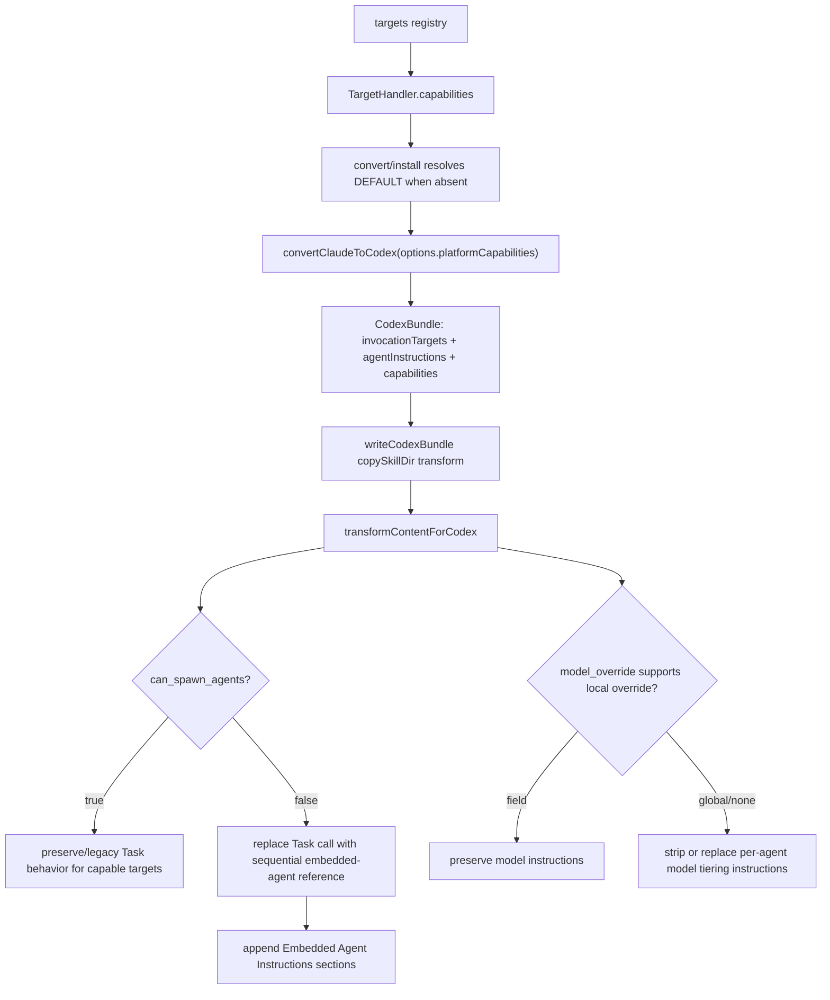

# feat: Add platform capability manifest

## Overview

本计划为 GaleHarnessCLI 增加第一版 Platform Capability Manifest，让转换器在生成目标平台内容时知道目标平台能否执行 sub-agent dispatch、是否支持 per-agent/per-dispatch model override。第一阶段以 Codex 端到端落地为先导：Codex 输出不再把 Claude `Task X(args)` 调用改写成 `Use the $X skill to:` 这种当前 Codex 无法自动执行的死指令，而是在构建时把被调用 agent 的指令嵌入到 workflow skill 中，并剥离或替换不适用于 Codex 的 model tiering 指令。

---

## Problem Frame

现有 Codex 转换链把 copied `SKILL.md` 中的 `Task agent(args)` 正则替换为 `$agent` skill 调用，但 Codex 当前的 sub-agent dispatch 需要用户显式授权，转换器不能假设运行时可以 spawn agent。这个问题本质是目标平台能力差异没有进入转换决策：同一个 skill body 在 Claude Code、Codex、Gemini、Kiro 等平台上需要不同的结构化降级策略，而不是同一套盲目正则改写（see origin: `docs/brainstorms/2026-04-24-platform-capability-manifest-requirements.md`）。

---

## Requirements Trace

- R1. `TargetHandler` 新增可选 `capabilities` 字段，类型为 `PlatformCapabilities`。
- R2. `PlatformCapabilities` 第一版包含 `can_spawn_agents: boolean` 和 `model_override: "field" | "global" | "none"`。
- R3. Codex handler 声明 `can_spawn_agents: false`, `model_override: "global"`；Claude handler 声明 `can_spawn_agents: true`, `model_override: "field"`。
- R4. 转换器在构建时读取目标 handler capabilities，并把能力作为内容重写输入。
- R5. 当 `can_spawn_agents: false` 时，Codex 输出中的 `Task X(args)` 调用不再变成 `$X skill` 指令，而是引用同一 skill 文档内的嵌入 agent section。
- R6. 嵌入 agent 指令使用命名 section，例如 `## Agent: repo-research-analyst`，包含该 agent 的核心指令，供主 agent 在同一 context window 中 sequential 执行。
- R7. 当目标不支持 per-agent/per-dispatch model override 时，转换器剥离或替换 skill body 中的 model tiering 指令。
- R8. 对 `can_spawn_agents: true` 的目标，Claude Code 输出保持原生 `Task X(args)` 语法。
- R9. Capability-aware 重写对 skill 作者透明，不要求修改源 skill 文件。
- R10. 未声明 capabilities 的 target handler 使用 Claude Code 兼容默认值：`can_spawn_agents: true`, `model_override: "field"`。
- R11. 转换器只修改输出目录内容，不修改源 skill 文件。

**Origin actors:** A1 转换器（Converter）, A2 目标平台 Handler, A3 Skill 作者

**Origin flows:** F1 Capability-Aware Skill Conversion

**Origin acceptance examples:** AE1 covers R4/R5/R6, AE2 covers R4/R7, AE3 covers R8/R10

---

## Scope Boundaries

- 第一版只让 Codex target 走 capability-aware agent inlining 的端到端路径；其他目标先声明或继承 capabilities，不重写各自现有行为。
- 第一版只覆盖 `can_spawn_agents` 和 `model_override` 两个能力维度。
- 不修改 `plugins/galeharness-cli/skills/**/SKILL.md` 源文件，也不要求 skill 作者新增 metadata。
- 不实现运行时能力查询或自动探测；capabilities 是构建时静态声明。
- 不实现 per-skill `execution_model` 声明。
- 不实现完整跨平台 skill 验证套件。
- 不做 token 预算压缩、agent section 摘要生成或语义级 agent body 精简；第一版以正确性和可测试结构为先。

### Deferred to Follow-Up Work

- 扩展 capabilities 维度（如 question tool、prompt size、parallelism、sidecar support）：后续独立设计，避免第一版把 schema 做成未经验证的大杂烩。
- 为所有 16+ targets 建立 capability conformance tests：后续独立测试投资，第一版只覆盖默认兼容、Claude、Codex 和回归风险最高的内容重写路径。
- 针对大型 workflow skill 做 token-aware agent body 压缩：后续优化；第一版先保证 Codex 输出可执行。

---

## Context & Research

### Relevant Code and Patterns

- `src/targets/index.ts` 定义 `TargetHandler` 和全局 `targets` 注册表，是 capabilities 字段的自然挂载点。
- `src/commands/convert.ts` 和 `src/commands/install.ts` 是读取 handler、调用 `handler.convert(plugin, options)` 的入口；这里最适合把 `target.capabilities ?? DEFAULT_PLATFORM_CAPABILITIES` 注入转换上下文。
- `src/converters/claude-to-codex.ts` 已经在 `convertClaudeToCodex` 中同时拥有 `plugin.skills` 和 `plugin.agents`，能构建 agent instruction map，解决 copied `SKILL.md` 写入时找不到 agent body 的问题。
- `src/targets/codex.ts` 的 `writeCodexBundle` 通过 `copySkillDir(..., transformSkillContent)` 对 copied `SKILL.md` 做 Codex transform；第一版应复用这条路径，但把 transform 所需的 capabilities 和 agent instruction map 放进 `CodexBundle`。
- `src/utils/codex-content.ts` 当前集中处理 Codex 内容重写，包括 Task、slash command、`.claude/` 路径和 `@agent` 引用；新增能力感知重写应优先扩展这里，而不是散落在 writer。
- `tests/codex-converter.test.ts` 已覆盖 generated command/agent skill 的 Task 重写；`tests/codex-writer.test.ts` 已覆盖 copied `SKILL.md` 的 Task 重写，是 AE1 的主要回归测试位置。

### Institutional Learnings

- `docs/solutions/codex-skill-prompt-entrypoints.md`：Codex 的技能、prompt 和 workflow entrypoint 是结构性边界；修复 Codex 转换问题时要先明确目标 surface，再做内容重写。该学习也强调 copied `SKILL.md` 需要 Codex-specific transform，并且未知 slash 文本不能被误改。
- `docs/solutions/integrations/cross-platform-model-field-normalization-2026-03-29.md`：不同目标平台的 model 字段格式完全不同；Codex skill frontmatter 不支持 model 字段，Codex 模型选择是全局配置或运行时命令。第一版 model override 处理应将 Codex 视为 `global`，避免在 skill 内容中保留 per-agent model 选择指令。
- `docs/solutions/adding-converter-target-providers.md`：转换器应优先使用结构化映射，避免试图语义解析 agent body；内容转换很脆弱，必须有边界测试，尤其是路径、slash command 和 agent dispatch 的正则。
- `docs/solutions/best-practices/new-target-platform-cr-checklist.md`：target handler 注册字段会被 `--also` 等路径消费；新增 target-level 字段时要覆盖 primary、`all` 和 `--also` 调用路径，防止某条 CLI 分支漏传默认值。

### External References

- 未做新的外部研究。现有 repo 内 `docs/specs/codex.md` 已记录 Codex skills/frontmatter、prompts、config 和模型配置的官方来源快照；本计划依赖该本地规格和当前 Codex 运行约束。

---

## Key Technical Decisions

- **Capabilities 作为转换上下文，而不是 converter 内部硬编码。** 在 `TargetHandler` 上声明 `capabilities`，由 `convert`/`install` 在调用 converter 时注入 `options.platformCapabilities`。这样满足“转换器读取 handler capabilities”的要求，同时保持 target-specific converter 可以按需忽略新字段。
- **Capabilities 类型放在独立共享类型文件。** 新建 `src/types/platform-capabilities.ts`，避免 `src/targets/index.ts` 和 converter options 之间形成不必要的导入耦合。
- **Codex agent inlining 用 bundle 携带 agent instruction map。** `convertClaudeToCodex` 构建 `agentInstructions`，`CodexBundle` 传给 writer；writer transform copied skill 时即可解析 `Task galeharness-cli:repo-research-analyst(...)` 并嵌入对应 agent body。
- **Codex writer 也要有目标本地默认。** 正常 CLI 路径会由 converter 注入 capabilities，但 `writeCodexBundle` 的直接调用和 writer 单测可能构造最小 bundle。Codex writer 在 bundle 缺少 capabilities 时应使用 Codex target 默认（`can_spawn_agents: false`, `model_override: "global"`），而不是全局 Claude-compatible default，避免直接写入路径恢复旧死指令。
- **嵌入 section 使用去重的 named sections。** 每个 transformed document 中同一个 agent 只生成一次 `## Agent: <name>` section，Task 调用点替换为“run embedded agent section sequentially with input ...”。这避免同一 workflow 多次引用同一 agent 时重复膨胀。
- **嵌套 Task 调用采用 bounded recursive inlining。** agent body 中若包含已知 `Task Y(args)`，可以继续嵌入；用 visited set 防止循环。未知 agent 不生成 `$skill` 死指令，而保留明确的 sequential fallback note，提示实现期确认缺失 agent 映射。
- **Model override stripping 做窄匹配。** Codex 已经丢弃 frontmatter `model` 字段；正文处理只针对明确的 per-agent/per-dispatch model 指令、`model: "..."` 示例和已知 model tiering 段落，替换为“use the current global model”。不要删除普通领域词 “model”。
- **Claude 行为通过默认 capabilities 和显式 handler 声明保护。** `claude` 声明 `field/true`，未声明目标也默认同等能力，保证 AE3 和向后兼容。

---

## Open Questions

### Resolved During Planning

- 嵌套 agent dispatch 第一版是否递归？结论：做 bounded recursive inlining，但只对已知 agent 生效，并用 visited set 防循环。这样比“一层内联”更能避免把死指令藏进嵌入 agent body，且测试面仍可控。
- Codex 的 `model_override` 应该是 `global` 还是 `none`？结论：Codex 声明为 `global`，因为 Codex 有全局 `config.toml` / runtime model 选择，但不支持 skill/agent 局部 model frontmatter 或 per-dispatch override。
- Agent section 放在调用点还是文末？结论：调用点替换为顺序执行指令，文末追加去重的 `## Embedded Agent Instructions` 区块。这样保持主流程可读，也避免在列表中插入大段 agent body 打断 workflow。

### Deferred to Implementation

- 最终 helper 命名和 option 字段名：实现时可按现有 TypeScript 风格微调，但必须保留独立能力类型、默认 capabilities 和 CodexBundle agent instruction map 的边界。
- Model tiering 段落的首批精确匹配集合：实现时以实际 `plugins/galeharness-cli/skills/**/SKILL.md` 命中结果为准，先覆盖 `gh:review`、`gh:plan`、`gh:compound`、`document-review` 中明确的 model override 指令。
- 大型 embedded agent section 对 Codex 上下文体积的实际影响：第一版不做压缩；若 `install --to codex` 生成内容过大，后续再做摘要或按需 reference 提取。

---

## High-Level Technical Design

> *This illustrates the intended approach and is directional guidance for review, not implementation specification. The implementing agent should treat it as context, not code to reproduce.*

---

## Implementation Units

- [x] U1. **Define platform capabilities contract**

**Goal:** 建立 target handler 可声明、converter 可消费的能力契约，并保证未声明目标向后兼容。

**Requirements:** R1, R2, R3, R10

**Dependencies:** None

**Files:**
- Create: `src/types/platform-capabilities.ts`
- Modify: `src/targets/index.ts`
- Test: `tests/converter.test.ts`

**Approach:**
- 定义 `PlatformCapabilities` 和 `DEFAULT_PLATFORM_CAPABILITIES`，默认值为 `can_spawn_agents: true`, `model_override: "field"`。
- 在 `TargetHandler` 上新增可选 `capabilities?: PlatformCapabilities`。
- 在 `targets` registry 中给 `claude` 和 `codex` 显式声明 capabilities；其他 target 第一版可不声明，靠默认值保持行为。
- 避免把 capabilities 类型定义在 `src/targets/index.ts` 中，以免 converter options 导入 target registry 时增加耦合。

**Patterns to follow:**
- `src/targets/index.ts` 中 `defaultScope` / `supportedScopes` 的可选 handler metadata 模式。
- `docs/solutions/best-practices/new-target-platform-cr-checklist.md` 关于 target registry 字段在 `--also` 路径上的一致性提醒。

**Test scenarios:**
- Happy path: 读取 `targets.codex.capabilities` -> 返回 `can_spawn_agents: false`, `model_override: "global"`。
- Happy path: 读取 `targets.claude.capabilities` -> 返回 `can_spawn_agents: true`, `model_override: "field"`。
- Edge case: 一个未声明 capabilities 的 test handler 经默认解析 -> 得到 `DEFAULT_PLATFORM_CAPABILITIES`，不需要每个 target 立即声明。

**Verification:**
- TypeScript 编译通过，现有 targets 无需批量改动也能通过类型检查。
- 测试明确证明 Codex/Claude 声明和默认 fallback 行为。

---

- [x] U2. **Pass capabilities through CLI conversion paths**

**Goal:** 确保 `convert`、`install`、`--to all` 和 `--also` 都把 handler capabilities 注入 converter options，让转换器真正基于目标平台能力做决策。

**Requirements:** R4, R10, R11

**Dependencies:** U1

**Files:**
- Modify: `src/converters/claude-to-opencode.ts`
- Modify: `src/commands/convert.ts`
- Modify: `src/commands/install.ts`
- Test: `tests/cli.test.ts`

**Approach:**
- 扩展共享 converter options 类型，新增 `platformCapabilities?: PlatformCapabilities`。
- 在 CLI 调用 `handler.convert(plugin, options)` 前，解析 `handler.capabilities ?? DEFAULT_PLATFORM_CAPABILITIES`，并传入每次转换调用。
- 覆盖 primary target、auto-detected `all` target、`--also` extra targets 三条路径。
- 保持 `handler.write` 不感知 capabilities；capability-aware 内容应在 converter/bundle 层决策，而非 writer 临时查询 registry。

**Patterns to follow:**
- `src/commands/install.ts` 中 `handler.defaultScope` 在 `--also` 分支传递的模式。
- `src/commands/convert.ts` 和 `src/commands/install.ts` 已有的 shared `ClaudeToOpenCodeOptions` 组装方式。

**Test scenarios:**
- Happy path: `convert --to codex` 触发 Codex converter 时 options 中包含 Codex capabilities，输出走 agent inlining 行为（可通过后续 U3/U5 的输出断言覆盖）。
- Integration: `install --to all` 检测到 Codex 时，Codex bundle 使用 Codex capabilities；其它未声明 target 使用默认能力且现有输出不变。
- Edge case: `--also codex` 分支不漏传 capabilities，Codex extra output 与 primary Codex output 的 Task 重写策略一致。

**Verification:**
- 所有 CLI conversion 分支都调用同一个小 helper 解析 capabilities，避免分支漂移。
- 不修改源 plugin 目录，只影响生成 bundle/output。

---

- [x] U3. **Add Codex agent instruction map and embedded Task rewriting**

**Goal:** Codex copied/generated skills 在遇到 `Task X(args)` 时，不再输出 `$X skill` 死指令，而是引用同一文档内嵌的 agent instruction section。

**Requirements:** R4, R5, R6, R8, R9, R11; covers AE1, AE3

**Dependencies:** U1, U2

**Files:**
- Modify: `src/types/codex.ts`
- Modify: `src/converters/claude-to-codex.ts`
- Modify: `src/utils/codex-content.ts`
- Modify: `src/targets/codex.ts`
- Modify: `src/targets/index.ts`
- Test: `tests/codex-converter.test.ts`
- Test: `tests/codex-writer.test.ts`

**Approach:**
- 在 `CodexBundle` 中新增 `agentInstructions`（名称可实现时微调），由 `convertClaudeToCodex` 从 `plugin.agents` 构建。
- 在 `CodexBundle` 中携带实际使用的 capabilities；`writeCodexBundle` 若遇到历史/测试构造的 bundle 缺少该字段，应使用 Codex target 的本地默认能力。
- key 同时支持 normalized final segment 和 fully-qualified/final-segment lookup，确保 `Task repo-research-analyst(...)` 与 `Task galeharness-cli:repo-research-analyst(...)` 都能找到同一 agent。
- 扩展 `transformContentForCodex` options：包含 `platformCapabilities`、`agentInstructions`、递归 visited set 和输出 section 收集器。
- 当 `can_spawn_agents: false` 且 agent 已知时，把原 Task 行替换为顺序执行指令，例如“Run the embedded agent section `Agent: repo-research-analyst` sequentially in this context. Input: ...”，并在文末追加：
  - `## Embedded Agent Instructions`
  - `### Agent: repo-research-analyst`
  - agent description/capabilities（如有）
  - transformed agent body
- 对同一文档内重复引用同一 agent 去重，但保留每个调用点的 input。
- 对未知 agent 不生成 `$skill` 引用；输出明确 fallback note，指向缺失 agent mapping 的实现期排查。
- 对 `can_spawn_agents: true` 的目标保持现有 Task 行为；Claude converter 不经过 Codex transform，AE3 主要通过 target capabilities/default 行为和 Claude converter 测试保护。

**Execution note:** 先写 copied `SKILL.md` 的失败测试，因为这是用户实际遇到的 Codex 死指令路径。

**Patterns to follow:**
- `src/utils/codex-content.ts` 现有 Task regex 支持 namespaced agent final segment 的逻辑。
- `src/converters/claude-to-codex.ts` 的 `convertAgent` 已经把 agent capabilities prepend 到 generated skill body，可复用相同格式构造 embedded section。
- `tests/codex-writer.test.ts` 中 copied `SKILL.md` transform 测试结构。

**Test scenarios:**
- Covers AE1. Happy path: copied `SKILL.md` 包含 `Task galeharness-cli:repo-research-analyst(feature_description)`，Codex writer 输出不包含 `Use the $repo-research-analyst skill to:`，包含 `## Embedded Agent Instructions` 和 `### Agent: repo-research-analyst`。
- Happy path: bare `Task best-practices-researcher(topic)` 与 namespaced Task 都能通过 final segment 找到 agent instruction。
- Edge case: 同一 agent 被引用两次 -> 调用点出现两处 sequential input 指令，但 embedded section 只出现一次。
- Edge case: zero-argument Task -> 输出 sequential 指令不带空的 `Input:` 噪音，也不生成 `to:`。
- Error path: Task 引用不存在的 agent -> 输出包含明确的 “agent instructions were not available” fallback note，不生成 `$missing-agent skill` 死指令。
- Integration: generated command skill 中的 Task 调用也走同一能力感知 transform，避免 command-derived skill 和 copied skill 行为不一致。
- Integration: 直接调用 `writeCodexBundle` 且 bundle 未显式包含 capabilities -> copied `SKILL.md` 仍使用 Codex 默认能力，不退回 `Use the $agent skill` 旧行为。

**Verification:**
- `install --to codex` 生成的 `gh-plan` skill 中不再出现 `Use the $repo-research-analyst skill to:`。
- 现有 slash command、`.claude/` 路径和 `@agent` 引用转换测试继续通过。

---

- [x] U4. **Strip unsupported model override instructions for Codex**

**Goal:** 当目标不支持 local model override 时，输出内容不再要求 agent 使用 `model: "haiku"`、`model: "sonnet"` 或类似 per-subagent model tiering。

**Requirements:** R4, R7, R9, R11; covers AE2

**Dependencies:** U1, U2

**Files:**
- Modify: `src/utils/codex-content.ts`
- Modify: `src/converters/claude-to-codex.ts`
- Test: `tests/codex-converter.test.ts`
- Test: `tests/codex-writer.test.ts`

**Approach:**
- 在 Codex content transform 中增加窄范围 model override sanitizer，仅当 `model_override` 为 `"global"` 或 `"none"` 时启用。
- 保留 Codex generated skill frontmatter 继续不输出 `model` 字段的现状。
- 对正文中的明确 override 指令做替换或删除：
  - `model: "sonnet"` / `model: 'haiku'` / YAML-style `model: haiku` 示例行。
  - “pass `model: "sonnet"`” 这类 tool-call 参数指导。
  - 已知 model tiering 段落中要求在不同 persona/subagent 使用不同模型的指令。
- 替换文案应表达“使用当前平台/全局模型”，不要让 Codex 运行时尝试选择一个不存在的 per-agent model。
- 不删除普通 “model” 术语，例如业务模型、数据模型、LLM-as-judge model 概念，避免误伤技能内容。

**Patterns to follow:**
- `docs/solutions/integrations/cross-platform-model-field-normalization-2026-03-29.md` 关于 Codex model 字段和“when in doubt, drop”的结论。
- `src/utils/model.ts` 的 shared model handling 思路：平台差异集中在 helper，而不是散落到每个 converter。

**Test scenarios:**
- Covers AE2. Happy path: copied `gh:review` 风格内容包含 `model: "sonnet"` dispatch 指令，Codex transform 后不再包含该 literal，改为继承当前全局模型。
- Happy path: agent frontmatter `model: sonnet` 仍不会出现在 generated Codex skill frontmatter。
- Edge case: 内容中出现 “data model” 或 “model context protocol” -> 不被 sanitizer 删除。
- Edge case: 对 `model_override: "field"` 调用 transform -> 保持 model tiering 文本不变，用于证明默认/Claude-like target 不受影响。

**Verification:**
- Codex 输出不包含指导 Codex 传递 per-agent `model` 参数的正文。
- 非 Codex target 现有 model normalization 测试不需要改动或继续通过。

---

- [x] U5. **Harden fixtures and regression coverage**

**Goal:** 用测试覆盖 capability-aware 重写的核心合同，防止未来新增 target 或调整 Codex transform 时恢复死指令。

**Requirements:** R5, R6, R7, R8, R10, R11; covers AE1, AE2, AE3

**Dependencies:** U1, U2, U3, U4

**Files:**
- Modify: `tests/fixtures/sample-plugin/agents/agent-one.md`
- Create: `tests/fixtures/sample-plugin/agents/repo-research-analyst.md`
- Create: `tests/fixtures/sample-plugin/agents/learnings-researcher.md`
- Modify: `tests/fixtures/sample-plugin/skills/skill-one/SKILL.md`
- Modify: `tests/codex-converter.test.ts`
- Modify: `tests/codex-writer.test.ts`
- Modify: `tests/converter.test.ts`

**Approach:**
- 增强 sample plugin，让 fixture 具备一个 copied skill 调用多个 agents 的真实形态。
- 测试 Codex primary conversion、writer copy transform、默认 capabilities fallback 和 Claude-compatible preserve behavior。
- 保留或调整现有 “Task -> Use the $skill” 测试：如果该行为只适用于 `can_spawn_agents: true`，测试名和 options 要表达能力条件；Codex 默认测试应断言 embedded section。
- 加入未知 agent 和 model sanitizer 的边界测试，避免“看似修了 gh:plan，但其他 workflow 仍会产生死指令”。

**Patterns to follow:**
- `tests/codex-writer.test.ts` 用临时目录构造 copied skill，适合断言写入后的真实文件内容。
- `tests/model-utils.test.ts` 和各 converter tests 的做法：对跨平台 model 行为写小而明确的断言。

**Test scenarios:**
- Integration: fixture plugin 转 Codex 后，copied `SKILL.md` 中所有 known Task 调用均转换为 embedded-agent sequential references。
- Integration: fixture plugin 转 Claude 后，Claude output 保持 agent/skill 原生结构，不引入 Codex embedded section。
- Error path: unknown Task 不变成 `$skill` 死指令，并在输出中有可诊断 fallback。
- Regression: unknown slash route、URL、`.claude/` path rewrite 和 existing prompt target rewrite 行为保持现有测试预期。

**Verification:**
- `bun test tests/codex-converter.test.ts tests/codex-writer.test.ts tests/converter.test.ts` 能证明本计划的核心合同。
- 完整 `bun test` 应作为实现完成前的最终验证。

---

- [x] U6. **Document capability-aware conversion behavior**

**Goal:** 更新用户和维护者能看到的文档，使 Codex capability-aware 行为、capabilities schema 和后续扩展边界可发现。

**Requirements:** R3, R4, R9, R10

**Dependencies:** U1, U3, U4, U5

**Files:**
- Modify: `README.md`
- Modify: `docs/specs/codex.md`
- Modify: `docs/solutions/adding-converter-target-providers.md`
- Test: `bun run release:validate` expectation only if plugin inventory metadata is touched

**Approach:**
- 在 README 的 target/conversion 说明中记录 Codex 会把 unsupported sub-agent dispatch 降级为 embedded sequential sections，而不是运行时 spawn。
- 在 `docs/specs/codex.md` 增补本 repo 的 Codex conversion policy：Codex supports global model selection but not per-skill/per-agent model override in generated skills。
- 在 `docs/solutions/adding-converter-target-providers.md` 中加入新 target provider checklist：声明 capabilities、确认 default fallback、为 content transforms 写能力矩阵测试。
- 不更新 release-owned version，不手写 changelog release entry。

**Patterns to follow:**
- Root `AGENTS.md` 的 release versioning 规则。
- `plugins/galeharness-cli/AGENTS.md` 对跨平台 skill 转换和 tool selection 的说明风格。

**Test scenarios:**
- Test expectation: none -- 文档更新本身无运行时行为；实现完成时由相关 converter tests 证明行为。

**Verification:**
- 文档能回答三个问题：target 如何声明 capabilities、Codex 为什么 inline agent、未来新增 target 应在哪里补测试。

---

## System-Wide Impact

- **Interaction graph:** `src/commands/convert.ts` / `src/commands/install.ts` -> `targets` registry -> target converter -> target bundle -> writer transform。Capabilities 应在 converter 调用前确定，writer 只消费 bundle。
- **Error propagation:** 缺失 agent instruction 不应抛出并中断整个转换，除非实现选择在 strict test helper 中显式验证；用户-facing 输出应带可诊断 fallback，避免静默生成 `$missing skill` 死指令。
- **State lifecycle risks:** `copySkillDir` 只改输出目录文件；源 plugin skill/agent 文件保持不变。`CodexBundle` 增加 instruction map 后要注意不把绝对 source paths 写入输出内容。
- **API surface parity:** `TargetHandler` 和 shared converter options 是内部 TypeScript API，但会影响所有 target converters 的类型检查。未声明 capabilities 的 target 必须保持现有行为。
- **Integration coverage:** Unit tests 要覆盖 converter-level generated skill 和 writer-level copied skill 两条路径；单测只测 `transformContentForCodex` 不足以证明真实 install output。
- **Unchanged invariants:** Codex prompt wrapper model、canonical `gh:*` workflow prompt 生成、unknown slash preservation、`.codex/config.toml` MCP merge 行为不属于本次变更范围，测试预期应保持不变。

---

## Risks & Dependencies

| Risk | Mitigation |
|------|------------|
| Embedded agent body 让 Codex skill 体积明显增加 | 第一版只按实际 Task 引用去重嵌入；把 token-aware compression 明确 defer，避免先做复杂摘要导致指令丢失 |
| Model sanitizer 误删普通 “model” 业务术语 | 采用窄匹配和回归测试，优先替换明确 `model: "..."` / dispatch 参数 / known tiering 段落 |
| CLI 某条路径漏传 capabilities | U2 覆盖 primary、`all`、`--also`，并抽 helper 统一解析默认值 |
| agent body 中相对 reference 路径在嵌入后语义变弱 | 第一版嵌入核心 body，并在 section heading 标明来源 agent；若 agent 依赖 sidecar/reference 文件，后续再做 sidecar-aware embedding 或 reference copy 策略 |
| 其它 target 未来需要不同 `can_spawn_agents` 策略 | 默认保持 Claude-compatible，第一版不强行重写其它 target；后续 target 可逐个声明并增加测试 |

---

## Documentation / Operational Notes

- 实现完成后运行完整 `bun test`；如果只改 converter/tests/docs，通常不需要 `bun run release:validate`，除非更新了 plugin inventory、marketplace metadata 或 release-owned counts。
- PR 标题建议使用 `feat(converters): add platform capability manifest`，因为这是转换器能力而非单纯文档变更。
- 不手动 bump 版本，不更新 root `CHANGELOG.md` release entry。

---

## Sources & References

- **Origin document:** [docs/brainstorms/2026-04-24-platform-capability-manifest-requirements.md](../brainstorms/2026-04-24-platform-capability-manifest-requirements.md)
- Related ideation: [docs/ideation/2026-04-24-codex-subagent-parallel-invocation-ideation.md](../ideation/2026-04-24-codex-subagent-parallel-invocation-ideation.md)
- Related code: `src/targets/index.ts`
- Related code: `src/converters/claude-to-codex.ts`
- Related code: `src/targets/codex.ts`
- Related code: `src/utils/codex-content.ts`
- Related tests: `tests/codex-converter.test.ts`
- Related tests: `tests/codex-writer.test.ts`
- Institutional learning: `docs/solutions/codex-skill-prompt-entrypoints.md`
- Institutional learning: `docs/solutions/integrations/cross-platform-model-field-normalization-2026-03-29.md`
- Institutional learning: `docs/solutions/adding-converter-target-providers.md`
- Institutional learning: `docs/solutions/best-practices/new-target-platform-cr-checklist.md`
