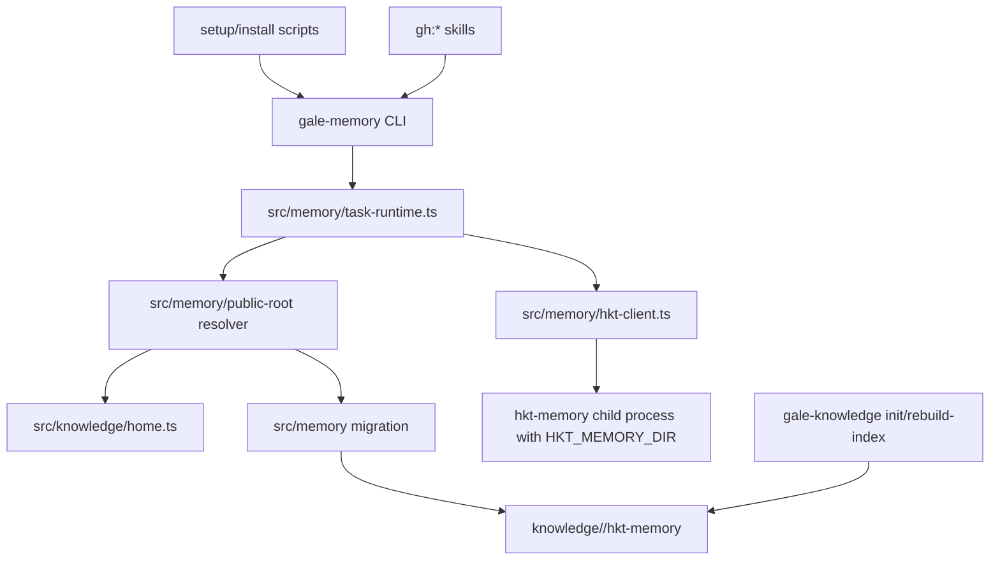

# feat: HKTMemory Public Knowledge Migration

## Overview

本计划把 Gale-managed 的 HKTMemory 默认记忆根目录收敛到公共知识库：`~/.galeharness/knowledge/<project>/hkt-memory`。核心做法是复用现有 `gale-knowledge` 的 home/project 解析，在 `gale-memory` 和 `HktClient` 这一层集中注入 `HKT_MEMORY_DIR`，首次发现项目本地 `memory/` 时执行 copy-first 迁移，并通过诊断/status 输出说明当前来源状态。

这不是重写 HKTMemory，也不改变裸 `hkt-memory` 在独立场景下的默认 `memory/` 语义。只有通过 GaleHarness 脚本安装、`gale-memory` helper 或 Gale-managed runtime 进入的调用会默认使用公共知识库路径（see origin: `docs/brainstorms/2026-04-24-hktmemory-public-knowledge-migration-requirements.md`）。

---

## Problem Frame

当前公共知识文档已经由 `gale-knowledge` 管理到全局 Git 仓库，但 HKTMemory 的 L0/L1/L2、governance、lifecycle 和 session 相关文件仍默认落在项目本地 `memory/`。这导致同一个 GaleHarness 工作流产生两套知识来源：durable Markdown 文档可迁移，HKTMemory 的高价值记忆却跟随单个 checkout，清理项目仓库或换机器时容易丢失上下文。

现有代码已经有良好的全局知识仓库基础：`src/knowledge/home.ts` 解析 `GALE_KNOWLEDGE_HOME` 和项目名，`cmd/gale-knowledge/init.ts` 初始化 Git 仓库，`cmd/gale-knowledge/rebuild-index.ts` 扫描 Markdown 并写入 HKTMemory。缺口在 memory runtime：`cmd/gale-memory/index.ts` 只负责 task memory 子命令，`src/memory/hkt-client.ts` 直接调用 `hkt-memory`，没有统一 memory root、迁移或状态诊断。

---

## Requirements Trace

- R1. Gale-managed HKTMemory 默认解析到 `~/.galeharness/knowledge/<project>/hkt-memory`，支持显式覆盖。
- R2. 项目名解析复用 `gale-knowledge` 的 `extractProjectName` / `sanitizePathComponent` 规则。
- R3. Gale-managed 调用通过 `HKT_MEMORY_DIR` 或 `--memory-dir` 指向全局 root，不改变裸 `hkt-memory` 默认行为。
- R4. 全局 root 创建 HKTMemory 分层目录，并允许 governance / lifecycle / task ledger 使用同一 root。
- R5-R10. 现有项目 `memory/` 执行 copy-first 一次性迁移；跳过派生缓存；不删除本地目录；冲突不静默覆盖；迁移后优先全局 root。
- R11-R12. release binary、自源码 setup、自检和技能 runtime 统一通过 `gale-memory` 进入。
- R13-R14. 公共知识库 `.gitignore` 忽略 HKTMemory 派生缓存；`rebuild-index` 可索引 Markdown，但避免递归污染同一 HKTMemory root。
- R15-R18. 支持用户覆盖、状态诊断和 graceful degradation；裸 `hkt-memory` 只通过文档和诊断说明兼容边界。

**Origin actors:** A1 GaleHarness 用户, A2 安装/运行脚本, A3 Gale memory runtime, A4 HKTMemory CLI/runtime, A5 公共知识库维护者
**Origin flows:** F1 新用户首次使用, F2 现有项目迁移, F3 公共知识库 git 化与索引, F4 裸 `hkt-memory` 兼容
**Origin acceptance examples:** AE1 新用户全局 root, AE2 copy-first 迁移, AE3 冲突报告, AE4 git ignore 与 rebuild-index, AE5 覆盖/裸命令/降级诊断

---

## Scope Boundaries

- 不修改 HKTMemory 上游裸命令默认路径；`vendor/hkt-memory/scripts/hkt_memory_v5.py` 已支持 `HKT_MEMORY_DIR` 和 `--memory-dir`，本计划在 Gale wrapper 层使用它。
- 不删除、不移动项目本地 `memory/`；它保留为 legacy backup 和裸命令兼容路径。
- 不做长期双写、实时同步或双向合并。
- 不把 `*.db`、vector store、BM25/session transcript index、`_lifecycle/events.jsonl` 等派生缓存作为公共知识库 Git source of truth。
- 不改变 HKTMemory 的 L0/L1/L2 算法、MCP server、vector backend、session transcript schema 或 lifecycle 语义。

### Deferred to Follow-Up Work

- 裸 `hkt-memory` 默认全局化：如果未来要改变上游独立语义，应在 HKTMemory 自身仓库另起设计。
- 项目本地 `memory/` 清理命令：可以后续增加显式 cleanup/archive 工具，但本计划不自动删除用户数据。

---

## Context & Research

### Relevant Code and Patterns

- `src/knowledge/home.ts` 已提供 `resolveKnowledgeHome`、`extractProjectName`、`sanitizePathComponent`，应作为公共 root 和 project 解析的基础。
- `cmd/gale-knowledge/init.ts` 当前 `.gitignore` 只有 `*.db`、`vector-index/`、`.last-rebuild-commit`，需要补齐 HKTMemory 派生缓存规则。
- `cmd/gale-knowledge/rebuild-index.ts` 当前递归扫描所有 Markdown 并调用 vendored `hkt_memory_v5.py store`，需要明确处理 `hkt-memory` subtree，避免把公共知识库 Markdown 重复写回同一 memory root。
- `src/memory/hkt-client.ts` 是所有 task recall/capture 的集中调用点，适合注入 `HKT_MEMORY_DIR` 并保留 unavailable/timeout 的 skipped 结果。
- `src/memory/task-runtime.ts` 负责 envelope、项目、repo root、branch 和 task id；状态诊断和 migration trigger 应复用这里的项目上下文，而不是每个技能拼路径。
- `cmd/gale-memory/index.ts` 当前只有 `start`、`capture`、`feedback`，适合新增 `status`、`migrate` 或 `resolve-root` 等辅助子命令。
- `scripts/setup.sh` / `scripts/setup.ps1` 当前主动创建项目本地 `memory/`，这正是需要调整的 source setup 行为。
- `scripts/install-release.sh` / `scripts/install-release.ps1` 已安装 `gale-memory` 和 `gale-knowledge`，但安装后自检尚未验证 HKTMemory memory root 指向公共知识库。
- `tests/gale-memory-runtime.test.ts`、`tests/knowledge-path.test.ts`、`tests/knowledge-init.test.ts`、`tests/knowledge-rebuild-index.test.ts`、`tests/install-release-sh.test.ts`、`tests/install-release-ps1.test.ts` 是本计划的主要测试扩展点。

### Institutional Learnings

- `docs/solutions/developer-experience/global-knowledge-repository-infrastructure-2026-04-20.md` 确认全局知识仓库采用 env -> config -> default 的路径优先级、fallback 策略和 CLI 职责分离。
- `docs/solutions/integration-issues/hkt-memory-install-to-path-2026-04-23.md` 说明 HKTMemory 的实际风险在安装链路和 PATH 可见性；本计划应把诊断做清楚，避免技能静默失败。
- HKTMemory 检索结果中已包含本需求文档自身，说明后续存储只需要保存摘要和路径，不需要把完整计划复制到向量层。

### External References

- 未使用外部资料。该变更主要受 repo-local CLI、vendored HKTMemory 和现有 GaleHarness 约束决定，外部最佳实践不会改变实现边界。

---

## Key Technical Decisions

| Decision | Resolution | Rationale |
| --- | --- | --- |
| Gale-managed root | `<resolveKnowledgeHome()>/<project>/hkt-memory` | 直接继承公共知识库的 project 解析和 Git 管理，不再引入第二套 home 规则。 |
| 覆盖优先级 | `gale-memory --memory-dir` -> 用户已有 `HKT_MEMORY_DIR` -> Gale config `memory.hkt_memory_dir` -> derived public root | 保留 HKTMemory 既有 env 语义，同时让 Gale 有持久配置入口；只有 wrapper 内部设置 child env。 |
| 迁移策略 | copy-first、幂等 manifest、冲突报告 | 满足不破坏用户数据和不静默覆盖。 |
| 统一入口 | `gale-memory` / `HktClient` 集中设置 env | 避免技能和脚本分散拼路径，后续 gh:* 都可自然继承。 |
| Git source of truth | Markdown 分层记忆、governance Markdown、迁移 manifest；排除 DB/index/session 派生缓存 | 让公共知识库可审计可迁移，同时避免提交可重建噪声。 |
| rebuild-index 自引用防护 | `gale-knowledge rebuild-index` 写入独立索引 root，例如 `~/.galeharness/vector-index/knowledge-repo`，不得写入任一 `<project>/hkt-memory` root | 允许索引 `hkt-memory/**/*.md`，同时防止这些 Markdown 被重复存回自身造成递归污染。 |

---

## Open Questions

### Resolved During Planning

- 全局 memory root 配置优先级：采用 `--memory-dir`、已有 `HKT_MEMORY_DIR`、Gale config、derived public root 的顺序。
- 迁移 manifest 位置：放在全局 target root 下的 `.gale-migration-manifest.json`；冲突报告放在 `MIGRATION_CONFLICTS.md`，必要时同时输出机器可读冲突列表。
- 忽略规则：公共知识库忽略 `*.db`、`vector_store/`、`vector_store.db`、`bm25_index.db`、`entity_index.db`、`session_transcript_index.db`、`.last-rebuild-commit`、`_lifecycle/events.jsonl`、临时/缓存目录；保留 Markdown 和必要 manifest。
- release binary 如何获得 HKTMemory CLI：不在本计划强制打包 Python HKTMemory；release 安装只验证 `gale-memory` wrapper 可用并在缺失 `hkt-memory` 时给出可执行诊断。source setup 继续安装/验证 HKTMemory CLI。
- 状态诊断位置：新增 `gale-memory status` 作为主入口，安装脚本和 README 引导用户运行；`gale-knowledge` 只负责 home/init/rebuild-index。

### Deferred to Implementation

- Gale config 字段的最终命名和兼容读取细节：实现时应优先复用现有 `~/.galeharness/config.{json,yaml}` 读取模式，保持向后兼容。
- 冲突报告的具体字段顺序和输出文案：不影响架构，可在测试锁定前微调。
- 独立索引 root 的精确配置字段名：默认位置按 `~/.galeharness/vector-index/knowledge-repo` 设计，实现时可复用现有 config 读取机制暴露覆盖项。

---

## High-Level Technical Design

> *This illustrates the intended approach and is directional guidance for review, not implementation specification. The implementing agent should treat it as context, not code to reproduce.*

状态模型：

| Status | Meaning | Primary action |
| --- | --- | --- |
| `global` | 全局 root 存在并被 Gale-managed 调用使用 | 正常运行 |
| `legacy-local` | 只有项目本地 `memory/`，且未触发迁移 | 提示可运行迁移 |
| `migration-needed` | 本地 `memory/` 存在且 target 缺失或 manifest 缺失 | 自动或显式 copy-first 迁移 |
| `migrated` | manifest 显示已完成迁移，后续使用 global | 正常运行 |
| `migration-conflict` | 同名 Markdown 内容不同或目标更近 | 不覆盖，输出冲突报告 |
| `unavailable` | `hkt-memory`、git、权限或路径不可用 | graceful degradation |

---

## Implementation Units

- [ ] U1. **Public Memory Root Resolver**

**Goal:** 新增 Gale-managed HKTMemory root 解析层，集中决定当前项目的 target root、覆盖来源和状态基础信息。

**Requirements:** R1, R2, R3, R4, R15, R16, AE1, AE5

**Dependencies:** None

**Files:**
- Create: `src/memory/public-root.ts`
- Modify: `src/memory/task-runtime.ts`
- Test: `tests/gale-memory-public-root.test.ts`
- Test: `tests/knowledge-path.test.ts`

**Approach:**
- 复用 `resolveKnowledgeHome`、`extractProjectName` 和 `sanitizePathComponent`，组装 `<knowledgeHome>/<project>/hkt-memory`。
- 支持 `gale-memory --memory-dir`、用户已有 `HKT_MEMORY_DIR`、Gale config、默认 derived root 的优先级，并在返回值中标明 source。
- 提供创建标准 HKTMemory 目录结构的 helper：`L0-Abstract/topics`、`L1-Overview/topics`、`L2-Full/{daily,evergreen,episodes}` 和必要 index/MEMORY 文件。
- 解析失败时返回可诊断对象，不直接抛到用户工作流顶层，保持 graceful degradation。

**Execution note:** 先写路径优先级和 path-sanitization 的单元测试，再接 runtime。

**Patterns to follow:**
- `src/knowledge/home.ts` 的 env/config/default 优先级和 project 解析。
- `tests/knowledge-path.test.ts` 的 env restore 模式。

**Test scenarios:**
- Happy path: 设置 `GALE_KNOWLEDGE_HOME` 和 project 后解析到 `<home>/<project>/hkt-memory`。
- Happy path: 显式 `--memory-dir` 或等价 option 覆盖默认 root，status source 标记为 explicit。
- Edge case: 用户已有 `HKT_MEMORY_DIR` 时不被 derived public root 覆盖。
- Edge case: 无 git remote 时 fallback 到当前目录名，并拒绝包含路径分隔符或 traversal 的 project。
- Error path: config 文件不可读或 git 不可用时仍返回默认路径或 `unavailable` 诊断，不阻塞 envelope 构造。
- Covers AE1: 新项目无本地 `memory/` 时创建全局 L0/L1/L2 结构，不创建项目本地 `memory/`。

**Verification:**
- `buildTaskEnvelope` 可获得一致 project/root 信息。
- 新 helper 在 macOS/Linux/Windows path 语义下不产生 traversal 风险。

---

- [ ] U2. **Copy-First Migration Engine**

**Goal:** 为现有项目本地 `memory/` 提供幂等、安全的一次性复制迁移，保留本地目录并记录 manifest/冲突。

**Requirements:** R4, R6, R7, R8, R9, R10, R16, AE2, AE3

**Dependencies:** U1

**Files:**
- Create: `src/memory/migration.ts`
- Modify: `cmd/gale-memory/index.ts`
- Test: `tests/gale-memory-migration.test.ts`

**Approach:**
- 识别 HKTMemory 形态的本地 `memory/`：至少存在 `L0-Abstract`、`L1-Overview` 或 `L2-Full` 中任一标准目录。
- 迁移只复制 Markdown 分层记忆、governance Markdown、必要轻量 manifest；默认跳过 `.db`、vector/index/cache、session transcript index、`_lifecycle/events.jsonl` 等派生文件。
- target 不存在时直接复制；target 已存在时逐文件比较：相同内容跳过，target 缺失则复制，内容不同则不覆盖并记录冲突。
- 写入 `.gale-migration-manifest.json`，包含 source path、target path、timestamp、copied/skipped/conflicted counts、规则版本和 status。
- 冲突时生成 `MIGRATION_CONFLICTS.md`，status 返回 `migration-conflict`，后续 Gale-managed 调用仍优先全局 root，但提示用户检查冲突。
- 本地 `memory/` 永远不删除、不改名。

**Execution note:** 先用临时目录做 characterization-style 测试，覆盖复制/跳过/冲突/幂等，再接 CLI。

**Patterns to follow:**
- `tests/knowledge-init.test.ts` 的临时目录和 cleanup 模式。
- `cmd/gale-knowledge/init.ts` 的幂等初始化思路。

**Test scenarios:**
- Covers AE2: 本地 `memory/L0-Abstract`、`L1-Overview`、`L2-Full` 和多个 `.db` 文件迁移后，Markdown 存在于全局 target，`.db` 不复制，本地目录仍存在。
- Covers AE3: source/target 同名 Markdown 内容不同，迁移不覆盖 target，返回 `migration-conflict` 并写冲突报告。
- Happy path: target 缺失时复制标准层级和 index/MEMORY 文件，并写 completed manifest。
- Edge case: 重复运行迁移时 copied count 为 0 或只复制新增文件，manifest 更新但不重复内容。
- Error path: source 不可读或 target 权限不足时返回 `unavailable`/failed diagnostic，不删除任何文件。
- Integration: `gale-memory migrate --cwd <repo>` 可触发同一 migration engine，并输出 JSON 诊断。

**Verification:**
- 迁移过程不会修改或删除项目本地 `memory/`。
- manifest 足以判断后续运行是否已迁移、是否有冲突、是否需要人工处理。

---

- [ ] U3. **Runtime Injection Through gale-memory and HktClient**

**Goal:** 让所有 Gale-managed task memory 调用自动使用 U1 解析出的 memory root，并在首次使用时触发安全初始化/迁移。

**Requirements:** R3, R5, R10, R12, R15, R18, AE1, AE2, AE5

**Dependencies:** U1, U2

**Files:**
- Modify: `src/memory/hkt-client.ts`
- Modify: `src/memory/task-runtime.ts`
- Modify: `cmd/gale-memory/index.ts`
- Test: `tests/gale-memory-runtime.test.ts`
- Test: `tests/gale-memory-cli.test.ts`

**Approach:**
- `HktClient` 增加 env 注入能力：child process 使用 `{ ...process.env, HKT_MEMORY_DIR: resolvedRoot }`，但如果 resolver 判定用户显式设置了 `HKT_MEMORY_DIR`，保留其值并在 diagnostics 中标注 override。
- `startTaskMemory` / `captureTaskMemory` / `feedbackTaskMemory` 在构造 client 前解析 root，并按策略执行 `ensureGlobalMemoryRoot` 与 migration check。
- `cmd/gale-memory` 增加 `status`、`resolve-root`、`migrate` 子命令；现有 `start`、`capture`、`feedback` 输出中附带 memory diagnostics。
- 保持 `skippedResult` 语义：`hkt-memory` 不可用、超时、JSON malformed 都不阻塞核心工作流，但 reason 更清楚地包含 memory root 和安装建议。
- 不在 gh:* skill 中直接拼 `HKT_MEMORY_DIR`；技能层继续调用 `gale-memory start/capture`。

**Execution note:** 先扩展 fake client/child spawn 测试，确保 env 注入契约清楚，再改 CLI 输出。

**Patterns to follow:**
- `src/memory/hkt-client.ts` 的 timeout/unavailable skipped result。
- `cmd/gale-memory/index.ts` 当前 JSON 输出风格。
- `tests/hkt-memory-compounding.test.ts` 中“技能应使用 gale-memory helper 而不是 raw hkt-memory”的约束。

**Test scenarios:**
- Happy path: `startTaskMemory` 在无本地 `memory/` 时创建全局 root，并调用 fake client。
- Happy path: `HktClient` spawn 时传入 `HKT_MEMORY_DIR=<globalRoot>`。
- Edge case: 用户显式 `HKT_MEMORY_DIR=/custom` 时 child env 使用 `/custom`，status 显示 override。
- Error path: `hkt-memory` binary 不存在时仍返回 skipped，并包含 `hkt-memory unavailable` 与 resolved memory root 诊断。
- Integration: `gale-memory status --json` 返回 `global`、`legacy-local`、`migration-needed`、`migrated`、`migration-conflict` 或 `unavailable` 之一。
- Covers AE5: 裸命令或自定义 env 场景下，诊断说明实际路径与 Gale-managed 默认是否被覆盖。

**Verification:**
- 所有 Gale-managed memory 调用只有一个 runtime/helper 入口负责 root 注入。
- 旧的 `start`、`capture`、`feedback` CLI JSON 消费者不因新增 diagnostics 破坏。

---

- [ ] U4. **Knowledge Repo Git Ignore and Rebuild-Index Safety**

**Goal:** 让公共知识库能容纳 `<project>/hkt-memory`，只把 Markdown/manifest 作为 source of truth，并让 rebuild-index 写入独立索引 root，避免递归污染当前 HKTMemory root。

**Requirements:** R8, R13, R14, AE4

**Dependencies:** U1

**Files:**
- Modify: `cmd/gale-knowledge/init.ts`
- Modify: `cmd/gale-knowledge/rebuild-index.ts`
- Test: `tests/knowledge-init.test.ts`
- Test: `tests/knowledge-rebuild-index.test.ts`

**Approach:**
- 扩展 `GITIGNORE_CONTENT`，覆盖 HKTMemory 派生缓存：`*.db`、`vector_store/`、`vector_store.db`、`bm25_index.db`、`entity_index.db`、`session_transcript_index.db`、`.last-rebuild-commit`、`_lifecycle/events.jsonl`、临时缓存目录。
- `initKnowledgeRepo` 对已存在 `.gitignore` 的仓库提供幂等补丁逻辑，不只在首次 init 写入规则。
- `collectMarkdownFiles` 默认仍可扫描 `hkt-memory/**/*.md`，但 `rebuildIndex` 调用 HKTMemory store 时必须设置独立 `HKT_MEMORY_DIR`，默认位于 `~/.galeharness/vector-index/knowledge-repo`，而不是任何 `<project>/hkt-memory` root。
- 独立 index root 是可重建缓存，不属于公共知识库 Git source of truth；公共知识库只保存 Markdown 和必要 manifest。

**Patterns to follow:**
- `cmd/gale-knowledge/rebuild-index.ts` 当前增量/full 模式、`.last-rebuild-commit` 逻辑和 skipped/error 计数。
- `tests/knowledge-rebuild-index.test.ts` 对 collect、changed files、uv unavailable 的覆盖方式。

**Test scenarios:**
- Covers AE4: `gale-knowledge init` 后 `.gitignore` 包含 HKTMemory DB/index/session 派生缓存，但不忽略 `hkt-memory/**/*.md`。
- Happy path: 已存在 `.gitignore` 的知识仓库重新 init 后追加缺失规则，不删除用户自定义规则。
- Edge case: `collectMarkdownFiles` 可找到 `project/hkt-memory/L2-Full/daily/foo.md`，但 `rebuildIndex` 的 child process env 指向独立 index root，不会把它重复写回同一 root。
- Error path: `uv` 或 HKTMemory script 不可用时仍只输出 warning，不推进失败文件的 rebuild pointer。
- Integration: full rebuild 处理普通 `plans/` Markdown 与 `hkt-memory/` Markdown 时，processed/skipped/errors 计数可解释。

**Verification:**
- 公共知识库 Git 状态不会出现 `.db` 或可重建 index 文件。
- `rebuild-index` 不会在 `<project>/hkt-memory` 下产生重复 L2 记忆；索引产物只出现在独立 index root。

---

- [ ] U5. **Installation and Source Setup Alignment**

**Goal:** 调整 release binary 安装、自源码 setup 和自检输出，使新用户不再由 GaleHarness 脚本默认创建项目本地 `memory/`。

**Requirements:** R5, R11, R12, R16, R18, AE1, AE5

**Dependencies:** U1, U3

**Files:**
- Modify: `scripts/setup.sh`
- Modify: `scripts/setup.ps1`
- Modify: `scripts/install-release.sh`
- Modify: `scripts/install-release.ps1`
- Modify: `tests/setup-scripts-ci-mode.test.ts`
- Modify: `tests/install-release-sh.test.ts`
- Modify: `tests/install-release-ps1.test.ts`

**Approach:**
- Source setup 移除或替换当前直接 `mkdir -p memory/...` 的步骤，改为调用/提示 `gale-memory status` 或 `gale-memory resolve-root`，由 runtime 在公共知识库创建 root。
- source setup 仍继续安装和验证 `hkt-memory` CLI，因为 HKTMemory 是 Python 工具，release binary 暂不打包它。
- release installer 的 post-install verification 增加 `gale-memory status` 建议；如果 `hkt-memory` 不在 PATH，输出清晰诊断但不让二进制安装失败。
- Windows setup 保留 `hkt-memory.cmd` 安装逻辑，同时让自检说明 memory root 是公共知识库路径。
- CI mode 不写用户 profile，不污染 repo `memory/`。

**Patterns to follow:**
- `scripts/setup.sh` / `scripts/setup.ps1` 已有 CI mode、PATH 和 HKTMemory install 自检结构。
- `tests/install-release-sh.test.ts` 使用本地 archive 和 stdout contract。

**Test scenarios:**
- Covers AE1: source setup 文本和 CI 测试不再创建项目本地 `memory/L0-Abstract`。
- Happy path: install-release stdout 包含 `gale-memory status` 或等价诊断建议。
- Edge case: `hkt-memory` 不可用时 setup 输出 warning，不阻塞 `gale-harness` / `gale-knowledge` binary 安装。
- Windows: PowerShell installer/self-check 文案包含 `gale-memory.exe status`，且不依赖 bash。
- CI: `GHALE_CI=1` 下不会尝试交互配置或写 shell profile，仍能验证 CLI 启动。

**Verification:**
- 新安装用户通过 Gale-managed 入口产生的记忆进入公共知识库。
- 贡献者 setup 不再把 repo 根目录 `memory/` 当作默认事实来源。

---

- [ ] U6. **Documentation and Skill Contract Updates**

**Goal:** 更新 README、技能约束和测试契约，让用户和后续 agent 都知道 `gale-memory` 是统一入口，裸 `hkt-memory` 是兼容边界。

**Requirements:** R11, R12, R15, R16, R17, R18, AE5

**Dependencies:** U3, U5

**Files:**
- Modify: `README.md`
- Modify: `plugins/galeharness-cli/README.md`
- Modify: `plugins/galeharness-cli/skills/**/SKILL.md` where raw HKTMemory calls remain
- Modify: `tests/hkt-memory-compounding.test.ts`
- Test: `tests/x-skill-contract.test.ts`

**Approach:**
- README 的“全局知识仓库”和“环境变量”章节新增 HKTMemory public root 说明：Gale-managed 默认、覆盖优先级、裸命令兼容、诊断状态含义。
- 安装后自检从 `hkt-memory stats` 单独检查，扩展为 `gale-memory status` + 可选 `hkt-memory stats`。
- 检查 gh:* 技能是否仍直接调用 `hkt-memory retrieve/store/session-search`；能收敛的改为 `gale-memory start/capture`，暂不能收敛的至少明确 graceful fallback 和 public root 约束。
- 明确公共知识库 Git source of truth：Markdown 和必要 manifest 跟踪，DB/index/session transcript cache 不跟踪。

**Patterns to follow:**
- `tests/hkt-memory-compounding.test.ts` 已验证部分技能使用 `gale-memory` helper。
- README 当前安装和环境变量结构。

**Test scenarios:**
- Happy path: 文档包含 `~/.galeharness/knowledge/<project>/hkt-memory` 和 `gale-memory status`。
- Edge case: 文档明确裸 `hkt-memory` 仍可能使用当前工作目录 `memory/`，需要 env/flag 才进入全局 root。
- Contract: 技能内容不再新增 raw `hkt-memory` 调用，或测试允许的例外有明确注释。
- Covers AE5: README 说明自定义 `HKT_MEMORY_DIR`、Gale-managed 默认和 unavailable 降级。

**Verification:**
- 用户能从 README 独立理解新路径、迁移状态和覆盖方式。
- 技能约束防止后续改动重新分散 memory-dir 逻辑。

---

- [ ] U7. **Release Validation and End-to-End Acceptance Coverage**

**Goal:** 补齐跨模块验收测试，确保路径迁移、安装脚本、知识库索引和文档契约作为一个系统工作。

**Requirements:** All, especially AE1-AE5

**Dependencies:** U1, U2, U3, U4, U5, U6

**Files:**
- Modify: `tests/hkt-memory-cli-smoke.test.ts`
- Create: `tests/hktmemory-public-knowledge-migration.test.ts`
- Modify: `tests/release-archive.test.ts`
- Modify: `tests/release-components.test.ts`
- Modify: `tests/release-metadata.test.ts` if release-owned descriptions/counts change

**Approach:**
- 增加端到端临时目录测试：模拟 knowledge home、repo cwd、本地 legacy memory、运行 `gale-memory status/migrate/start`，验证 target root 和 manifest。
- release archive 已包含 `gale-memory` / `gale-knowledge`，只在行为或 help text 变化时更新断言。
- 若插件 README、技能 inventory 或 release-owned metadata 受影响，运行 release validation 并更新对应 fixtures/metadata。
- 保持真实 HKTMemory CLI smoke 测试用临时 `--memory-dir`，避免污染 repo 或用户公共知识库。

**Patterns to follow:**
- `tests/hkt-memory-cli-smoke.test.ts` 使用临时 memory dir 避免污染 repo。
- `tests/release-archive.test.ts` 验证 release binary 文件完整性。

**Test scenarios:**
- Covers AE1: 空项目首次 `gale-memory start` 使用全局 root，并创建 L0/L1/L2。
- Covers AE2: legacy local memory 迁移复制 Markdown、跳过 DB、本地保留。
- Covers AE3: 同名冲突返回 `migration-conflict`。
- Covers AE4: `gale-knowledge rebuild-index` 在包含 `hkt-memory` subtree 时不会递归写回。
- Covers AE5: 显式 env override 和 missing binary 场景有可解释诊断。
- Release: release archive 仍包含四个 binary，install scripts 的自检文案和实际 binary 名称一致。

**Verification:**
- 推荐测试命令：`bun test tests/gale-memory-runtime.test.ts tests/gale-memory-public-root.test.ts tests/gale-memory-migration.test.ts tests/knowledge-init.test.ts tests/knowledge-rebuild-index.test.ts tests/install-release-sh.test.ts tests/install-release-ps1.test.ts tests/hktmemory-public-knowledge-migration.test.ts`
- 全量验证命令：`bun test`
- release 元数据验证命令：`bun run release:validate`

---

## System-Wide Impact

- **Interaction graph:** 安装脚本、`gale-memory`、`src/memory/*`、`gale-knowledge init/rebuild-index`、README 和技能契约都会受到影响。实现必须保持 root 解析集中，避免多处拼路径。
- **Error propagation:** memory unavailable、migration conflict、permission denied 应作为 diagnostics 返回或 warning 输出，不应让 gh:* 核心工作流失败。
- **State lifecycle risks:** copy-first 迁移会产生 manifest 和冲突报告；重复运行必须幂等。全局 root 成为 Gale-managed source of truth，本地 `memory/` 只作为 backup。
- **API surface parity:** macOS/Linux shell、Windows PowerShell、release binary、source setup、programmatic `HktClient` 都要看到同一 root 规则。
- **Integration coverage:** 单元测试不足以证明安装和 runtime 一致，需要端到端临时目录测试覆盖 status/migrate/start。
- **Unchanged invariants:** 裸 `hkt-memory` 默认仍是上游行为；`gale-knowledge` 的 `brainstorms/plans/solutions` 文档类型不扩展为 `hkt-memory` 类型；公共知识库仍是 Git 管理根。

---

## Risks & Dependencies

| Risk | Likelihood | Impact | Mitigation |
| --- | --- | --- | --- |
| 错误覆盖用户已有全局记忆 | Medium | High | U2 使用逐文件比较、冲突报告和 no-overwrite 策略。 |
| 安装脚本仍创建项目本地 `memory/` | Medium | Medium | U5 移除 source setup 的本地 mkdir，并用测试锁定。 |
| `rebuild-index` 把 `hkt-memory` Markdown 重复写回自身 | Medium | High | U4 固定使用独立 index root，并用 AE4 测试 child env 与输出位置。 |
| 用户自定义 `HKT_MEMORY_DIR` 被 wrapper 覆盖 | Low | Medium | U1/U3 把用户已有 env 设为高优先级，并在 status 中显式显示。 |
| Windows path / PATH 诊断不一致 | Medium | Medium | U5 复用现有 PowerShell setup/installer 测试，避免 bash 依赖。 |
| HKTMemory CLI 缺失导致技能看似成功但没记忆 | Medium | Medium | U3/U5 用 `gale-memory status` 和 skipped diagnostics 暴露原因。 |

---

## Phased Delivery

### Phase 1: Runtime Foundation

- 完成 U1、U2、U3。此阶段让 `gale-memory` 能解析 root、迁移 legacy memory、向 HKTMemory child process 注入 `HKT_MEMORY_DIR`。

### Phase 2: Knowledge Repository Safety

- 完成 U4。此阶段保证公共知识库 Git source of truth 和 rebuild-index 行为不会污染或递归。

### Phase 3: Installation and Documentation

- 完成 U5、U6、U7。此阶段对齐 release/source 安装、自检、README、技能契约和端到端验收。

---

## Documentation / Operational Notes

- README 需要增加“Gale-managed HKTMemory root”小节，并列出 status 值、覆盖优先级和裸命令兼容说明。
- 安装脚本输出应引导 `gale-memory status`，不要只要求用户运行裸 `hkt-memory stats`。
- 迁移是 copy-first，可回滚方式是删除或重命名全局 target root/manifest 后重新运行；项目本地 `memory/` 一直保留作为恢复来源。
- 如果公共知识库 Git 状态出现 `.db` 或 index 文件，说明 `.gitignore` 或 migration skip 规则有缺口，应先修规则再提交知识库。

---

## Acceptance Criteria

- 新项目通过 `gale-memory start` 首次使用后，全局 target root 存在，项目仓库未新增 `memory/`。
- legacy 项目本地 `memory/` 的 Markdown 被复制到 `~/.galeharness/knowledge/<project>/hkt-memory`，`.db` / index 缓存未复制，本地目录保留。
- 冲突文件不被覆盖，`gale-memory status` 输出 `migration-conflict` 或等价 JSON 诊断。
- `gale-knowledge init` 生成的 `.gitignore` 排除 HKTMemory 派生缓存但允许 Markdown 记忆和 manifest。
- `gale-knowledge rebuild-index` 不会把 `hkt-memory` subtree 重复 ingest 回自身，索引写入独立 index root。
- release/source 安装自检和 README 均说明 `gale-memory status`、覆盖优先级和裸 `hkt-memory` 兼容边界。
- `bun test` 和 `bun run release:validate` 通过。

---

## Sources & References

- **Origin document:** `docs/brainstorms/2026-04-24-hktmemory-public-knowledge-migration-requirements.md`
- Related plan: `docs/plans/2026-04-20-001-feat-global-knowledge-repo-plan.md`
- Related solution: `docs/solutions/developer-experience/global-knowledge-repository-infrastructure-2026-04-20.md`
- Related solution: `docs/solutions/integration-issues/hkt-memory-install-to-path-2026-04-23.md`
- Related code: `src/knowledge/home.ts`
- Related code: `cmd/gale-knowledge/init.ts`
- Related code: `cmd/gale-knowledge/rebuild-index.ts`
- Related code: `cmd/gale-memory/index.ts`
- Related code: `src/memory/hkt-client.ts`
- Related code: `src/memory/task-runtime.ts`
- Related code: `scripts/setup.sh`
- Related code: `scripts/setup.ps1`
- Related code: `scripts/install-release.sh`
- Related code: `scripts/install-release.ps1`
